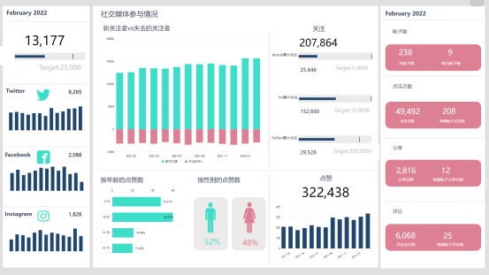

DAU/MAU比率是每日活跃用户与每月活跃用户数的比率，主要在APP运营中反馈一款产品的用户粘性。在过去的30天内，如果DAU/MAU数值越高，则代表流失用户越少，用户对产品的使用频率较高，用户粘性较强；反之，则代表流失用户较多，流失率高，用户对产品的使用频率较低，用户粘性较低。

### **什么是DAU、MAU和DAU/MAU比率？**

DAU：每日活跃用户数，Daily Active Users，代表当日登录过应用的唯一用户数。

MAU：每月活跃用户数，Mouthly Active Users，代表过去30天内登录过应用的唯一用户数。

DAU与MAU的比率是在单日窗口内与您的产品互动的月活跃用户的比例。

即**DAU/MAU比率(%)=日活跃用户/月活跃用户**

**举例说明DAU/MAU比率的上下限：**

假定产品效果极好，用户使用一次后不在登录，则MAU就是DAU的累加，DAU/MAU比率=1/30=3.3%；

假设产品效果极好，用户使用后每日都登录，则代表没有用户流失，DAU/MAU比率=100%。

那么从理论上，DAU/MAU比率的上下限分别是3.3%和100%，数值越高则代表产品对用户粘性越强。

DAU/MAU比率帮助企业了解用户与产品之间互动的频率，可以了解到有多少少用户成为了忠诚用户。对于初创公司而言，其收入可能是活跃用户的恒定倍数。

### **行业基准**

当然，产品的DAU/MAU比率越接近100%，则用户参与度越好。然而，就平均基准而言，“标准”在产品、参与类型和行业之间存在显着差异。可以查看具有类似产品类型或同一行业的公司的外部DAU/MAU比率。

标准的DAU/MAU比率一般维持在10-20%，只有像微信、Facebook这样社交型产品，DAU/MAU会超过50%；而比较成功的游戏产品的DAU/MAU比率会在20%左右。

### **优缺点**

**优点：**

这个比率特别有助于了解企业产品对用户的价值。它提供了用户留存的情况。对于早期初创公司来说，这是评估牵引力和潜在收入的有用指标。

使用比率，而不是单独使用DAU或MAU，可以避免片面数据的影响，增加实际参与度的必要背景。

**缺点：**

DAU/MAU比率的一个缺点是，同样的企业无法看到哪些用户被保留以及哪些用户正在流失。这时就可以通过采用DataFocus等BI类工具，制作完善的可视化看板，监测用户数据。

 

**总结**

DAU/MAU比率是用来判定用户使用频率和产品对用户粘性的重要指标，但更适合用于每日产生的数据都有价值的应用或行业，例如社交类、游戏类APP；像旅游、求职、租车、医疗等低频率被使用的应用，使用频率本身较低，但在使用时却会产生较大的商业价值。
