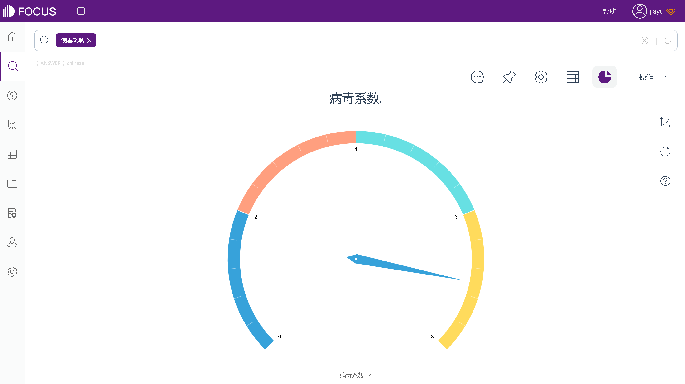

对于公司，尤其是初创公司而言，用户增长是至关重要的。而以较低成本获得较多的客户，则是营销团队所希望的。

裂变，就是典型的 低成本高增长的获客手段。今天，我们来了解一个裂变背后的核心指标——病毒系数（K值）

## **什么是病毒系数？**

病毒系数是现有用户产生的新用户数量。该指标可计算加速公司发展的指数推荐周期，有时称为“病毒性”。“病毒性”是用户向你的公司推荐朋友或同事的内在动因。

**病毒系数= 每个用户发送的邀请 \* 转化率 (%)**

计算你的产品或服务的病毒系数，需要两个数据：每个用户发送的邀请数量（推荐、分享或任何最能代表使用你的产品/服务的邀请），以及那些邀请的平均转化率。然后将这两个指标相乘得到病毒系数（通常称为“k”值）。

**例如**，你的微信好友、微信群和朋友圈中，总共有100人，你将某商品售卖信息发送给朋友、微信群以及朋友圈，其中有7人购买了你的产品，那么，转化率即为7%，则病毒系数K=100\*7%=7。

分析工具：DataFocus

## **指标优点：**

病毒系数是一个能很好地描述公司增长轨迹的指标。该指标数值的大小，受到产品本身的影响。因此，如果想提高产品的病毒式传播能力，要从改进产品开始。即使是“病毒性”最强的产品，也只有在被共享的情况下才有成效。“共享”是营销人员衡量和预测口碑增长的好方法，口碑增长是最有效的营销渠道。

## **指标缺点：**

虽然病毒系数是一种营销指标，但它不是营销部门自己就可以更改的指标。就其本质而言，病毒式传播必须嵌入到产品或服务中才能有效。

除了考虑病毒系数，病毒循环时间也很重要。也就是，从用户邀请朋友，到其中一个或多个朋友成为用户，并开始推荐其他人所需的时间。病毒循环时间越短，公司的发展速度就越快。
