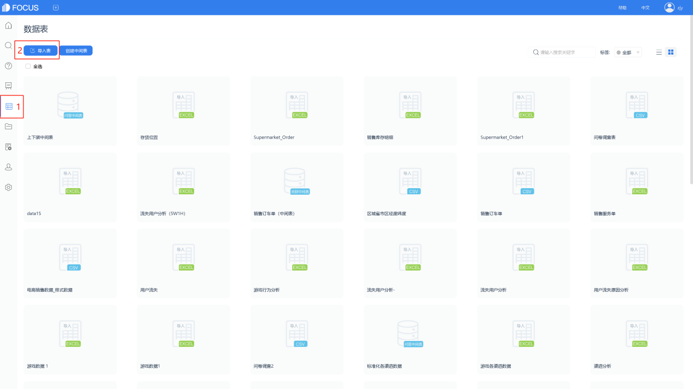
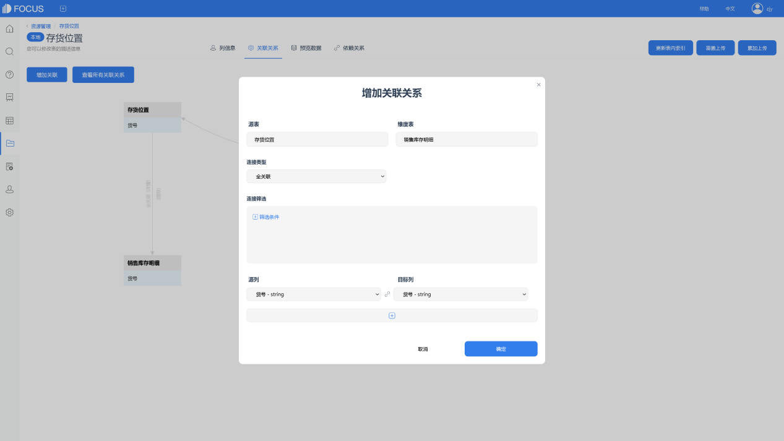
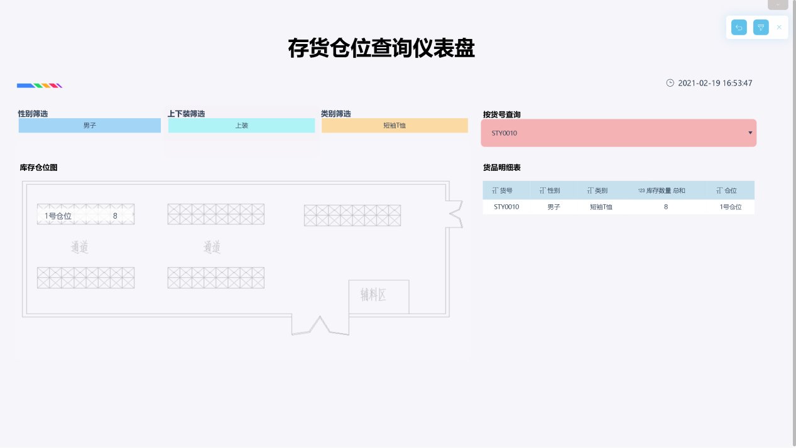

前面的文章，我们分析了货品的库存状况和销售状况，那么，如何了解货品的仓储状况呢？

我们可以用DataFocus建立一个货品仓位查询系统，即制作一个“存货仓位查询仪表盘”，在可以按各个维度查询货品位置的同时，提高仓管员的找货效率。

这个仪表盘中，上方彩色的查询条件区，可以分别或同时按性别、上下装、类别和货号来查询货品。

左下角的仓库平面图上，标有仓位编号以及库存数量，在查询条件发生变化时，信息会随之变化，即大屏产生联动效果，用以查看货品所在位置。

右下方的货品明细清单，同样会随着查询条件的变化而改变，即大屏产生联动效果，用以查看货品的明细。

## 数据源

### 1.1 数据源表

制作这个“存货仓位查询仪表盘”，我们需要有货品的销售库存明细以及货品的仓位明细。例如下面俩份数据：

在DataFocus的数据管理模块，将这两份数据导入系统。

### 1.2表间关联

导入后 ，进入其中一张表的详情界面，通过货号将两表关联，即可对这两份数据一起进行搜索式分析，并制作仪表盘所需图表。

## 图表制作

仪表盘是由一张张图表汇总而成，因此，我们需要在DataFocus的搜索模块，将仪表盘中所需要的信息，分别制作成图表并固化到系统中。

### 2.1 简单图表制作

对于仪表盘中“性别筛选”、“类别筛选”、 “货品明细清单”的制作。

首先，进入搜索模块，选择刚刚导入的两张表作为数据源表，双击列名（或搜索框中输入列名）进行搜索分析。

再将图表转换为所需要的形式后，根据想要的样式设置图表属性，最后于操作栏下以历史问答形式保存到系统。即实现简单图表的制作。

### 2.2 公式与中间表的使用

从数据表中我们可以看出，原表中没有上下装信息，即没有对某件货品是上装还是下装的标明。但货品类别中，含“裤”和“裙”字样的均为下装，其它为上装。因此，我们可以使用公式新增货品的上下装信息。

在增加公式界面，编辑如下公式，并保存为上下装公式列。

上下装= if contains(类别,"裤") or contains(类别,"裙") then"下装" else "上装"

由于可视化大屏的联动效果，是在已存储的、有关联的表间实现的。因此，我们需要将货品的上下装信息以中间表形式存储到DataFocus系统，并与两张原表关联，再进行“上下装筛选”图表的制作。

表间关联字段，我们仍然使用“货号”，因此，在制作“上下装中间表”时，搜索列名“货号”、“上下装”后，再于操作栏下保存为中间表。

最后，表间关联和图表“上下装筛选”的制作可以参考上文。

### 2.3 关键词的使用

在搜索仓位以及库存数量后，我们可以看到所有仓位和对应的库存量都会显示，但仪表盘中，每个仓位都是分开显示的，这是如何做到的呢？

我们可以使用DataFocus的关键词“包含”来实现。例如，筛选5号仓位的信息，则在搜索框中继续输入 仓位包含“5”，转换为数值表，如图所示。

再进行表头的隐藏、字体大小设置后，即可得到仪表盘中的效果。

## 仪表盘的制作

制作并保存所需图表后，即可进入数据看板模块，创建并编辑看板，制作我们想要的存货仓位查询仪表盘。

按货号查询货品的功能，可通过添加文本组件中的“筛选下拉框”来实现。

通过添加仓位图片、导入并调整历史问答（即图表）、插入组件以及样式修改等设置，即可达到我们想要的效果。

保存后，点击右上角的预览，查看联动效果。如图，在按货号查询后，即可知晓该货品的仓位以及明细信息。

