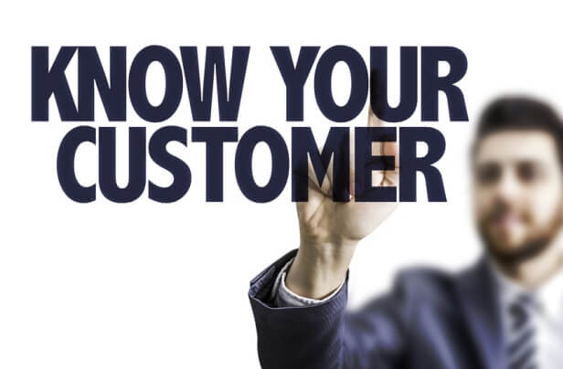
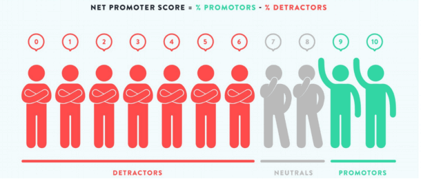
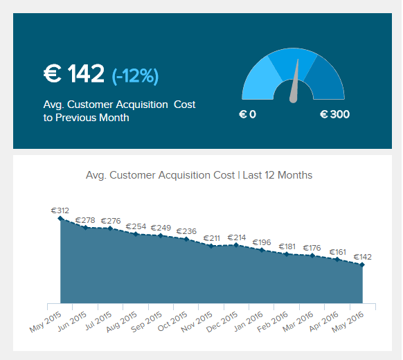
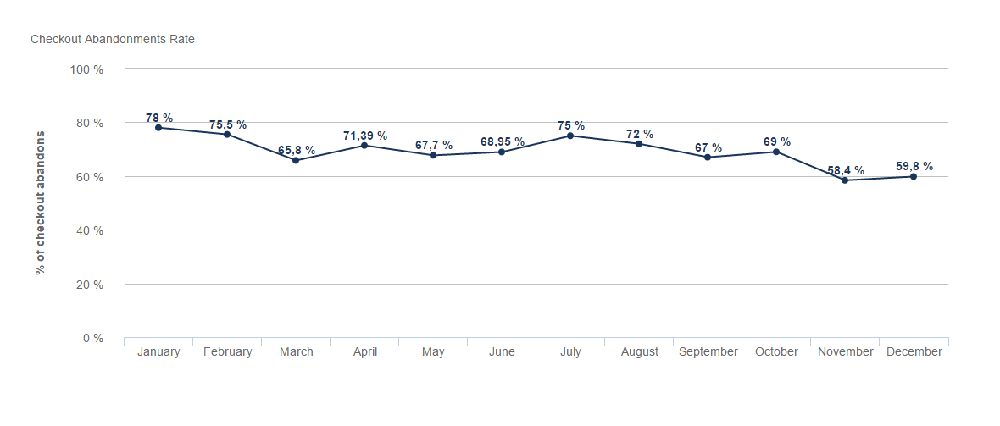
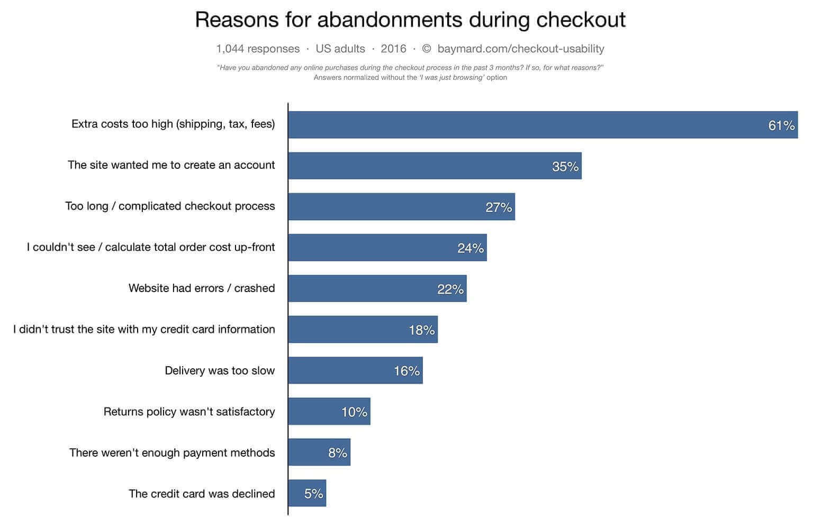
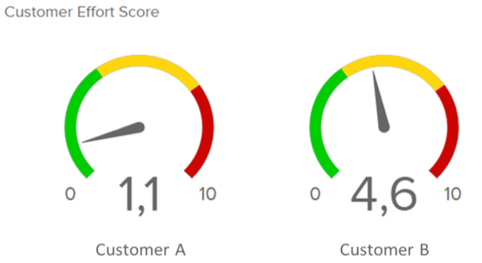

_“每家公司最大的资产都是客户，因为没有客户就没有公司。” -_ 迈克尔·勒伯夫。

您的客户是您企业的命脉。无论您是 B2B 还是 B2C，始终如一地满足客户的需求和期望，将决定你是一家拥有向上发展轨迹的坚如磐石的公司，还是一家失败的企业。有很多很多的书籍和资源致力于如何改善您与客户的关系。然而，真正衡量您与客户的关系却很少被提及。我们认为我们需要为此做点什么，因为如果您可以衡量您与客户的关系，那么改善它会容易得多。在DataFocus[这里](https://www.datafocus.ai)，我们以使数据可操作且易于理解而自豪。这就是为什么在本文中，我们将探讨与您的客户和您的业务关系相关的 7 个客户 KPI，帮助您细化制定[KPI 仪表板](https://www.datafocus.ai/infos/best-kpi-dashboard-examples)。这些客户指标将提高您为客户服务的能力——但您应该选择哪些？

## 如何选择正确的客户指标

您应该选择最能准确反映您在核心业务模式上的执行情况的[KPI 。](https://www.datafocus.ai/infos/kpi-examples-and-templates)

因此，如果您主要是一家通过冷电子邮件和推荐获得业务的 B2B SaaS 公司，则使用净推荐值 (KPI #2)、终身客户价值 (KPI #4) 和获客成本 (KPI #5)很有意义。

或者，如果您是一家销售消费品的实体店，您可能需要关注整体客户满意度 (KPI #1) 和客户努力得分 (KPI #7)。

最后，如果您是一家除了通过电子邮件列表销售外，还使用大量 Google AdWords 和 Facebook 广告来增加流量的电子商务商店，您的结账放弃率 (KPI #6)、获客成本 (KPI #5 )，电子邮件打开率 (KPI #3) 将是非常有用的 KPI。

如果您目前没有跟踪任何这些 KPI，那就从跟踪 2-3个开始。这样您就不会被信息淹没——但您仍将做出更有效和数据驱动的决策。

## 1) 客户满意度

这可能是有史以来最著名的客户 KPI——即使是对于没有业务经验的消费者也是如此。在客户支持电话或聊天结束时，几乎每个人都被问到：“您对我的服务满意吗？”。

甚至现在的应用程序也在这样做——他们会在用户使用时询他们对应用的评价，然后将该评价转移到 iOS 或 Google Play 商店。客户满意度是一个非常有用的指标，因为它非常简单。你本质上是在问这个问题：“你觉得和我们打交道怎么样？”。根据您的业务，您可以通过以下几种方式了解这个KPI：

- 作为一家实体店，您可以在收据上放置一个指向网络调查的链接。
- 如果您是一家 SaaS 企业，您可以在用户浏览您的网站时弹出一个问题调查。
- 您可以简单地将调查问卷通过电子邮件发送给您的客户。

无论您选择什么，请务必通过忠诚度积分、折扣代码或参加抽奖活动来激励客户——否则几乎没有人会填写调查表。提供奖励措施还可以使您的数据更加准确，否则只有真正愤怒或绝对欣喜若狂的客户才会回答您的问题，这会导致结果出现偏差。

## 2) 净推荐值

推荐几乎是所有业务中最好的营销形式之一。推荐不会花您一分钱，却能带来很多信任和信誉，并且表明您的产品或服是真正为客户服务的。

那么，您如何知道您的客户向其他人推荐您的频率呢？您使用的是所谓的净推荐值。[《哈佛商业评论》](https://www.slideshare.net/aramshaw/net-promoter-score-a-10-slide-introduction)发现，随着净推荐值的增加，该客户 KPI 与更高的公司收入相关。

以下是计算净推荐值的方法，正如这篇有用的[Survey Monkey 文章](https://www.surveymonkey.com/mp/net-promoter-score-calculation)所解释的那样。您通过任何一种最有效的机制向您的客户提出这个问题：“您将我们推荐给朋友或同事的可能性有多大？”。您将回复分为 3 组：

- 0 - 6：贬者
- 7 - 8：被动
- 9-10：推荐者

然后你做这个等式：

**（推荐者人数 - 批评者人数）/（受访者人数）x 100。**

以下是查看此等式的其他一些方法：

净推荐值 = 推荐者百分比 - 贬损者百分比

净推荐值 =（#Promoters/Total 受访者）-（#Detractors/Total 受访者）

## 3) 电子邮件列表打开率

这个客户 KPI 很容易量化，因为它只是您打开的电子邮件的数量除以您发送的总量。如果您在网上开展大量业务，那么您的电子邮件列表就是您公司最大的资产之一。但是，即使您在实体零售店进行所有销售，电子邮件列表也是向客户推销产品的绝佳方式。

话虽如此，如果您的客户都没有打开您的电子邮件，则电子邮件营销效就没什么效果。考虑您的电子邮件打开率随时间变化的趋势比将您公司的打开率与行业的一些通用“平均打开率”进行比较要好。一年前您的电子邮件打开率明显高于现在，那么这是一个值得关注的问题。是不是因为：

- 您的电子邮件主题和标题不好？
- 您没有使用可信赖的电子邮件发件人？
- 您的电子邮件是否被电子邮件供应商视为垃圾邮件？
- 您没有在电子邮件中为您的客户提供有价值的内容/优惠，因此他们停止打开邮件？

这不是一个小问题。根据您公司和电子邮件列表的规模，打开率的小幅降低可能会对您的底线产生重大影响。

## 4) 客户终身价值

这个客户指标与 SaaS 公司特别相关，但它对任何类型的业务都很有用（尽管对于没有奖励计划的 B2C 实体公司可能很难跟踪）。我们将[客户生命周期价值](https://www.datafocus.ai/infos/kpi-examples-and-templates-sales#customer-lifetime-value) (CLV) 定义为“您希望在您的关系生命周期内从客户身上赚取的金额”。

如果你是一家 SaaS 公司，逻辑很简单：一旦你获得了客户，你可以让他们支付的时间越长，你获得的利润就越多。但是，任何基于电子邮件营销的业务也可以充分利用 CLV 指标。

正如真正的电子邮件漏斗专家所知道的，您的大部分利润都来自那些购买您漏斗中所有追加销售的铁杆粉丝。因此，寻找更多方法来提高最佳客户的 CLV， 可以直接转化为更好的利润率。

## 5) 获客成本

虽然这个指标可能并不适用于所有实体店，但对于 B2B 企业和 SaaS 公司而言， [客户获取成本](https://www.datafocus.ai/infos/kpi-examples-and-templates-management#customer-acquisition-cost) (CAC) 是一个至关重要的客户指标。它代表您为签下新客户而投资的所有成本。

CAC 和 CLV 也密切相关。假设您是一家 SaaS 公司，通过付费流量获得大量新线索。由于在大多数付费流量平台上，您都是在为“竞标”，如果您的 CLV 比竞争对手高，您可以“承受”比竞争对手更高的客户获取成本，同时仍然保持盈利。

但是，如果您处于业务的早期阶段，并且您的 CLV 还没有达到您期望的水平，您可能需要寻找其他更便宜的流量来源，以降低您的 CAC ，保持您的现金流健康。

## 6) 结账放弃率

虽然此客户 KPI 对于任何具有在线销售流程的企业都很有用，但它主要适用于电子商务公司。当人们将物品放入购物车而不结账（和付款）时，您就是把钱留在了桌子上。根据专注于电子商务研究的[Baymard 研究所，平均购物车放弃率相当高，为 69.23%。](https://baymard.com/lists/cart-abandonment-rate)为什么顾客会放弃他们的购物车？

好吧，很多人只是在做“逛街”的网络版。正如 Baymard 研究所所说：“......很大一部分购物车放弃只是用户浏览电子商务网站的自然结果——许多用户将进行橱窗购物、价格比较、保存物品以备后用、探索礼品选择等等。这些在很大程度上是不可避免的购物车和结账放弃。”

但是，剩余的许多原因都在您的控制范围内，Baymard 研究所在这张有用的图表中显示了这些原因：

## 7) 客户努力得分

对于 SaaS 公司和实体店来说，这都是一个非常有用的指标。基本上，客户努力得分会询问您的客户从您的公司获得他们想要的东西的难易程度。

如果你是一家 SaaS 公司，你需要有一个较低的客户努力得分——否则，用户会抱怨你的产品太难使用，他们就会取消。如果您有一家零售店，您希望确保客户不会因为四处寻找合适的商品而感到沮丧。你可以问这样一个问题：“在 1-10 的范围内，您在使用我们的产品时付出了多少努力？” 或者对于一家零售店，“在 1-10 的范围内，找到你今天想要的东西有多难？”

## 您应该跟踪的 7 个客户指标

- 客户满意度
- 净推荐值 (NPS)
- 电子邮件列表打开率
- 客户终身价值 (CLTV)
- 客户获取成本 (CAC)
- 结账放弃率
- 客户努力得分

客户 KPI 对您的业务非常重要。如果您没有定期跟踪以上 7 个客户指标，那么现在是时候这样做了。您不需要跟踪所有这些 KPI，也不应该这样做，因为随着时间的推移，您可能会不知所措。因为这些 KPI 的真正价值不是来自一次性的“快照”，而是来自对每个季度的趋势研究。为了使这个过程自动化，利用专业的[CRM 仪表板](https://www.datafocus.ai/infos/best-crm-dashboard-report-examples)是有意义的。

最后，请务必检查不同的[KPI 示例](https://www.datafocus.ai/infos/kpi-examples-and-templates)，并选择与您的核心业务模型最相关的示例，并使用这些数据来改善您的客户体验。
