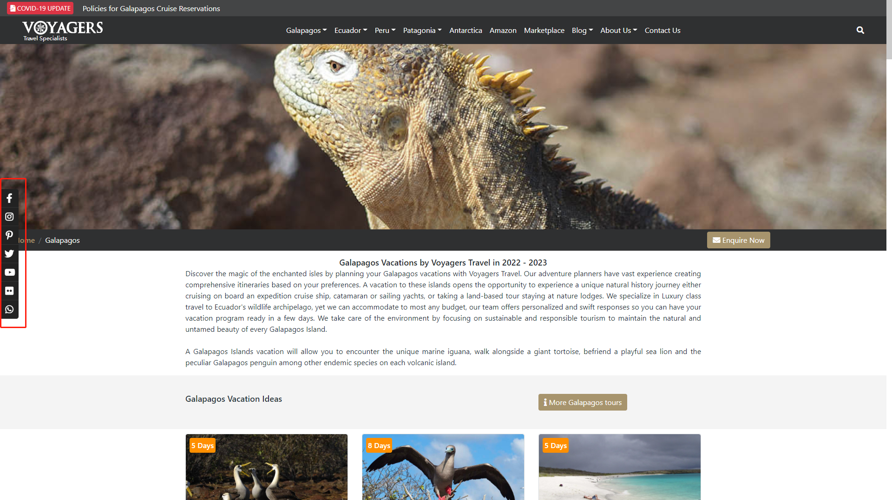

谷歌每秒能接收超过40,000次搜索。百度日活在6亿左右。正是这些数字，支撑着SEO优化虽然沦为一种“古老”的推广方式，但仍是目前最主要的推广方式之一。这也是为什么，很多企业虽然选择了通过新媒体来做品牌推广，但仍然没有放弃SEO。

如果没有制定完善的SEO策略，那么很有可能会是去一笔可观的收入。但是，如何衡量通过SEO工作赚了多少Q呢？这并不是一件容易的事。

在接下来的文章中，我们将讨论9种跟踪SEO投资回报率(ROI)的最有效方法，同时可以结合您公司的业务，选择一种或多种最适合您业务的策略。

## **如何跟踪SEO的投资回报率**

### **1.查看一段时间内的流量**

DataFocus可以帮助跟踪一段时间内的网站流量。通过对时间序列的分析，可以研究流量趋势，帮助清楚了解当流量激增/下降时触发了哪些活动。

研究这些趋势将向您展示某些主题是否存在周期性或季节性，可能会在每年的固定时间段都为企业带来指定流量。通过研究趋势，还可以展示哪些SEO策略对您有用，哪些没有用，这样就可以有选择性的集中SEO策略。

例如，前几年发布的一篇关于高考的博客，每年到高考时间段前后都会有一大批的学生家长涌入，参考其中的资料。

### **2.区分流量来源**

在对网站流量的趋势有了解后，一定要想尽办法区分网站的流量来源。目前国内网站的主要流量来源简单分为三种：直接访问（书签+搜索栏输入域名地址）、搜索引擎和外部链接。

举一个例子：

如上图所示，该网站的主页链接了多个不同的页面，每个页面都存在对应的特定关键词。借助DataFocus等BI工具跟踪自然流量链接到的不同页面，以便了解哪些页面的转换良好。研究单页面的流量可以使您清楚地了解自然搜索的转化率。

另外，假设您正在进行PPC（按点击付费）活动。如何跟踪您的流量来源呢？

建议为每个广告系列创建不同的页面，这样得到的用户流量记录数据就是不一样的，可以帮助您了解自然流量是如何到达您的网站。

### **3.跟踪首次接触交互**

首次接触互动或交互展示了用户在网站上进行转换之前与之互动或点击的第一个营销渠道。

通过了解用户到达网站之前所接触的营销渠道，可以帮助分析用户行为和转化漏斗，对公司后续的SEO工作是有很大帮助的。

首次接触交互可能不是客户在您的网站上购买的确切时间，但它展示了客户首先是如何了解您的网站的。依此可以建立品牌知名度，对于确定最终导致他们转化的客户的进一步行动至关重要。

### **4.使用发票进行跟踪**

跟踪SEO工作的投资回报率的一种创新方法是直接从发票上列出潜在客户的来源。通过在客户购买期间生成的每张发票上放置一个唯一的代码，比如二维码，来做到这一点。

一旦在每张发票上设置了唯一的二维码以进行准确的归属，只需计算该特定细分产生的总收入并比较数据库中的指标，即可帮助您确定有多少客户因您的SEO策略而转化。

### **5.使用电子邮件跟踪SEO潜在客户转化**

投资回报率需要进行非常详细的跟踪，同时也包括跟踪SEO线索在电子邮件等其他渠道上的转化器看。

所谓的使用电子邮件跟踪，其实指的是使用一种工具来监控电子邮件的送达率，打开率，链接的点击次数等。通过监控收件人是否会阅读电子邮件、以及是否会点开正文中的链接来衡量电子邮件营销活动的效果。

实施电子邮件跟踪并研究他们如何从SEO线索中转化。

### **6.DA和PA**

DA是Domain Authority，指的是域名权重。DA通过质量得分的形式体现网站在搜索引擎上的排名，是衡量网站权威度的一个指标。

PA是Page Authority，指的是页面权重。PA同样以质量得分的形式衡量特定网页在搜索引擎上的排名，是衡量单个网页权威度的一个指标。

域名权重和页面权重都是SEO策略运行情况的有力指标，可以通过投资SEO、创建大量高质量内容以及从您所在领域的高权威网站获取反向链接来增加您的DA和PA。

### **7.参与度指标**

除了上述讨论的方法之外，您还可以测量更多的用户参与度指标来跟踪SEO的投资回报率。

- **转化率**：当用户进入网站、执行对您的业务有利的操作并转变为付费客户时，就会发生转化。您通过使用跟踪URL并定义目标来跟踪转化率。
- **页面停留时间**：页面停留时间跟踪的是用户在特定页面上花费的时间。这可以帮助研究用户行为并改进网站。
- **点击率**：点击率即用户点击您的链接并登陆网站的次数。
- **跳出率**：跳出率是指用户在没有点击任何链接或采取任何其他操作的情况下登陆您的页面后离开。衡量跳出率，可以了解网站的质量以及您的SEO策略是否吸引了正确的受众访问网站。

### **8.关键词排名和分割**

用户在搜索引擎上进行的都是关键词搜索，然后搜索引擎匹配模糊关键词。因此网站可以瞄准更多的长尾关键词，为网站赢得更多点击和高质量的流量。

还有一种准确衡量SEO策略的投资回报率的方法是细分关键字。通过细分关键词可以剔除掉来自不相关关键词的流量。这些关键词可能也会给网站带来流量，但不是由于SEO的努力。

### **9.外包SEO跟踪**

如果您已经确定要跟踪SEO的投资回报，但您没有充足的时间或者完整的思路，那么，最简单的方法就是将这个任务外包给一家专业的公司，让该公司帮助您处理所有的ROI跟踪，确保公司的盈利。

# **结论**

搜索引擎优化是最有用的也是最容易被误解的商业策略之一。营销团队通过网站分析、衡量SEO的投资回报率，准确判断成功的SEO策略，为企业带来收入最大化；或者可以帮助优化改进SEO策略，让公司朝着正确的方向不断努力。

通过对网站一段时间内的研究，检查实施行的SEO技术的有效性，区分流量来源，准确判断所有搜索流量的来源。

跟踪用户在网站的首次接触互动，了解他们在成为客户之前首先与哪些渠道互动；借助发票或电子邮件跟踪客户的转化；提升网站和网页的DA、PA等。

这篇文章的目的是希望能够帮助您了解如何更有效的跟踪SEO的投资回报率，并且根据公司内部的不同业务，选取其中一种或多种更适合您的策略进行实施。

大家还有什么可以补充，欢迎在评论区留言~
