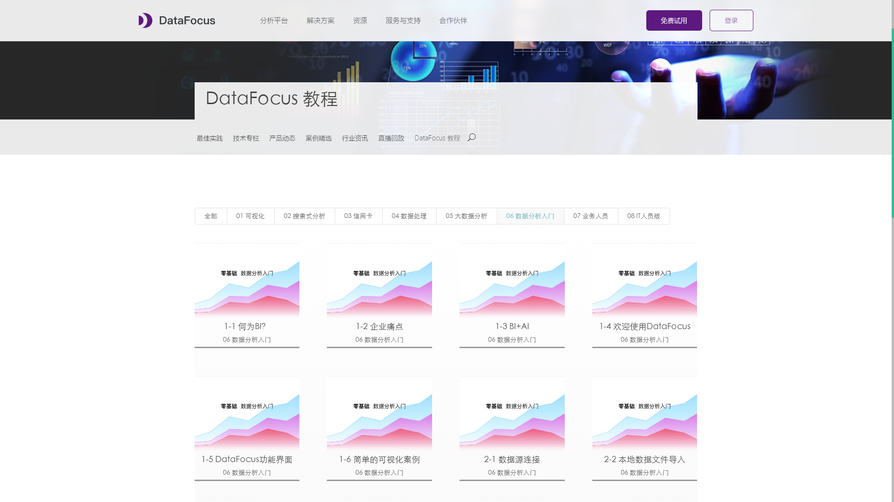
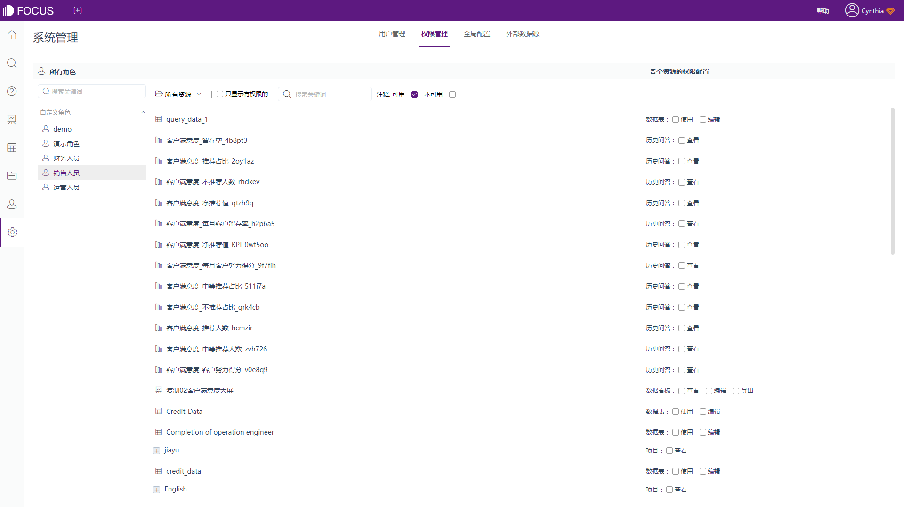
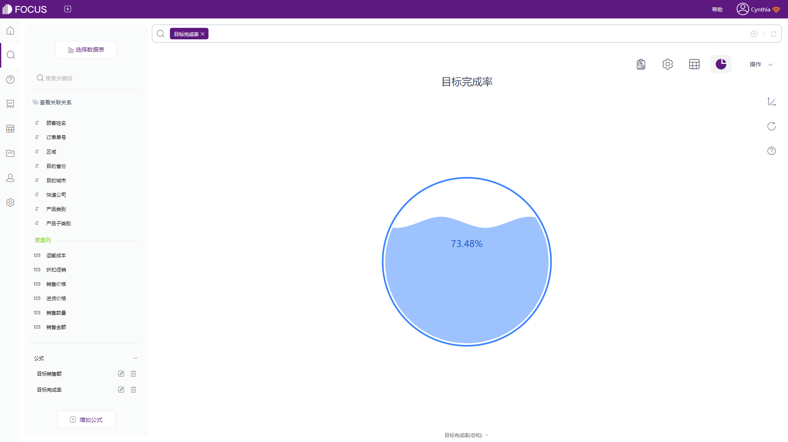
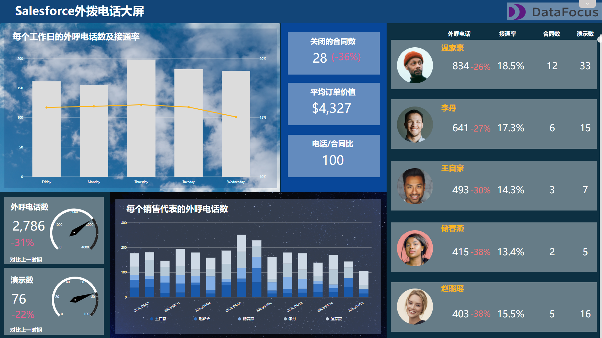

好像是突然之间，大街小巷都在讨论所谓“数字时代”、“大数据”、“数据可视化”，那么你对自己做决策所用到的数据是否充满信心，完全信赖数据的真实性呢？

一项Censuswide研究发现，在所有接受调查的人中，只有24%的人对其决策用到的数据充满信息。这也就意味着，超过3/4的受访者认为，自己可能根据不准确的数据制定了业务决策。

**数据素养是准确读取、分析和应用数据的能力。**掌握基础的数据素养，对公司的各团队成员来说，都是必备的技能。

那不禁就有人要问了，普通业务人员也需要么？难道需要雇佣一群天才来组建一个具备数据素养的组织？？

- 是的。普通业务人员也需要具备基础的数据素养，但要求可以不用太高，至少要做到可以准确读取数据；
- 当然不用。数据素养是可以依靠后期培养的，是一项可以学习、教授的技能。

接下来的内容，我们就将展示如何在组织中培养数据素养，以帮助公司真正实现信息驱动。

## **1.将数据素养纳入员工培训**

将有关提取、分析和应用数据的资源添加到常规的员工培训流程中。

第一步，**向团队传授数据素养的重要性**。公司可以收集大量客户行为相关的数据，展示并指导员工做出产品决策，初步体会数据驱动的好处。

第二步，**培训团队准确解读客户和产品数据**。但员工指导如何阅读收集到的信息，并正确提取有效数据时，他们就不太可能会被不准确的数据所误导。

第三步，**具体的培训内容需要“因人制宜”**。相比于软件或工程团队，营销或客户服务团队可能需要从更基础的层面开始学习；对于新员工或级别较低的员工，可以进行基础的数据素养培训；新员工和非IT团队可能不太熟悉数据集、数据库相关的内容。

_截图来源：DataFocus官网学习课程_

### **额外拓展：提供按需专业发展材料**

为员工提供资源，以了解更多有关正式培训之外的数据的信息，可以包括一些数据、带有文章的知识库或者自学课程等。

通过提出每周或每月的“推荐阅读”，引导团队成员自行选择或寻找资源。

由于不同的团队有不同的数据需求，可以考虑让经理为他们的团队推荐阅读材料。然后，多进行面对面或者在想的团队交流，提出问题并讨论学到的知识。

## **2.设定数据访问权限**

数据素养的培养需要实践，员工练习应用数据的次数越多，他们的数据素养就会越高。如果员工无法访问需要的信息，他们就很难学会如何有效地使用这些信息。

从项目规划的初始阶段，就需要**采取分散式的方法，使员工能够访问与其角色相关的数据。**

广泛的访问权限使员工能够做出明智的选择，团队可以在创建项目提案之前分析数据，而不是事后再来证明决策的合理性。但有些数据因为隐私问题必须设置限制，因此也不能授予员工对所有数据的开放访问权限。

在智能BI分析平台DataFocus系统中，资源权限依附于角色，通过为角色配置资源，将自定义的角色分配给不同的用户或部门，即可实现将打包资源分配到具体用户或部门，实现数据精确到行列的数据访问权限的划分。

### **额外拓展：整合数据源**

只有当公司数据有序的整合在一起后，分散式的数据访问权限才有用，我们可以通过采用聚合的BI软件来解决这个问题，例如DataFocus。将多种信息收集工具，包括Oracle、MySQL等收集到的数据，通过DataFocus充当所有这些数据的单一访问点。整合数据来源，明确员工的取数。

## **3.为员工分配不同KPI**

数据素养还存在一个障碍——员工被过多的数据淹没。因此我们可以对KPI进行拆分，为团队的每个成员分配一个或一组KPI，整体涵盖全套相关指标，这有助于将每个人的数据负载保持在可管理的水平。

例如，在营销团队中，一个人跟踪点击率等广告指标，而另一个人跟踪品牌召回等客户反馈指标。员工可以彻底研究自己的指标，包括它如何与公司的整体目标联系起来。可以帮助员工培养能力，集中精力。

### **额外拓展：要求经理监控公司范围内的指标**

在员工关注个人KPI的同时，需要分配团队负责人以整体管理这些数字。将注意力集中在数据片段上虽然可以提升员工成就感，但容易从宏观上忽略整理蓝图。因此，需要团队负责人跟踪公司范围内的指标，然后定期向团队展示。

例如，在营销团队中，可以分配员工跟踪潜在客户数量和广告支出，然后团队负责人可以跟踪营销投资回报率。会议上，团队成员可以将他们的KPI与全局指标进行比较，了解每条数据的更广泛影响。

## **4.采用数据可视化工具**

数据可视化对于建立数据素养是非常宝贵，借助图表使信息一目了然地进行展现。使用数据看板，每日实时监控数据，持续显示团队主要指标，同时向员工展现日常运营所产生的数据，还可以添加目标数据或比较功能保持团队成员的积极性。

_截图来源：DataFocus系统_

例如上图，通过图形，销售额就不再是一个“虚荣指标”，而转变成了一个目标完成率。

_示例数据看板_

数据看板将重要信息放在团队的视线范围内，可以加快决策速度，并帮助员工了解他们最重要的数据每天如何变化。

### **额外拓展：为每个团队显示单独的仪表板**

DataFocus可以通过菜单看板、轮播看板等制作多个数据看板，将不相关的指标利用单独的数据看板分隔开，展示不同的关键指标。

使用多个仪表板，以便每个团队都可以显示他们的关键指标。并非每个团队都有相同的KPI，单独的仪表板比将不相关的指标组合在一起更容易混淆。

借助数据可视化工具，公司可以显示日常任务中最重要的团队指标。

建立数据素养最重要的一步是将他们学到的知识付诸实践随着员工对数据分析越来越熟悉，可以赋予他们更大的权限，有助于建立他们对数据分析能力的信心。

纸上学来终觉浅，绝知此事要躬行。现在就动手，跟着我们一起，用DataFocus快速提升你的数据素养吧~
