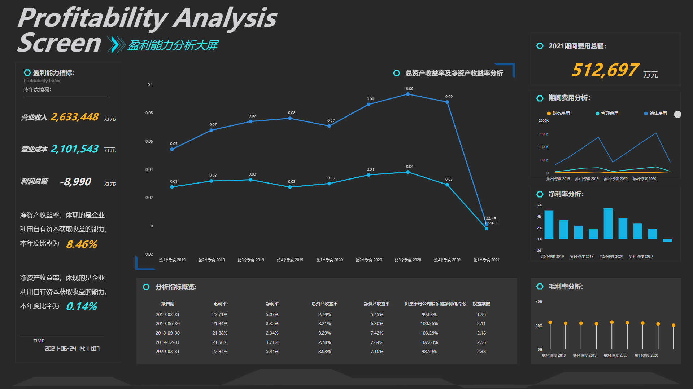

目前有一些工具以[商业智能软件](https://www.datafocus.ai/)的形式存在 - 专门设计用于改进传统 BI 功能的平台。

以前，我们提到了三个数据发现步骤：_数据准备、视觉分析和指导高级分析。_您使用的用于发现数据的软件应该为这三个关键阶段提供基础。在这里，我们为您留下一份此类工具应包括的主要属性列表，以便成功进行数据发现过程：

**1） 用户友好**

过去，数据发现和分析过程由专业分析师或 IT 专家来处理。今天，由于现代技术和数据的民主化，这种情况已经改变。任何现代数据发现工具的原则之一是它需要一个用户友好的界面。这将使组织中的每个人都能够利用他们可用的信息和工具。

**2） 快速**

随着过去几年数据的增长，市场上可用工具的提供也随之增加。由于许多企业受益于这些解决方案，您需要确保投资于将为您的企业提供竞争优势的技术。在瞬流飞速的行业时代，成功的关键。因此，您应该使用软件来帮助您准确理解需要什么来提高决策能力，而无需等待获取所需的信息。

**3） 轻松处理海量数据**

视觉发现有助于扩展传统[商业智能](https://www.datafocus.ai/)并提高效率。如果您有来自不同接触点的多个数据库，则应查找允许数据集成的工具，无论您希望包含多少信息。除了连接数据之外，您选择的发现工具还应支持处理大量数据。例如，具有高级筛选选项或模式识别。

**4） 具有交互式可视化**

人脑处理视觉效果的速度比数字快得多。因此，高质量的数据发现工具应包括强大且交互式的数据可视化，使信息的工作和分析过程变得流畅且易于理解。DataFocus 等工具提供[仪表板创建者](https://www.datafocus.ai/)，其中包括各种具有不同图表类型和颜色的预定义模板，使组织中的任何人都能够用数据讲述故事。在下图中，我们为您留下一个[财务仪表板](https://www.datafocus.ai/)示例，显示一目了然了解公司财务状况所需的主要指标。

**5） 具有高级图表选项**

除了交互式可视化外，开发良好的软件还应包含高级图表选项，以便进行质量分析并从数据中提取最大潜力。其中一些高级功能应该是：

- 能够将多个图表类型组合成一个。
    
- 添加辅助轴，以便进行高级比较和分析。
    
- 有不同的趋势指标，如正面或负面结果的颜色。
    
- 允许有条件格式指出意外值并发现隐藏的趋势或模式。
    
- 使用比较期特征比较来自两个不同时期的数据，并根据绩效和目标得出结论。
    

**6） 有自定义字段**

自定义字段是专业数据发现工具中需要查找的另一个重要功能，因为它们允许用户创建单独计算的字段，并在不同连接类型的帮助下将多个类别维度合并到合并字段中。专业仪表板工具（如数据针）提供自定义字段，这些字段可以轻松地使用"掉落"功能创建。

**7） 易于分享**

协作是成功数据管理的基本点。因此，共享功能是您在投资 BI 软件时应该找到的属性之一。 DataFocus 允许您根据利益相关者的角色和需要使用的数据向利益相关者提供不同类型的访问。能够轻松地分享见解和报告将增加团队之间的沟通，从而营造出更有生产力的环境。此外，您还可以计划共享计划并实现流程自动化，以确保客户及时获得所需的信息。

总之，您不必是专家分析员或阅读编程代码即可理解和从组织内的数据中获取价值。可靠的数据发现工具应使人们能够阅读和理解所有部门的数据模式，并相互共享此信息。无论您是在提取和评估[人力资源 KPI，](https://www.datafocus.ai/)还是在准备特定[的零售绩效指标](https://www.datafocus.ai/)，正确的工具都必须能够根据您的特定组织需求进行调整。

要在组织内开发真正的现代商业环境，您必须实现数据的发现，这样您才能保持相关性、成功性，并促进数据驱动文化。如果你不这样做，你将无法跟上数字世界的需求。如果您无法学习如何从数据中获取最大数据，您的业务_将_落后。

但随着技术的不断进步，商业智能的这一分支正在进一步演变，我们必须在实施技术时更深入地研究我们业务中正在发生的事情。它把我们带到哪里去了，它如何影响我们组织的未来和我们做出宝贵决定的能力？
