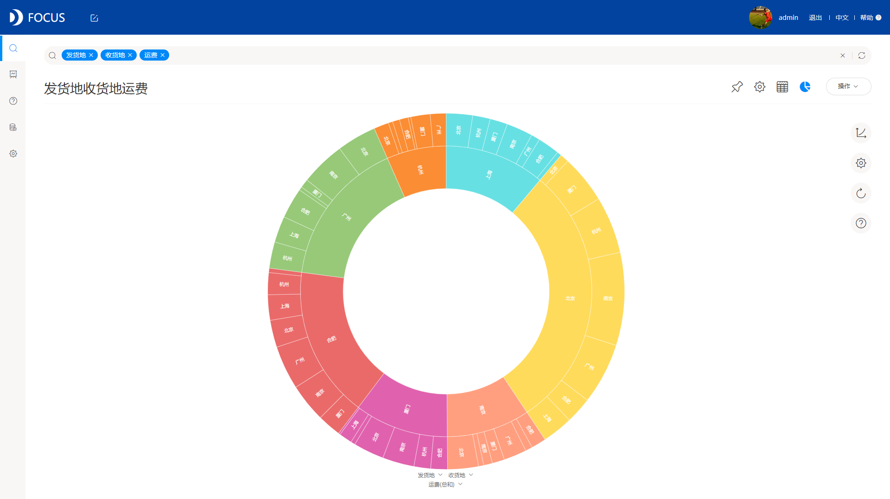

**\[box\]导读：**近期，狂犬疫苗案件中的“冻干人用狂犬病疫苗”设计生产记录造假问题，百白破疫苗案件中的“百白破疫苗”涉及效价指标不合格问题牵动着万千群众的心。2018年7月23日，习近平主席对吉林长春长生生物疫苗案件作出重要指示，强调要一查到底严肃问责，使得疫苗安全问题再一次成为社会焦点并持续发酵。疫苗安全问题并不是一个新问题。前有山西毒疫苗，后有山东非法疫苗，现如今又出现疫苗造假问题，是什么原因导致疫苗安全问题屡屡出现？早在2010年两会上，曾任中国疾病预防中心主任的王宇就直言：“部分疫苗质量不达标，监管部门缺少对这些疫苗大规模上市后的系统评价。有些疫苗完全达不到在人群中大规模使用的标准，与进口疫苗相比，质量档次差很多。”那么如何做到收集疫苗大规模上市后的系统评价呢？如何利用好收集到的评价呢？\[/box\]

每个国家都有或多或少类似的问题，那么遇到类似疫苗不良事件，美国是怎么做的？

**美国是怎么做的？**

\[video width="1920" height="972" mp4="http://case.datafocus.ai/12239.mp4"\]\[/video\]

美国针对于疫苗问题，在1990年成立了疫苗不良事件报告系统（VAERS），这是一个国家预警系统，用于检测美国许可疫苗中可能存在的安全问题，由疾病控制预防中心（CDC）和美国食品药物管理局（FDA）共同管理的一种被动报告系统。

任何人都可以向VAERS报告疫苗不良事件，当发生疫苗不良事件时，登入该系统，申报疫苗不良事件的发生，系统会要求填写疫苗问题相关的重要信息，要求尽可能填写完整，过后会有专门的工作人员进行核实，医疗保健专业人员必须报告某些不良事件，并要求疫苗制造商报告他们注意到的所有不良事件

所有申报的疫苗不良事件，系统按照年份统计整合，任何人可以在该系统查看下载所有整合后的疫苗不良事件数据，大大地提高了疫苗数据信息的透明度，为美国疫苗安全提供了可靠的监督系统，监督范围延伸到整个社会，所有的疫苗以及制造商都在民众的监督下。

VAERS系统为美国收集了大量疫苗不良事件数据，同时监管了美国疫苗市场，将疫苗不良信息彻底曝光，不留任何余地。

**VAERS系统数据的简单分析**

1、疫苗制造商分布

从图中可以观察到，在所有涉事的药品制造商中，MERCK & CO.INC.公司所占比例最大，占比46.2%，涉事数高达44900起；其次是GLAXOSMITHKLINE BIOLOGICALS，占比15.8%，SANOFI PASTEUR，占比15.6%，政府可以着重调查下这几家制造商是否有问题。

4、百白破疫苗和狂犬病疫苗各年份发生不良数

“DTP”疫苗代表的就是百白破疫苗，“RAB”则代表的就是狂犬病疫苗。观察图中数据，可以发现这两种疫苗的不良事件数随着年份不断减少，而且从图中可观察到“RAB”疫苗发生不良事件的次数明显多于“DTP”疫苗。

5、百白破疫苗和狂犬病疫苗不良事件疫苗批次

从表中我们得到狂犬病毒疫苗发生不良事件最多的疫苗制造商为"NOVARTIS VACCINES AND DIAGNOSTICS"，其所制造的狂犬病疫苗发生不良事件的批次最多。而百白破疫苗发生不良事件最多的制造商为"SANOFI PASTEUR"，U5235AA批次发生不良事件最多。

6、百白破疫苗和狂犬病疫苗接种年龄分布

将年龄分5组统计分别得到接种狂犬病毒疫苗和百白破疫苗产生的不良事件数。从条形图中发现百白破疫苗发生不良事件最多的年龄组是18岁以下的，而狂犬病毒疫苗发生不良事件最多的年龄组是18岁-36岁之间。

2、近三年致死致残事件数量分布

对近三年不良事件造成的结果进行进一步分析，观察致死致残的严重事故后果数量的变化。

从2016年到2018年，致死结果的记录数有所增加从2016年的462例到2017年的573例再到2018年上半年的326例，这是一个奇怪的趋势，也许说明了美国的疫苗可能正在发生一些事情或者出现了一些隐藏的问题；而致残与致残后死亡的结果记录数有所减少，比较符合总体的情况。

3、近三年每年不良事件数量变化

VAERS系统的数据记录到2018年的6月14日，汇总2016年、2017年以及2018年上半年的记录数量来看，在VAERS系统运作的情况下，每年疫苗相关不良事件的数量呈现逐年下降的趋势。申报到系统的不良事件数量从2016年的45715例降至2017年的38900例，2018半年报告记录量为12482例，仅为2017年记录量的三分之一，不出意外的情况下2018年的总记录量依然会保持下降的趋势。

说明VAERS系统确实地对疫苗安全问题起到了缓解改善的效果。

**建立一个数据公开系统，给广大群众完全的知情权，让他们参与到疫苗质量的监督中来，是一个根本的解决方案。**

疫苗安全问题，影响地不仅是下一代的健康，更是祖国的未来，摧毁的是民众对国产疫苗多年来积攒的那一点点信任。

国产疫苗的发展历程并不容易，对于疫苗的监管也十分严格，批签发都有一套正规的流程，后续对运输过程也有严格监管，但是仍有类似事件不断发生，未来怎样才能减少甚至杜绝类似事件的发生？民众即将破碎的信心又将如何拾起？

VAERS数据的分析结果表明，即使在美国，疫苗也会导致副作用甚至死亡。那为什么他们没有那么多“疫苗事件”呢？通过建立一个数据公开系统，给广大群众完全的知情权，让他们参与到疫苗质量的监督中来，是一个根本的解决方案。

疫苗安全问题不断接受新的考验，有很大原因在于疫苗信息透明度不高，监督力度有限。本文中提到的美国VAERS系统以及其运作机制，我们可以取其精华，建立一套属于自己的疫苗监管系统，让更多的人参与进来，既保证了信息的公开度，加强了群众监督力度，同时又给不法分子增加了一定的威慑力，并且在当今信息化时代，在监督的同时还能收集大量有效数据，充分利用好收集到的数据，运用数据分析工具进行一系列分析，既能及时发现并处理有问题的疫苗，也能为疫苗后续的发展提供宝贵的数据支持,为祖国的未来守住道德的底线！
