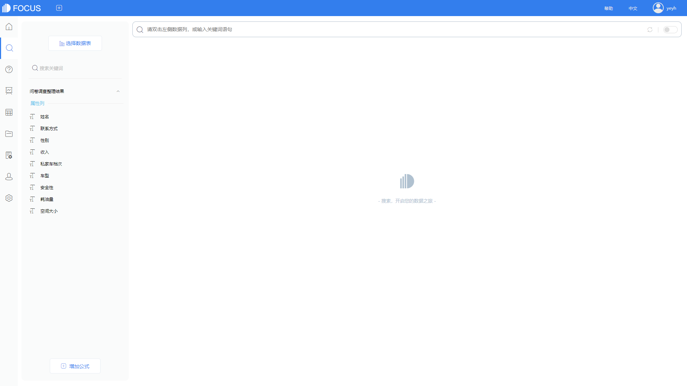

**目的：**对分类顾客群体对应的消费习惯进行分析。

**摘要：**随着市场经济的发展以及人民生活水平的提高，人们的消费水平也大大的提高，促使中国零售业的飞速发展，零售行业的竞争也日益激烈。此次案例分析的数据为某网上超市的3万笔订单数据，包括顾客ID，订单ID，消费金额，购买商品数量，工作日，时间点等因素。通过案例分析，可知“富人”对该网上超市的贡献率大于“穷人”；“穷人”与“富人”的购物时间没有特别大的差距，但其中一个峰值的时间段略有差异；从购买的商品中可以看出，“富人”比“穷人”更注重享受，食品类的占比较少。

**关键词：**零售业,分类顾客,消费习惯

一、案例背景

随着市场经济的发展以及人民生活水平的提高，人们的消费水平也大大的提高。中国零售业的飞速发展，使得人们的购物心理也发生了变化。它在人们心目中。可近年来，零售行业的竞争日益激烈，消费市场趋向饱和，因此了解消费最新趋势，掌握消费者购物心理，更好的满足消费者需求就显得尤为重要。

对顾客群体的消费情况及购物行为进行调查并分析，有助于超市等零售行业了解购物者的消费趋势，掌握消费者购物心理，实施差异化战略，正确寻找自身的市场定位。

此次案例分析的数据为某网上超市的3万笔订单数据，包括顾客ID，订单ID，消费金额，购买商品数量，工作日，时间点等因素。

二、案例问题

分类顾客的消费习惯会受到各种因素的影响，如时间点、顾客喜好等。本文将着重讨论影响分类顾客的消费习惯的因素。但由于顾客订单数据信息量巨大，数据随时间变化频繁，用EXCEL来进行操作会略显麻烦，使用Datafocus产品就可以快速处理大量数据，分析的准确性也高。

三、案例分析

（一）综合分析

1.顾客分类

为了研究分类顾客群体对应的消费习惯，首先将顾客按消费金额进行分类。在此次案例分析中，我们假设每单消费金额大于700元的顾客是“富人”；每单金额小于700元的顾客为“穷人”。

先通过饼图观察这两种类型的顾客人数的分布情况。

图 1 分类顾客对应的人数

从图中可以看到，一共有3万名顾客的数据，其中“富人”有9024人，“穷人”有20976人。“穷人”的数目远大于“富人”。

2.顾客的消费金额

接下来对比“穷人”与“富人”的消费总金额。

图 2 分类顾客对应的消费金额

结合图1可以发现，“富人”的人数虽远远小于“穷人”，但总计的消费金额却是“富人”更胜一筹。

（二）分类顾客分析

1.“富人”的购物时间

对分类后的顾客群体进行分析，首先研究“富人”的购物时间，通过柱状图可以直观对比一天中各个时间点的购物人数。

图 3 富人的购物时间

从图中可以看出，购物时间出现了两个峰值，分别是中午的11点以及晚上的22点，特别是晚上22点的下单人数是最高的。

2.“穷人”的购物时间

同样的，将“穷人”的各个时间点的购物人数也进行聚合，观察与“富人”之间的区别。

图 4 穷人的购物时间

从图中可以观察到，顾客各时间点的购物人数基本没有太大的区别。但与“富人”不同的是，“穷人”的购物时间也出现了两个峰值，分别是中午的12点以及晚上的22点。

3.“富人”喜爱的商品

对顾客购买的商品进行了分类，分别为食物（不易腐烂的食物），新鲜（新鲜和冷冻食物），饮料（各种饮料），家庭（家用卫生纸和小家电），美丽（洗护用品和化妆品），健康（可以在没有医生处方的情况下销售的药物），宝贝（宝宝用的东西），宠物（与宠物有关的物品）。

接下来研究“富人”对着8类商品的喜好程度。

图 5 富人喜爱的商品

通过条形图可以看到，在“富人”购买的商品中，平均占比最多的是饮料类，其次是食品类和新鲜类。

4.“穷人”喜爱的商品

同样的，通过条形图对“穷人”的喜爱偏好进行观察。

图 6 穷人喜爱的商品

从图中可以观察到，在“穷人”购买的商品中，占比最多的是食品类，其次是饮料类和新鲜类。

（三）数据看板

最后将这6个结果图导入“分类顾客的消费习惯”数据看板中，为了使数据看板更为美观，在全局样式中选择第三个预设样本，选择“自由布局”。操作结果如下：

图 7 数据看板

四、结论

综上所述，按此次案例分析的假设，这3万名顾客的数据，有“富人”9024人，“穷人”20976人。“穷人”的数目远远大于“富人”，但“穷人”的购买能力低于“富人”，总计的消费金额仍是“富人”略高于“穷人”。由此可见，“富人”对于该超市做出的贡献大于“穷人”。

在购物时间上，“穷人”与“富人”没有特别大的差距，都是两个峰值，晚上22点事一天中购物人数最多的时间点，但中午的时间段，“富人”的峰值出现在11点，而“穷人”的则是12点。

在“富人”购买的商品中，平均占比最多的是饮料类，其次是食品类和新鲜类；在“穷人”购买的商品中，占比最多的是食品类，其次是饮料类和新鲜类。

五、对策建议

1、中午10:00-12:00，晚上20:00-23:00是该网上超市购物高峰，购物数量大，金额多。就此，可以在这段时间内推出一些促销活动或者增加这段时间的商品类型。

2、对于所有的顾客来说。食品，水果，蔬菜，饮料等属于生活必需品，可以针对这些必需品多宣传，适当搞活动，定期促销。

3、因为该超市属于网上超市，快递也是极为重要的一部分，该超市可以注重在快递方面进行提高，提出“生鲜水果隔日达”之类的广告。
