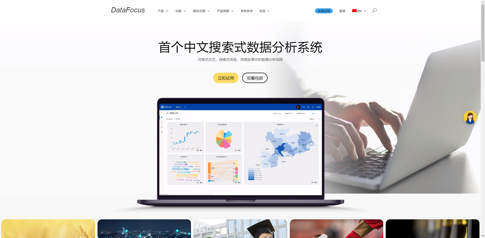

电信行业产生的数据量巨大，如何从复杂繁多的数据中挖掘可靠信息指导决策是行业的重点也是难点。另外，市场竞争大，各运营商已经从业务为中心向以服务为中心转变，为了保住和开拓客户资源，运营商需要一套商业智能系统（BI），比如DataFocus系统。从自身市场数据中获得企业运营状况的有效信息，从而更好的服务客户，增长收入。

落实到具体的DataFocus系统部署，以及贯彻执行到企业工作人员后，BI解决的问题是直观高效的：

1. 打破数据孤岛

将企业业务、财务、网管等系统数据通过BI数据仓库集中起来。可以将原本独立的“数据孤岛”通过添加关联关系进行整合，用以全局分析。

1. 智能决策方案

在DataFocus人机对话式分析，搜索即秒级响应分析的基础下，通过建立业务分析，竞争分析，营销监控，收益分析等pinboard，并整理成数据管理仓。通过图表之间的钻取联动发现影响业务的主要因素，从而及时做出正确地业务调整。

1. 了解用户情况，精准营销

BI系统可以通过分析用户属性和用户行为，进行用户管理、定位不同类型客户及用户的消费需求和习惯，分析出营销挽留活动的目标客户，为客户提供定制化的服务，优化产品、流量套餐和定价机制，实现个性化营销和服务，提升客户体验与感知，做到精准营销。还可以通过用户的信用度分析、欠费行为分析峰提前为电信企业预警，通过未接通呼叫分析、用户投诉分析等来及时处理问题，保证服务质量。

1. 优化内部人力资源管理

除了对外业务，还可以对内进行人力资源管理。人员构成分析、人员绩效考核分析，人力成本投入及回报分析来及时进行人员变动，让员工产生更高的绩效。
