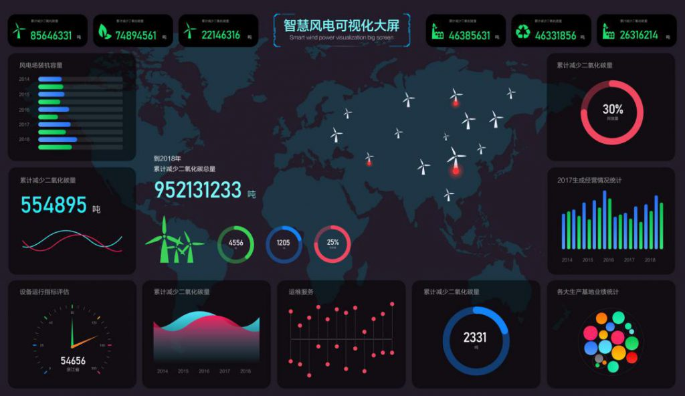

按需选择吧，首先你得自己搞明白你的需求是什么，那些BI数据可视化工具能满足你的需求。在满足需求这个基础上，你对什么因素更敏感。

**价格**

比如价格因素是你的第一考虑因素，并且具备一定的开发能力，有时间和精力，那你就可以选择开源的可视化工具。如果你是企业用，可以接受付费，那么就可以针对你的需求去调研各个产品的报价情况，排除报价高于企业BI建设项目预算的产品。

**部署速度**

产品是否能够快速部署也是很多企业考虑BI产品的一个因素，项目最终落地的时长也很重要。例如DataFocus，提供了丰富的数据接口，只需要按照指引做好配置，系统将会自动将位于不同数据库中的数据同步到一个数据仓库中，系统会根据用户的数据源自动进行数据缓存、定时更新并且生成快速索引，接下来花几个小时配置好数据关系就可以投入生产了。基于自然语言解析的数据搜索引擎降低了BI的使用门槛，无需进行长时间的培训，也不需要任何的代码基础。

**数据处理**

如果你需要处理的数据量很大，那么数据处理速度肯定也是很重要的。企业数据的增长已超过摩尔定律的惊人速度飞快增长，EXCEL和基于传统软件架构的数据分析工具无法搞笑的处理海量的数据分析任务。而事先创建CUBE的方法虽然能够缓解大数据的瓶颈，却无法快速的响应实时多变的需求。那么像DataFocus，它基于最新的大数据分析架构而设计，采用MPP方式将数十亿行数据缓存在内存中，数据的加载速度远高于传统方式。

总而言之，没有最好的产品，只有最契合的产品，还是开头那句话，按需选择。
