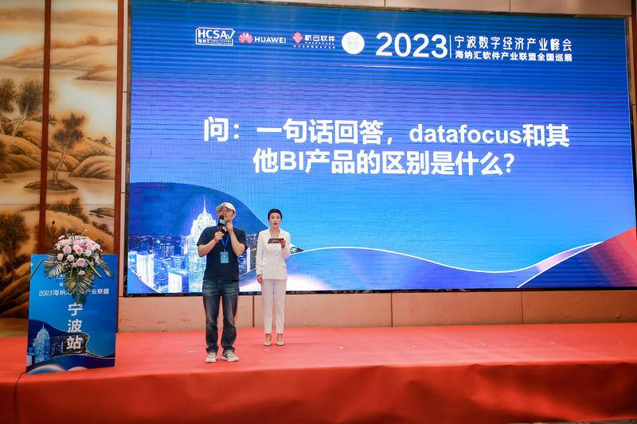

ChatGPT和Datafocus是目前市场上非常火热的两个数据分析工具，那么这两者之间有何联系呢？本文将着重探究ChatGPT和Datafocus搜索式BI这两个工具的联系及合作。

## 一、引言

随着大数据时代的到来，对于大数据的处理和分析变得越来越重要。为了更好地支持数据驱动的人工智能应用，许多企业和组织开始关注使用让数据从原始状态转化为有价值信息的工具，如ChatGPT和Datafocus搜索式BI。

ChatGPT是一款基于GPT3.5 Turbo模型API打造的AI助手，可为用户提供自然语言查询、多维度数据分析等服务；Datafocus BI则是一款全新的搜索式数据分析软件，基于现代人工智能技术，具备高效准确的数据挖掘、分析能力和可视化的数据展示功能。

## 二、ChatGPT与Datafocus搜索式BI的联系

### A. ChatGPT与Datafocus搜索式BI的共同点

首先，ChatGPT和Datafocus搜索式BI在处理数据交互方面都采用了人工智能技术，使得它们能够适应不同类型的数据，在进行数据分析时能够实现各种复杂的统计和机器学习算法。其次，两款工具都采用了自然语言处理技术，在数据分析前端提供了极大的便捷性和易用性。

### B. ChatGPT如何为Datafocus搜索式BI提供支持

ChatGPT作为AI助手，它以一种最自然的方式与人交互。用户可以使用自己熟悉的自然语言来查询、预测等指令，而无需考虑数据结构、复杂统计算法及编程细节等因素。同时，ChatGPT也提供多维度数据分析服务，能够根据用户的需求对各项数据进行可视化，并为用户提供更加详尽和全面的数据分析报告。这些特质使得ChatGPT可以成为Datafocus搜索式BI在数据分析前端的完美补充，为Datafocus搜索式BI提供稳定且强大的底层支持。

### C. Datafocus搜索式BI如何为ChatGPT提供数据分析能力

Datafocus搜索式BI的核心在于数据搜索和可视化。相比传统的BI（Business Intelligence）工具，Datafocus搜索式BI更注重用户借助搜索接口实现智能化分析，提高用户体验。通过Datafocus搜索式BI，用户可以根据自己的需求进行搜索，并直观地获取数据展示结果。此外，在数据分析方面，Datafocus搜索式BI还提供了大量数据分析算法，并采用数据可视化技术来支持复杂的机器学习模型分析。Datafocus搜索式BI可以根据用户提供的数据，通过内嵌在系统当中的算法和公式进行自动建模、特征工程以及预测等操作，并将结果反馈给ChatGPT。这样一来，ChatGPT和Datafocus搜索式BI实现了对前端筛选出来的数据自动分析处理，提高数据分析效率。

三、应用案例 为了更好地展示ChatGPT和Datafocus搜索式BI的协同效果，在本部分将以数据中心、电商平台和智慧城市三个方面为例说明它们在实际应用中的合作情况。

### A. 以数据中心为例，通过ChatGPT和Datafocus搜索式BI实现一体化搜索与分析

据调查，目前很多企业已经建造了自己的数据湖。令人头疼的是，在数据湖中寻找所需数据往往耗费了大量的时间，而且很难知道如何挖掘这些数据中的价值。引入ChatGPT可以解决这一问题，用户不需要具备专业数据库查询等相关技能，只需要简单地输入查询语句就可以完成这项工作。在数据分析方面，Datafocus搜索式BI也能够快速响应用户的搜索需求，并提供可视化分析结果，从而让客户不仅能轻松地检索和查看数据，而且能够寻找出其中所蕴含的对他们的业务有用的信息。

### B. 以电商平台为例，通过ChatGPT和Datafocus搜索式BI优化用户购物体验

在电商模式中，为了更好地服务用户，必须优化产品推荐机制。某些互联网企业采取基于推荐算法的推荐方式，因此需要对海量商品数据进行快速、准确的挖掘和处理。ChatGPT可以实现多种不同的语言交互与商品描述特征词匹配，高度智能化的广告、商品推荐算法也是其一个鲜明优点。而Datafocus搜索式BI则可以根据消费者与商品交互行为及消费历史数据的分析，为企业提供深度学习、机器学习等算法支持，并通过可视化展示直观呈现数据分析结果。两者通力合作能够更好地优化推荐模型，提高商品推荐的准确性和用户购物体验。

### C. 以智慧城市为例，通过ChatGPT和Datafocus搜索式BI统计人流量及车流量并对城市交通进行优化

在智慧城市建设中，如何利用大数据技术来实现智慧交通是一个亟待解决的问题。ChatGPT可以通过语音识别和多模态输入来收集使用者在城市交通场景下的主动反馈，比如拍照、录音等。而Datafocus搜索式BI则可以将这些采集到的数据进行自动分析处理，并根据交通运行情况给出科学的建议，例如调整信号灯时间、优化公交线路等，最终实现对城市交通的智能控制。

## 四、结论

从以上案例中不难看出，ChatGPT和Datafocus搜索式BI在各个领域的应用都呈现出良好的协同效果，其中Datafocus搜索式BI负责采集、处理和分析数据，而ChatGPT则负责数据分析前端的展示与查询，二者通力合作逐渐成为当前时代下数据分析的主流。

### A. ChatGPT与Datafocus搜索式BI合作的利弊分析

采用ChatGPT与Datafocus搜索式BI两种工具进行数据分析，可以充分体现各自的优势和特点。ChatGPT通过其强大的自然语言查询能力和可视化展示服务，帮助用户方便快捷地完成复杂的多层次数据分析，同时Datafocus搜索式BI也在数据处理方面提供全方位打包解决的方案，帮助用户在单个平台上实现数据分析的全过程。二者合作优缺点得当，将提高数据分析效率和准确度，同时也节省了大量人力物力，并达到更精细化的数据分析效果。

### B. 未来合作方向展望

未来随着技术不断进步和业务需求扩展，ChatGPT和Datafocus搜索式BI的合作将更加频繁、紧密。一方面，ChatGPT将推出更为智能化的分析功能，例如基于语义搜索的情感分析、语音识别描述等功能；另一方面，Datafocus搜索式BI也将持续拓展数据应用场景和算法能力，在数据分析效率以及领域深度挖掘等方面，不断提高其综合竞争实力。这也将为两者之间的合作带来更加广泛和深入的实践，进一步推动数据智能化和应用场景拓展。

## 五、总结

本文对ChatGPT和Datafocus搜索式BI之间的联系以及优势做了详细的分析，并针对性地提出了三个方面的应用案例，充分展现了二者之间强大的协同效应。在未来，随着人工智能技术的不断进步，ChatGPT和Datafocus搜索式BI之间的合作将越来越密切，也将在不断提升数据分析质量的同时为各行业企业带来更多的价值与发展机会。
