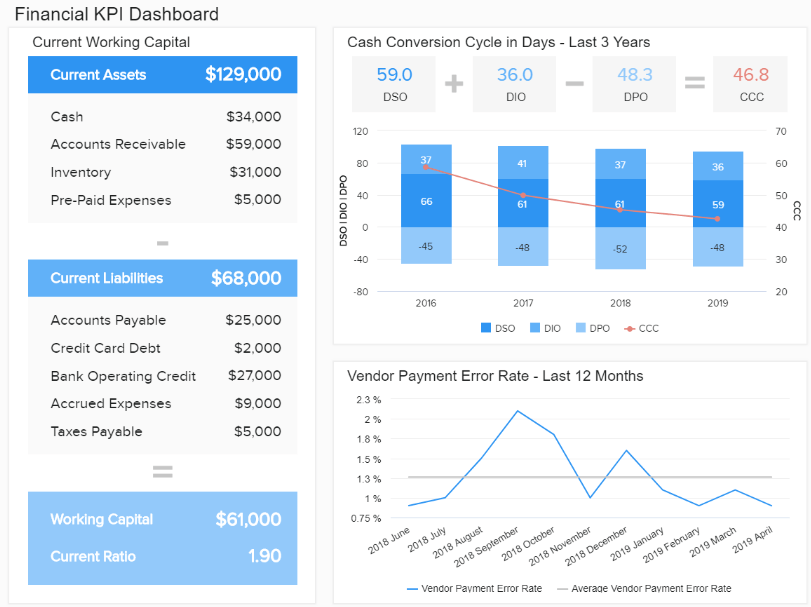

用户管理及权限管理一直是应用系统中不可缺少的一个部分。

用户和权限管理是利用互联网系统来实现对不同用户的权限的管理。权限管理，一般是指根据系统设置的安全规则或安全策略，用户可以访问而且只能访问自己被授权的资源，不多不少。

利用此系统可以对区域内各信息应用系统的权限分配和权限变更进行有效的统一化管理，实现多层次统一授权，审计各种权限的使用情况，防止信息共享后的权限滥用，规范今后的应用系统的建设。

DataFocus Cloud拥有完善的权限系统，确保系统的数据和功能可以安全地暴露给用户，真正地给用户一个安全、可靠、稳定的数据分析系统。

用户管理

DataFocus Cloud中权限依附于角色。

角色包括系统角色和自定义角色两大类，系统角色是预设好的，包括系统管理员、部门管理员、资源管理员、开发者和日志管理者5大类。自定义角色可由admin用户或者拥有资源管理员角色的用户新建。

通过为角色配置资源，可实现打包资源的目的。将自定义的角色分配给不同的用户/部门，即可实现将打包资源分配到具体用户/部门。

超级管理员（admin）可以查看完整的组织架构并进行增删改查；拥有部门管理员角色权限的用户，可以查看自身所在直接部门的组织架构，可为直接部门增删改岗位和用户。

。其中admin用户可配置任意角色给新增用户；拥有系统管理员角色权限的用户仅可配置开发者角色和自定义角色给新增用户。

组织架构包括部门、岗位、用户，部门下可以设置子部门。部门下可以增加岗位，并配置角色，为岗位配置完角色后，该岗位下所有用户即拥有该角色的权限。

不同角色都可以看到完整的用户列表。但只有拥有系统管理员角色的用户，可以对用户列表进行增删改操作。

权限管理

您可以自定义角色，设置不同的权限，便于用户权限分配。

权限分配范围包括，数据表、历史问答、数据看板、包括历史问答和数据看板的项目。

其中数据权限可精确到行列级别，实现不同的用户看到同一个表中的不同数据。数据权限包括数据表、历史问答、数据看板和项目4大类。

DataFocus Cloud具有比较完整的数据权限管理逻辑，适应于企业管理结构，具有相当的管理价值。

那么问题来了，这样一款软件在哪里可以使用呢？
