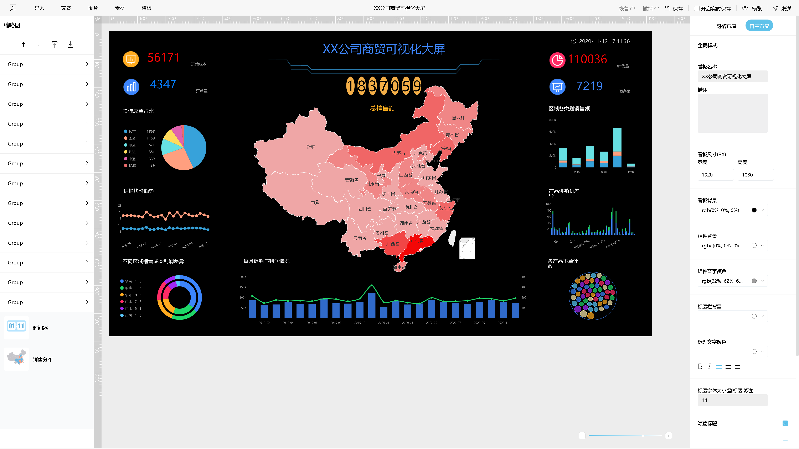
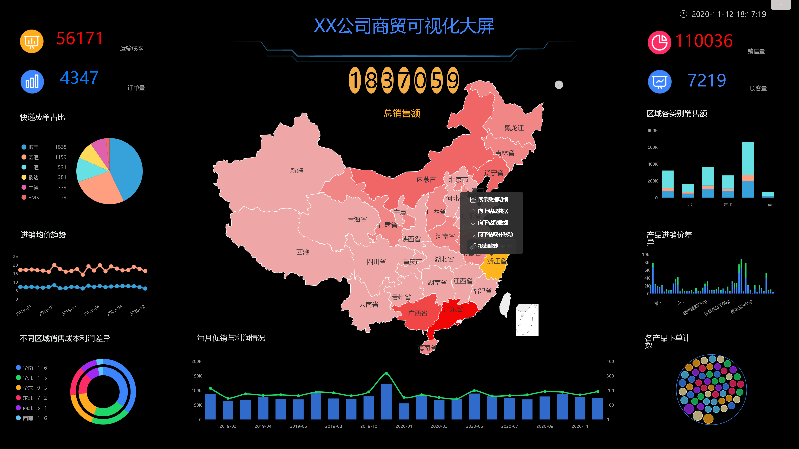

DataFocus——开启 可视化大屏 的制作

前面的文章，我们了解到如何在DataFocus系统中对Excel表中数据进行分析、制成图表并保存。那么，数据分析的结果如何汇总到一张数据看板中，即如何进行可视化大屏的制作，以用于在办公室或会议室中进行展示呢？这一章，我们来了解下数据看板的制作。

# 一 、数据看板简介

按业务场景划分，常见的数据看板有战略看板、分析看板、运营看板。用于监控数据、分析异常、团队协作等情景。看板一般具有聚焦一个商业问题、展现全貌数据的特征。制作时需注意看板中数据和信息量、看板布局、使用的图表类型等方面。

# 数据看板的制作

## 2.1 创建数据看板

在DataFocus系统中建立数据看板有3种方式：

1. 在搜索模块页面将搜索结果保存至数据看板时会看到‘创建数据看板’按钮，点击该按钮可创建一个新的数据看板。（注：添加到数据看板之前必须先保存到历史问答模块中）
2. 在数据看板汇总页面，点击“创建数据看板”按钮，选择看板模板后点击“创建”（也可不选中模板直接点击“创建”），建立一个新的数据看板。
3. 在资源管理页面，点击“创建资源”按钮下的“数据看板”，选择看板模板后点击“创建”（也可不选中模板直接点击“创建”），建立一个新的数据看板。

图表 2. 1 创建看板（数据看板界面）

图表 2. 2 看板模板的选择

## 2.2 编辑数据看板

创建新的数据看板后，则直接进入看板编辑界面。看板有网格布局和自由布局两种。

网格布局，则图表是按照规则的网格形式排列；自由布局，则是可以自由拖动图表的位置，也可以在页面右侧的样式配置中修改组件位置的坐标数据。我们以自由布局为例。

图表 2. 3 编辑数据看板

中间部分为看板显示区；数据看板右侧为样式配置区域，选中某一问答时为该问答的样式配置项，未选中任一组件时为看板全局样式配置项；左侧为看板内所有组件的图层管理。页面上方有导入历史问答图表、添加文字组件、添加多媒体组件等功能。

## 2.3 查看数据看板

编辑并保存数据看板后，即可点击“预览”进行数据看板的查看。

图表 2. 4 查看数据看板

在图表中或看板上方，可以进行联动、钻取、报表跳转等功能的操作。

图表 2. 5 图表上的部分交互功能

对DataFocus系统中将Excel数据分析的结果进行汇总查看的介绍，就简单介绍到这里，更多详细的系统操作，例如数据看板的轮播、外部查看、模板制作等功能，有待大家去发现哦~
