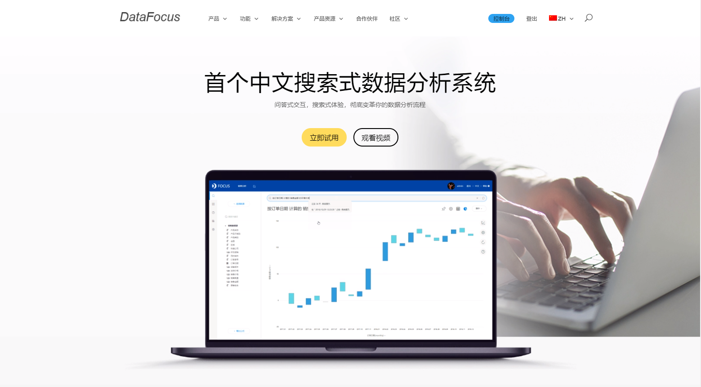

过去，企业相关的数据分析都是依靠IT人员。业务人员或者管理层将数据交给IT人员，同样的提出自己的需求，以求获取自己所希望的答案，但是由于所处的角色的不同大量，同样的数据很有可能产生的大量的需求，同样由于表述的原因可能需要重复的进行多次确认才可以达到最终的效果。有的企业则是专门招聘懂IT的数据分析人员，进行相关的数据整理和分析，但是由于没有直接和业务挂钩或者对业务的不理解，分析结果也有可能出现偏差，不能得到很好的结果。所以很多公司都希望为业务用户提供一个便捷的自助分析服务，将分析工作落实到真正有需要的人手上。但是同样的，分析工具是作为一个系统架构在企业上，需要适应企业的复杂业态，于是一个便捷的合适的自助式BI至关重要。

1、操作的便捷性

由于是分配的前方的业务人员使用，工具是否简单易用至关重要，影响到工具是否能够在企业真正的开展和使用。如果使用过于复杂，学习成本高，那么将很难在业务人员之中开展。

2、对大数据量和复杂分析的良好支撑

大多数企业都是不同的职能需要不同的系统经行管理，同样的也将产生大量的数据。由于不同的工具之间的数据不能进行有效的交互，造成数据壁垒。同样也是数据分析的大问题。

从DataFocus应用于应用于金融、电信、地产、制造、医药等多行业、多角色的案例来看，DataFocus能够经受住这样的考验，主要是因为其便捷高效的原因。

3、智能可视化操作

DataFocus 采用最新的AI 自然语言识别技术，独创的搜索式展现，极大的降低学习成本提高工作效率。搜索式展现只需要通过，简单的关键字组合进行搜索，便可以智能匹配合适的可视化图表进行展示，避免了学习复杂的sql语句。这样才能真正的交到业务人员手里。

4、多种数据格式导入

DataFocus 支持市面上的绝大多数的数据库，并支持excel,csv等表格格式数据导入，通过中间表进行表间关系的关联，从而打破数据壁垒。更好的进行数据的统筹分析。

5、大屏可视化展现

DataFocus通过搜索或者点击创建的可视化图表最终可以保存到可视化大屏上。用户可以进行可视化编辑，调整看板上面内容的位置大小配色等等，从而让数据和结果的展现更加的清晰明了。
