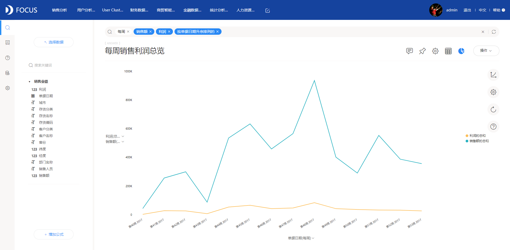

现在市面上大多的BI产品都具备了导入数据源的功能，这对企业数据导入后进行分析都非常大的帮助，能够帮助实时监控企业的数据情况，及时发现制止可能的问题。

在这篇文章中，我将借用市面上一款免费的叫DataFocus的工具，来简单介绍一下这个数据导入功能的操作步骤。为什么选用这款工具介绍呢？主要是因为这款工具使用起来比较简单，容易操作，而且可以在官网进行免费的申请试用，因此利用这款工具给大家讲解一下如何利用DataFocus工具进行数据源导入。

第一步：在数据管理页面选择数据源，点击“新建数据源”，以此创建一个新的连接，可以与企业的数据库相连；

第二步：选择连接类型并填写连接数据源的信息和选择定时导入更新的频率。DataFocus中的连接类型有postgresql、mysql、oracle、sqlserver、SAP等各类型的数据源，这在未来必将还有不断的更新迭代；

第三步：填写完数据源信息后，点击测试连接，若显示连接成功，才可继续进行下一步操作；

第四步：这里补充介绍一句，定时导入功能可以选择设置或者不设置，设置的周期也有每天、每周、每月，可以根据自己的需要选择恰当的导入周期；

第五步：测试连接完成后，点击创建，进行02步“选择需要导入的表”，左侧列表是数据库中原先存在并可以选择的表格，右侧为选择导入的表；

第六步：再选择数据表的导入方式，是选择全量还是增量。全部全量是指每次更新时都重新将所有的数据行导入；增量更新只导入数据表中新增加的行；

第七步：配置完成后点击确定，回到数据源列表，可以看到此时数据源的任务状态是“init”，进度也为0。因此选中需要进行导入的数据源，点击页面左侧的“开始”按钮；

第八步：可以看到数据源的任务状态从“init”变成“Pending”再成“Success”，则代表数据源数据导入成功。

