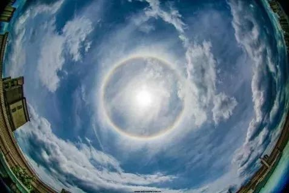

今天这篇文章想与大家分享下，初识旭日图的故事。

旭日图（Sunburst Chart）是一种进化的饼图，是现代才出现流行病进行使用的图表类型，它超越了传统的饼图和环图，能在饼图表示占比关系的基础上，增加表达了数据的层级和归属关系，能清晰的表达具有父子层次结构类型的数据。一般情况下，旭日图中离原点越近表示级别越高，相邻两层中，是内层包含外层的关系。

接下来，将对旭日图的特点进行介绍，同时讲述一下DataFocus系统中制作旭日图的特点。

1、集万千饼图于一身

同归上面这张图，可以看到太阳旁边围绕着的一圈彩色光环，这是日晕（Solar Halo）。日晕，又叫圆虹，是日光通过卷层云时，由冰晶折射或反射形成的。旭日图的样子与这种天文气象长得很像，但圆环日晕通常只有一层，而旭日图的“日晕”则可以根据数据的层次关系数量层层叠加上去。

旭日图其实简单来说就是饼图的简化版，饼图展示的数据占比情况只能是一个数字变量，但旭日图则可以展示多个数据变量，有多少数据变量就有多少个“环”，更能理清数据之间的父子层级关系。

2、一层一层剥开TA的心

旭日图中的“环”承载了大量带有层级关系的数据，层层嵌套，[环环相扣](https://www.baidu.com/s?wd=%E7%8E%AF%E7%8E%AF%E7%9B%B8%E6%89%A3&tn=24004469_oem_dg&rsv_dl=gh_pl_sl_csd" \t "_blank)，乍一看，似乎非常难懂。但其实只要多加耐心，仔细阅读，就可以发现旭日图中的规律。在旭日图中，一个圆环就是代表一个层级的分类数据，一个环块所代表的数值可以体现该数据在同层级数据中的占比。一般情况下，最内层圆环的分类级别最高，越往外，分类越细越具体。

最基础的旭日图是在树状图的基础上，把树状的层级关系转化为圆环的形式。相较于树状图，旭日图的圆形结构更节约空间。

3、DataFocus中旭日图

DataFocus系统中就可以进行旭日图的制作，如下图所示。和树形图有一定的类似，也是利用父子层次结构来清晰地表达层级和归属关系，同时能够帮助细分数据，了解该部分数据的真正构成。

