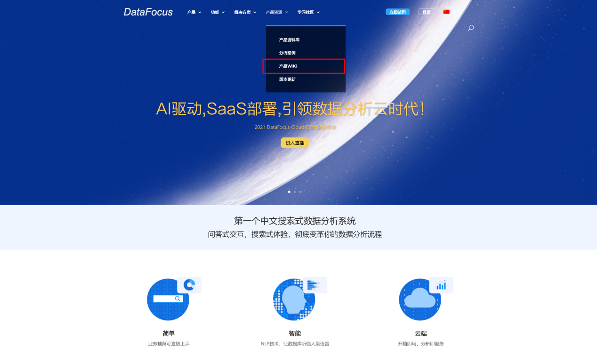

可视化大屏的联动是很重要的一个功能。具体来说就是通过选取某个过滤条件，大屏中所有与该过滤条件相关的数据都会进行相应的过滤操作。举个例子来说，一个销售可视化大屏，分别由以下五张销售相关的图表组成：

1. 销售数量排名前10的产品；
2. 销售金额排名前10的销售员；
3. 按订单日期计算的销售数量和销售额；
4. 销售额的环比；
5. 全国各地区销售额情况。

大屏的联动功能可以做到，如果我们按照地区（如上海）进行过滤，就可以得到：

1. 上海地区销售数量排名前10的产品；
2. 上海地区销售金额排名前10的销售员；
3. 上海地区按订单日期计算的销售数量和销售额；
4. 上海地区销售额的环比；
5. 全国各地区销售额情况。

也就说，全部数据图表都会根据选定的地区进行重新过滤；以此类推，如果我们选择“销售员张三”或者“产品A”进行过滤，那么每个图表也会进行对应的过滤操作。

大部分联动数据可视化产品或BI产品中，需要事先设定这样的大屏过滤条件。还有一些需要通过点击选项卡进行大屏过滤。DataFocus在产品设计之初，充分的考虑了易用性，除了其创新的搜索式分析极大的降低了数据分析的难度外，在大屏的交互上也考虑了用户的使用体验。懂设计的同学都知道fitts模型（Fitts’ Law 菲茨定律，费茨法则），这是一个由美国空军[人类工程学](https://baike.baidu.com/item/%E4%BA%BA%E7%B1%BB%E5%B7%A5%E7%A8%8B%E5%AD%A6/12714980" \t "https://baike.baidu.com/item/%E8%B4%B9%E8%8C%A8%E5%AE%9A%E5%BE%8B/_blank)部门主任的保罗·费茨（Paul M. Fitts）博士，对人类操作过程中的运动特征、运动时间、运动范围和运动准确性进行研究的基础上提出的定律，该定律指出，使用指点设备到达一个目标的时间，与当前设备位置和目标位置的距离（D）和目标大小（S），用数学公式表达为时间 T = a + b log2(D/W+1)。

尽管该法则是1954年就提出来的，但是其设计思想至今为互联网产品设计界所沿用。我们所熟知的苹果公司的Macintosh操作系统界面，均是根据这一原则来设计的。所以大部分用过苹果的人都会吐槽微软产品的设计比不上苹果。这个定律指导我们1)、设备当前位置和目标位置的距离D越长，所用时间越长；2)、目标的大小W越大，所用时间越短。

传统的大屏联动功能，需要通过鼠标选取相应的选项，鼠标点击一个较小的区域，效率较低。DataFocus在大屏的联动设计则进行了革新，用户任意点击大屏中图表的区域，比如饼图中的某个部分，或者柱状图的某个柱子，立即就会触发联动效果。这样的设计（1）、确保了用户进行联动选型的选择距离最短。用户目光所及之处，手势讲到的地方，直接触发；（2）、图表区域足够大，目标的选择非常容易。相比用鼠标区点选一个小方框，DataFocus中的任意点击某个区域，准确度显然更高。

