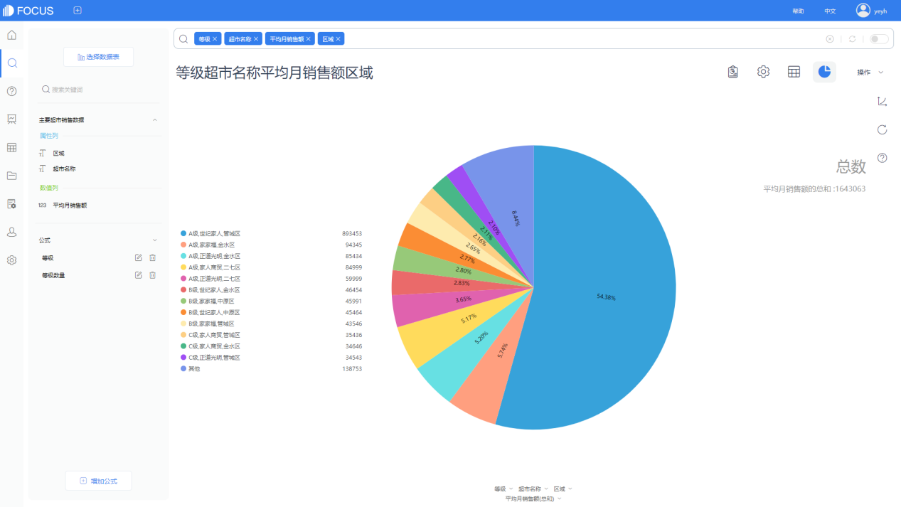

连接数据源作为对接企业数据的主要途径之一，有很高的使用频率。下面来详细介绍一下DataFocus连接数据源的操作要领。

1. 选择连接类型并填写连接数据源所需信息以及选择定时导入数据源进行更新的频率。现支持连接类型有postgresql、mysql、oracle、sqlserver、Sybase、SAP，在之后的产品迭代中将不断推出新的连接类型。

这里用postgreSQL为例，填写完数据源信息后，点击测试连接可以测试对数据库的连接情况，当跳出连接成功弹窗时，说明测试成功，就可以继续进行连接操作了。

2 点击创建进行导入表的选择，左侧列表为数据库中含有的表，右侧为选择导入的表。并可以对数据表进行行列粒度的筛选。

3 配置数据表，全量和增量是更新时导入新数据行的方式。全量更新是指每次更新时都重新自动化进行一次如上的连接新数据源操作，将所有的数据行导入；增量更新只导入数据表中增加的行。用户可以根据自身需求选择。

4 配置完成后回到数据源列表，即可选择开始导入数据，在导入成功后需要去数据列表中选择需要参与构建的数据表。

