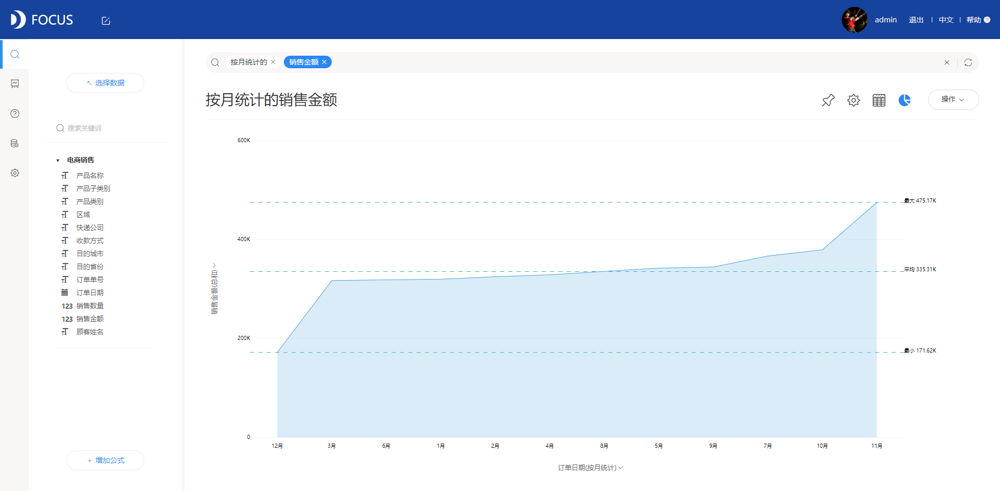
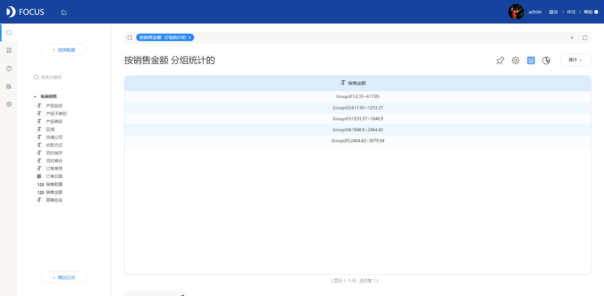
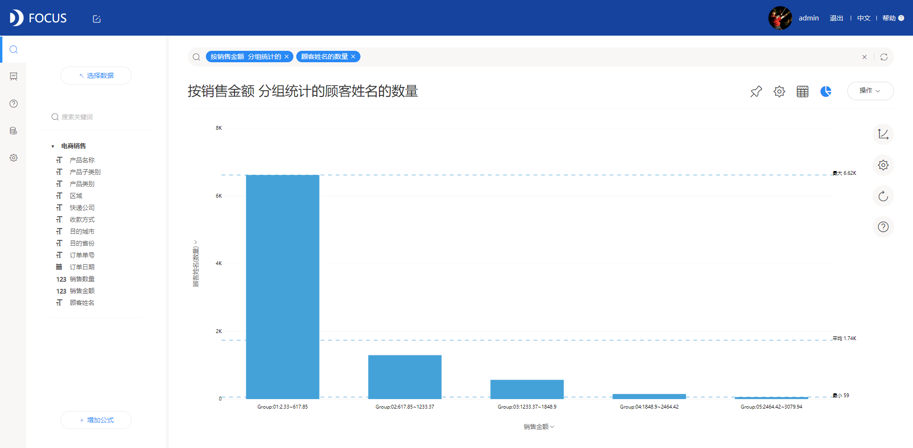
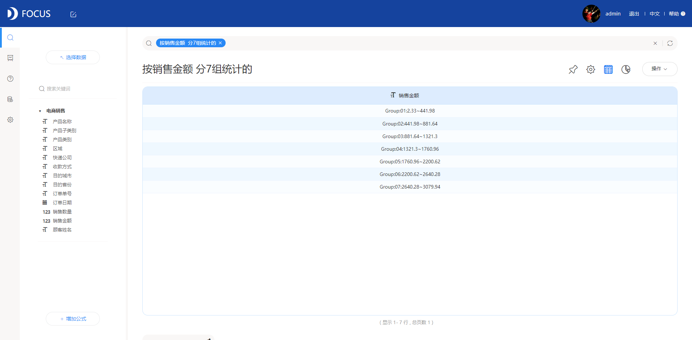

DataFocus搜索关键词之分组统计

今天来讲讲DataFocus搜索分析中分组统计的相关关键词。分组统计在我们日常的数据分析中也是经常用到的，快跟笔者一起来学习吧。

1.“按周/月/年统计”

首先是最简单的按时间统计。

例：按月统计的销售金额

2.按XXX 分组统计的（分段统计、划分统计的）

按XXX分组统计的是指将Measure默认按五组进行划分

例：按销售金额分组统计的

1. 按XXX 分组统计的（分段统计、划分统计的）XX的数量（去重后的数量）

按XXX分组统计的XX的数量是指将Measure默认按五组进行划分并统计在每个分组内XX的数量（去重后的数量）

例：按销售金额 分组统计的顾客姓名的数量

1. 按XXX分n组统计的(个段统计的)

按XXX分n组统计的是指将Measure列按设定的n个组进行划分

例：按销售金额分7组统计的

5.按XXX分n组统计的(个段统计的)XX的数量（去重后的数量）

按XXX分n组统计的XX的数量是指将Measure列按n组进行划分并统计在每个分组内XX的数量（去重后的数量）

例：按销售金额分7组统计的顾客姓名的数量

6.按XXX分n组间隔为m统计的 (步长为m统计的)

按XXX分n组间隔为n统计的是指将Measure列按设定的n个组，并且每组间隔为m进行划分

例：按销售金额分7组间隔为500统计的

1. 按XXX分n个组间隔为m统计的 (步长为m统计的)XX的数量（去重后的数量）

按XXX分n个组间隔为n统计的是指将Measure列按设定的n个组，并且每组间隔为m进行划分，并统计在每个分组内XX的数量（去重后的数量）

例：按销售金额分7组间隔为500统计的目的省份的去重后的数量

这么多分组统计的关键词是你需要的吗？如果有另外需求的统计情况的话，记得留言交流哦！
