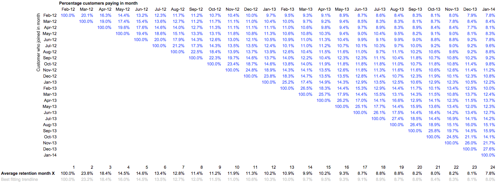
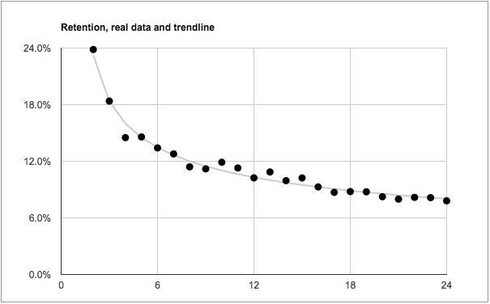

在这个大数据时代，越来越多的企业开始使用数据分析辅助决策，以让决策更加的精准和高效。而这样的理念有很多方法可以进行落地，比如聘请一些专业的数据分析师或组建数据分析团队专门做数据分析，也有使用一些智能BI工具如DataFocus、Power BI等等。但万变不离其宗，所有的底层逻辑一定是精确的算法或模型。这里我们为大家介绍同期群分析法。

 同期群分析指的是按照用户初始行为时间对客户划分群组，这个群组即为同期群，通过对一个群组的客户行为进行追踪观察，从而对客户行为进行预测，用以下图片进行简单介绍。

 通过横向分析，我们可以知道用户的留存情况。留存行为可以是下单行为、付款行为甚至是互动行为，如一月份引进的新客在未来几个月里是否有相应行为，通过几个月数据的观察得出规律，那么可以推测出客户的未来流失概率。具体操作如下图所示，通过第2个月至第24个月的用户留存曲线，拟合出相应的函数曲线，从而预测出第25个月的用户留存率。

通过纵向分析，我们可以知道商家提高客户留存方式的是否有效，如更换产品、服务质量、营销手段等。例如一月份引进的新客在二月份的留存率为10%，在二月份的引进的新客在三月份的留存率为15%，说明商家二月份对提高客户留存率的方式效率更高。

这就是同期群分析法，而DataFocus更可自定义公式，以让用户更好的进行数据分析。
