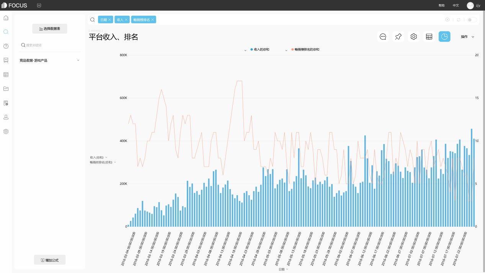

在日常工作中我们常常需要制作一些报告用来向领导进行汇报或者先投资方展示公司业务的价值以获得融资等等，将经营数据直观的转化为通俗易懂的数据可视化图表无疑是最高效的方法，但如何制作一个优美而高效的报告是一种需要磨砺的技巧，接下来我们将工作中总结出来一些干货经验分享给大家，希望可以有所帮助。

文中可视化图表均有DataFocus数据分析工具制作。

1.标题和文本注释

当我们完成图表的数据可视化统计和组合布局之后，并不意味着已经完成了我们的数据分析报告，如果只是几个图表的组合拼接成的一个仪表板，可能会让用户难以阅读和理解。由于数据可视化分析报告的可读性至关重要，所以我们需要使用简短有力的标题和文本，以最少的字数传达最有价值的观点、信息或故事。

通过标题和文本注释结合可视化来对数据进行讲述，突出显示具体见解，提供其他背景信息，将所有这些元素整合到一个顺畅的演示中。通过这些故事点让人们能够以更加有序的方式，深入探索每个可视化中的指标和见解。优秀的可视化作品不但可以帮助您更好地理解自己的数据，还可以更快地提供更有意义的见解，甚至启发其他人提出和回答新问题。

2.不要重复相同业务意义的表达

对同样维度和指标的数据可视化呈现形式有多种多样，但是注意不要在同一仪表板中重复相同业务意义的表达。例如我们统计每个地区销售额的占比分布情况，可以使用折线图、也可以用柱状图、饼图来进行展现，但是此时我们只需要选择最佳的表达方式（饼图）进行呈现即可。

3.钻取分析多层级数据

对于一些有树层级关系的数据，在DataFocus中可以通过数据层层钻取或者树状图/旭日图的形式进行呈现。通过数据钻取的形式，让用户在做数据穿透分析时更加方便灵活，同时节约常规仪表板多个维度分析所要占用的额外区域。

4.联动分析，替代控件过滤

在用户阅读整体的数据可视化报告时，直接通过同一数据看板中的图表和图表之间的联动关系来代替控件过滤，往往能够更进一步增强仪表板的引导式分析，让用户进行更加快捷和灵活的数据联动分析。

5.消除杂乱

DataFocus数据看板有丰富得多控件和交互支持，允许用户在看板中加入大量元素，但信息过多布局混乱的数据看板往往会反向阻碍用户的信息感知，尤其是对数据并不敏感的一般用户，这样就是南辕北辙了。在制作看板的时候，分析清楚看板的目的，保留你想让用户看到的数据，并按照合理的主次分层展示给用户，会去的更好的效果。

6.多维分析，防止一叶障目

我们每天遵循的习惯可能会隐藏数据背后潜在的价值，所以我们需要多尝试从看表格数字思考转换到看图形感知分析，勇于改变现状。在对数据进行探索分析思考时，要善于从不同角度去进行可视化分析，完善数据全貌，这样才能发掘数据背后的巨大价值。落实到具体的数据工作中，作为数据人，我们除了分析日常业务提出来的问题之外，还需要学会积极去处理未预见的问题，时刻保持对数据的怀疑态度，练就自己在探索数据业务问题时的前瞻性。
