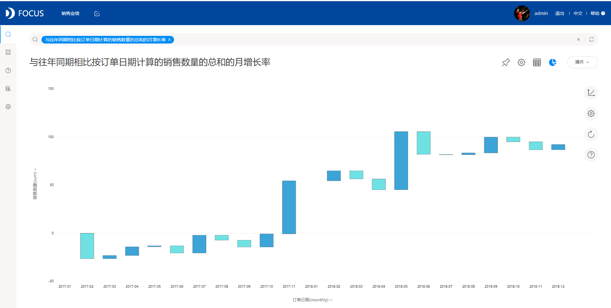

这是个好问题。使用过DataFocus的朋友有时候会觉得，进行数据分析时，输入框的交互时更类似于谷歌、百度这种搜索引擎的关键词方式。一开始一些不清楚如何使用的朋友会直接像与人对话的方式进行问题的输入，比如：请告诉我去年小张的销售业绩情况，这个沈阳分公司总共有多少人--我说的时搞销售的人有几个。。。。。，这些问题直接导致DataFocus懵逼。于是就有些朋友说：你们宣传的自然语言，我这说的时自然语言啊，为啥听不懂呢？你们虚假宣传吧？

稍安勿躁，一切都要从人工智能和自然语言处理的最初说起。人工智能现在很火爆，大家都知道siri、小冰、小娜这些机器人，也有与这些虚拟人物对话的经历。很多人都在微信中聊过小冰，大部分时候，她的表现都很优秀，显得很机智，偶尔还会给你抖抖机灵。但是当你逗过一段时间之后，慢慢会觉得索然无味。从闲聊的角度，虽然她的回答看起来很人类，也充满趣味，但总感觉有点不对劲，有的时候表现得太聪明，压根儿就不像个人类；另一方面，一旦你开始和她正经交流，希望向她咨询问题的时候，希望探讨一个想法的时候，她的反应要么是傻傻不知道，要么是瞎乱调侃一通---这完全取决于你的谈话风格。

为什么会这样呢？这还要从这类人工智能产品的实现原理去分析。大量的聊天机器人都是通过海量的对话语料库进行强化训练而来，这个训练浅显的说就是对大量真实的人类对话进行分类，然后标记出不同的场景、人物画像，比如年龄，性别，性格等等。然后你第一次开始聊天的时候，他会通过几个问题将你归类成比如无知少女、世故的大叔等等，然后根据这个分类去语料库中寻找对应的回答来回应你。可想而知，这类机器人的功能也就限于闲聊，价值并不大。

DataFocus是一款闲聊机器人吗？显然不是。DataFocus的目标是回答用户关于数据的问题，这都是严肃的交互，用户是希望得到准确的答案的，因此准确的答案，高效的交互才是终极目标。大家都知道，著名的图灵先生提出过一个检验人工智能的方法，那就是让人和机器对话交流，如果人类不能判断交流对象是机器的话，那么这个人工智能就达到了人类的程度。虽然这种判断标准非常粗陋。但是多年以来，没有多少工程师能做到。关键原因就是自然语言对于机器来说太过于复杂，人类的语言表达方式，其复杂程度甚至远远要超过围棋、自动驾驶这类问题的难度。语言虽然有语法，但是确灵活多变，有的时候毫无规则可言。就拿上面的例子来说，一个人要问个问题：请告诉我去年小张的销售业绩情况，这句话的表达方式可以有很多种，如果结合上下文语句，那几乎就无法穷尽。

我们不可能像小冰一样去收集海量的关于数据的问题的语料，更何况这类问题与场景直接相关，上下文的关联程度要比闲聊大得多，要训练出小冰这种效果几乎是不可能的事情。

让我们专注于问题。人们使用DataFocus的目的是要快速的进行数据查询和分析，只要在有限的规范下达到这个效果就是最优的方案。因此DataFocus的设计进行了折衷，他类似于谷歌的关键词输入方法，但是又有一定的规范限制，并且这些规范又扩展了搜索框对特定数据问题的理解能力。如果你静下心来花个30分钟习惯了其搜索使用方法之后，你会发现牺牲一定的灵活性，得到的是高得多的效率，并且你总可以得到正确的答案，这才是一个工业级产品应该有的结果！
