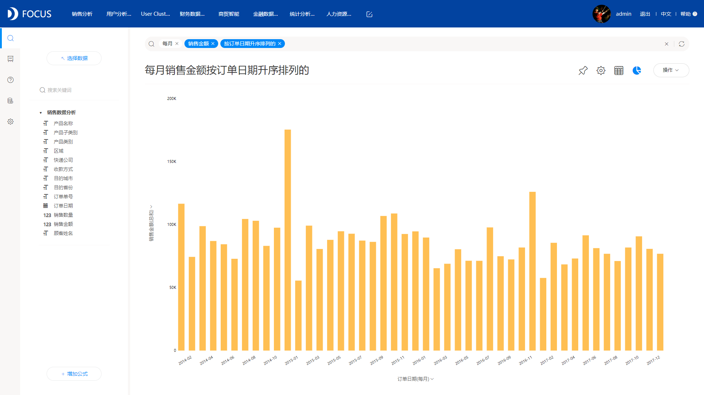

 

在产品需求的调研中，我们发现了这样一个普遍现象：

某公司是一家跨国企业某区的总部，下辖十几家子公司。总部资管部要求各个子公司每月编报资金滚动，每月总部人员都需要对报表做汇总做出分析，然后将数据分发给各个子公司。子公司将总部发来的数据表复制粘贴进新报表，再填写当月的更新数据。如此往复，总部人员每月都需要收集各公司发来的几十封邮件，下载附件中的excel工作簿，再从每个工作簿的十几张工作表中找到更新数据复制粘贴到相应的汇总表找那个进行汇总分析处理。为了不错关键数据，从汇总到审核，整个过程搞得精疲力竭还很容易出现错误。

针对这种工作状况，DataFocus设计了多表关联功能来实现跨数据表的高效汇总，大幅提升数据分析工作的效率和精度。

通过在数据管理列表中创建表关系视图，来构建表间的关联关系（如图1所示）。建构完成后就可以在搜索界面直接进行跨表查询，无须再重建新数据表以满足汇总分析的需求。DataFocus仅需要简单的三步选择即可完成，无需任何编程。

图1

在关联关系设置中，通过先选择维度表，再表关联的连接类型（内连接、左连接及右连接）和筛选条件，最后匹配源表与维度表中的关联列字段，就可以完成对关联关系的设置。还可以通过点击源列下方的‘＋’按钮增加新的源列及目标列的输入框。不过要注意一下，在创建表关联关系的时候，表关联不能出现回路和闭环。

关联关系创建完毕，会在表关联关系信息中显示出这样一个关系视图（如图2所示），直观的让用户看到该表是如何与其他数据表关联的。

 图2

接下来，给大家解释下设计中出现的三中连接类型，我们通过两个简单的假设数据来进行演示。

一、内连接

内连接只返回源表和维度表关于“客户ID”相互匹配的行，其余部分全部为空。

二、左连接

左连接包含源表所有行，如果源表中某行在维度表没有匹配，则汇总表中对应维度表的部分全部为空。

三、右连接

右连接包含维度表所有行，如果维度表中某行在源表没有匹配，则汇总表中对应源表的部分全部为空。

DataFocus能够同时支持多个数据表进行一对一和一对多的关联，还可以通过筛选条件进行更灵活的关联。
