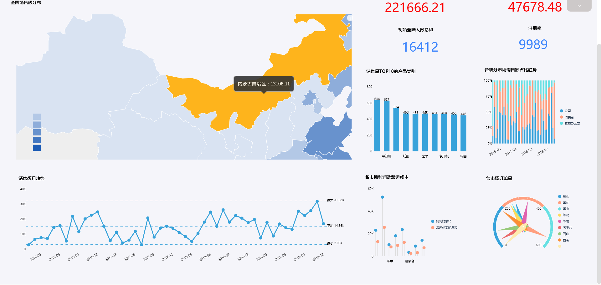

## 如何用DataFocus对Excel表中数据进行处理？

对Excel表中数据的处理，除了之前介绍过的“处理重复数据”、“处理缺失数据”、“数据转换”，还会涉及“数据抽取”、“数据分组”、“数据计算”等方面。今天，我们将继续介绍，如何在DataFocus系统中处理Excel表的数据。

## 一、导入Excel数据表

在用DataFocus系统处理数据之前，需要先将本地Excel数据表导入到系统中。大致流程如下：

1. 数据表管理模块的“导入表”栏下选择导入本地文件（或资源管理功能模块中点击“创建资源”按钮）。
2. 选定“EXCEL”文件类型，并在选择本地文件后点击“上传“。
3. 上传成功后的 Excel表配置信息界面，可以选择导入的列、重新命名表名及列名、修改列类型等等，配置完成确认无误后点击“确定”完成上传。

## 二、数据处理

### 2.1 数据抽取

数据抽取，将表中某些字段的部分信息抽取出来，组合成新的字段的过程。包括将某一字段的部分信息截取出来；将某几个字段合并为一个新字段；给数据源表中没有的字段匹配新的字段。

#### 2.1.1列拆分与公式抽取

在数据源表中 ，若多项数据显示于同一单元格中，则需要采用分列的方法抽取新字段。分类抽取的源数据，需要具有一定的发生规律，如使用同一种间隔符号间隔，或者字符串位置相同。

若数据间使用同一种间隔符号间隔，可以在DataFocus系统中，直接使用“列拆分”功能，根据间隔符号进行数据的拆分。具体操作如下：

A、进入DataFocus的搜索模块，选择数据源表，并采用双击或搜索框输入列名的方式，选择出需要按照特定分隔符进行拆分的列。

B、点击右上角的操作下拉框，找到“数据转换”。

C、在数据转换设置界面，数据转换类型选择“列拆分”，并选择拆分的属性列、设置拆分列数、拆列分隔符，再点击下一步。

D、定义分列后的各列名称，点击确定即分列完成。

图表2. 1 列拆分

若数据中所需抽取的字符串位置相同，则可以使用公式进行字符串的抽取。

在系统的搜索模块，选择数据源表后，可以直接在搜索框中使用公式，也可以在左下角的“增加公式”中制作公式列。

例如图表2. 2，获取“姓名”列中每个人的姓氏时，若所有人都是单姓，没有复姓，可以直接使用公式“substr”获取“姓名”列中第一个字符串。

图表2. 2 字符串抽取

#### 2.1.2 合并得到新字段

在日常工作中 ，有时需要将多列信息合并到一列中。此时可以使用DataFocus系统中的“concat”公式来实现。

在系统的搜索模块，选择数据源表并进入“增加公式”界面，进行公式concat的编辑并保存为公式列。双击或在搜索框输入该公式的列名，即可完成对列信息的合并与查看。

公式的使用方式，可参考公式编辑界面的“公式辅助”。在鼠标滑动到公式上方时，会看到该公式的使用样例，如图2.3。

concat公式是对字符串的连接操作，若需将其它类型的字段进行连接，可以使用转换公式进行数据类型的转换。

图表2. 3 concat公式

#### 2.1.3 用公式返回值抽取新数据

我们需要的字段有时候不能从数据源表字段中直接提取，而是需要通过计算得到。这时，在DataFocus系统中，可以通过公式来实现。

如图表2.4，一份员工的业绩数据表，想要依据员工的业绩计算出提成金额，并成为源表数据的一部分。计算规则：当业绩小于3000时，提成率为5%；当业绩在3000到8000之间时，提成率为8%；当业绩在8000以上时，提成率为12%。

图表2.4 源数据

在DataFocus系统的搜索模块，选择数据源表后，点击下方的“增加公式”，使用公式“if...then...else”进行计算并保存为公式列。

图表2.5 制作公式列

对于需要保存的数据列，双击或在搜索框中输入列名，并在搜索栏下选择“保存为中间表”，即可将当前展示的数据以数据表形式保存到系统中，并用于今后的数据分析。

图表2.6 以数据表形式保持到系统

### 2.2 数据分组与计算

在DataFocus系统中，可以直接使用分组关键词对数值列进行分组统计。例如上面提到的员工业绩数据表，根据业绩分组并统计每组员工人数。

如图2.7 ，在系统的搜索模块，选择数据源表后，搜索框中直接输入“按业绩分3组间隔为1000统计的”“姓名的数量”，即完成对“业绩”列按间隔为1000分2组（剩余部分自动归为“其他”），并统计出各组员工人数。

图表2.7 分组统计

在DataFocus系统中 ，对于数据的计算，可以使用公式来实现。公式的使用方式同上，通过“增加公式”窗口制作公式列，或直接在搜索框中进行公式的使用。

## 三、文末

DataFocus系统中的公式，包括聚合公式、分析公式、日期公式、混合函数、数字函数、逻辑操作符、文本操作函数等，所以对于Excel表中数据的抽取、分组、计算等处理，都可以使用公式来实现。
