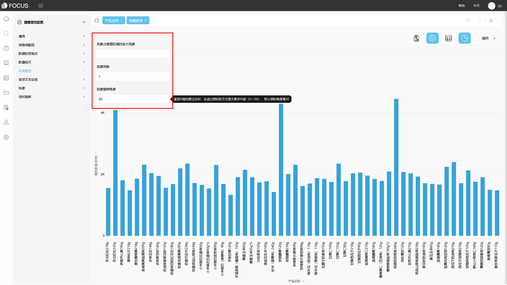

**目的：**通过对乳腺癌患者死亡率的研究，找出乳腺癌的病理特征，以期提高远期生存率。

**摘要：**乳腺癌是女性最常见的恶性肿瘤，外科治疗历史久远。在各种恶性肿瘤中，乳腺癌是疗效比较好的一种，然而总的生存率仍然不能令人满意，以早期发现，早期治疗为好。通过此次数据分析，可以发现乳腺癌的手术存活率达到了86.58%；乳腺癌患者的患病天数与死亡率没有明显的相关性；乳腺癌是一种在女性身上发病率较高的特殊癌症且其不容易发生远处转移；乳腺癌的组织学类型占比较大的中低分化，而在中分化中，最常见的是同侧腋淋巴结转移；而与患者的死亡率存在较大的关系的是肿瘤大小及浸润范围，存在同侧腋淋巴结转移的中分化肿瘤，其肿瘤大小及浸润范围较大的女性则较容易出现死亡。

**关键词：**乳腺癌,死亡率,病理特征,浸润范围

一、案例背景

乳腺癌是女性最常见的恶性肿瘤之一，近年来我国乳腺癌的发病率呈迅速上升的趋势，在女性各肿瘤中居首位。由于乳腺癌的病因尚比明确，早期诊断和早期综合治疗是防治乳腺癌的最有效手段。

此次案例分析的数据是来自TCGA数据库的乳腺癌患者术后情况，包括患者的性别，年龄，术后患者的状态，肿瘤的组织学分型，肿瘤转移情况，肿瘤复发情况，患病天数等，通过对乳腺癌患者死亡率的研究，找出乳腺癌的特征，以期提高远期生存率。

二、案例问题

乳腺癌是女性最常见的恶性肿瘤之一，因此也会受到广大女性的关注和高度重视，因此研究乳腺癌患者死亡的规律，并提高患者的生存能力就成了非常迫切的需求。但由于乳腺癌病例的数据量非常庞大，数据更新很快，用EXCEL来进行操作会略显麻烦，使用Datafocus产品就可以快速处理大量数据，分析的准确性也高。

三、案例分析

（一）综合分析

1.手术存活率

首先计算所有乳腺癌病例的存活率与死亡率。通过饼图，观察乳腺癌通过外科手术治疗后所能达到的生存率。

图1 乳腺癌手术死亡与存活情况

乳腺癌虽然作为困扰女性的恶性肿瘤之一，但其通过手术治疗所能达到的存活率与其他癌症比较仍高出很多。从图中可以观察到，乳腺癌的术后存活率达到了86.58%，死亡率仅占13.42%，也就是在此次案例中，有910名患者通过手术成功生存。

2.患病天数对比

其次对乳腺癌病例的患病天数进行研究，通过对比存活和死亡的患者的患病天数，观察患病天数对患者死亡的影响。

图2 存活与死亡患者的患病天数对比

从上图可以看出，不是患者患病天数越长，死亡的概率就越大。患者的患病天数与死亡率没有明显的相关性，但根据临床试验的结果，仍然是尽早发现，尽早治疗。

（二）乳腺癌的病理特征

1.男女性别分布

虽然乳腺癌对女性的影响相当大，但根据此次数据发现，男性也有一定的概率患病。

图3 死亡患者中的男女性分布情况

从上图可以观察到，在死亡的所有患者中，女性患者高达140人，但有趣的是，死亡的患者中居然有1名男性。

2.肿瘤转移情况

此次研究还是主要围绕着死亡的女性患者展开，因此对死亡的女性患者的肿瘤基本情况进行研究。通过折线图观察不同类型的肿瘤转移情况的死亡人数。

图4 死亡女性患者的肿瘤转移情况

从图中可以观察到，在所有死亡的女性患者中，肿瘤无远处转移的患者占据最大部分。也就是说，乳腺癌本身较不容易发生远处转移，但仍有发生远处转移的概率。

3.组织学类型

接下来对无远处转移的死亡女性患者的肿瘤组织学类型进行研究。

图5 死亡女性患者的肿瘤组织学类型分布

从图中可以看出，无远处转移的肿瘤类型种，乳腺癌的组织学类型占比较大的是中低分化而非高分化，这也为乳腺癌的高生存率提供了部分解释。

4.局部淋巴情况

同样的，对中分化的肿瘤类型的局部淋巴结进行观察。

图6 死亡女性患者的局部淋巴情况

从图中可以观察到，在中分化的肿瘤中，最常见的是同侧腋淋巴结转移。

5.肿瘤大小及浸润情况

最后，对肿瘤的大小及浸润情况进行统计。

图7 死亡女性患者的肿瘤大小及浸润范围情况

从图中可以看出，患者的死亡率与肿瘤大小及浸润情况存在较大的关系。在女性死亡患者中，存在同侧腋淋巴结转移的中分化肿瘤，其肿瘤大小仅存在两种可能，分别是肿瘤浸润范围的最大直径是0.1cm-2.0cm和2.0cm-5.0cm，其中占据大部分的肿瘤浸润范围是最大直径在2.0cm到5.0cm之间的。

（三）数据看板

最后将这7个结果图导入“乳腺癌手术预后情况”数据看板中，为了使数据看板更为美观，在全局样式中选择第三个预设样本，选择“自由布局”。操作结果如下：

图8 数据看板

四、结论

综上所述，乳腺癌作为一种恶性肿瘤，相较其他恶性肿瘤存在较高的手术存活率，达到了86.58%，也就是在此次案例中，有910名患者通过手术成功生存。通过此次研究还发现乳腺癌患者的患病天数与死亡率没有明显的相关性。

接下来对所有死亡的患者进行了一系列的病理研究，观察乳腺癌的病理特征。通过对死亡患者的性别研究，可以发现乳腺癌是一种在女性身上发病率较高的特殊癌症；虽有发生远处转移的概率，但乳腺癌较不容易发生远处转移；乳腺癌的组织学类型占比较大的中低分化；在中分化的乳腺癌中，最常见的是同侧腋淋巴结转移；而与患者的死亡率存在较大的关系的是肿瘤大小及浸润范围，在女性死亡患者中，存在同侧腋淋巴结转移的中分化肿瘤，其肿瘤大小仅存在两种可能，分别是肿瘤浸润范围的最大直径是0.1cm-2.0cm和2.0cm-5.0cm，其中占据大部分的肿瘤浸润范围是最大直径在2.0cm到5.0cm之间的。

五、对策建议

1、建议女性定期进行身体检查，预防各类疾病。一旦发现，一定要尽快治疗；

2、如果发现自己患有乳腺癌，一定要及时治疗，尽力配合医生手术，因为乳腺癌的手术存活率还是非常高的。
