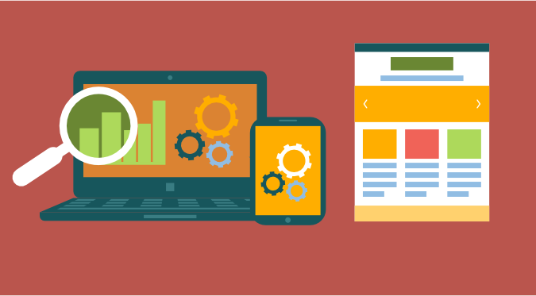

结论是：数据是巨大的，商业智能 (BI) 和[数据可视化工具](https://www.datafocus.ai/infos/data-visualization-tools)将继续存在。各种规模的组织现在都能够轻松连接到他们的各种数据源、交互并理解他们的数据，并共享他们的分析。随着 BI 市场的成熟，企业意识到他们需要能够处理各种分析类型的强大工具。就像有各种[仪表板类型](https://www.datafocus.ai/infos/strategic-operational-analytical-tactical-dashboards)和[不同的数据可视化类型一样](https://www.datafocus.ai/infos/how-to-choose-the-right-data-visualization-types)讲述不同的数据故事，数据报告和分析有多种意图。有两个总体业务智能桶可以帮助确定要构建哪种类型的数据报告：数据探索报告和数据呈现报告。让我们更深入地研究它们，并展示两者之间不同的数据可视化技术。

## 数据探索和数据发现

数据探索或数据发现是[商业智能软件](https://www.datafocus.ai/infos/best-bi-tools-software-review-list)的主要业务。这些探索工具有助于确保用户将高质量的实时数据带入他们的分析中。然后，该软件将这些不同的数据源混合在一起。这种对业务数据的轻松访问允许广泛的用户执行分析并获得以前难以获得的洞察力，即使是数据科学家也是如此。这是这些工具和分析是成功的关键。

数据发现是数据分析的第一步。在企业做出数据驱动的决策之前，他们需要了解数据。正如谷歌大图可视化研究小组的联合负责人 Martin Wattenberg 最近在推特上所说，“可视化不会增加洞察力，它会成倍增长。如果您一开始就对数据一无所知，那么可视化将无济于事。”

理解数据的第一步是确保数据为 探索做好了适当的准备。幸运的是，商业智能可以完成很多这样的繁重工作。数据发现通常包括汇总数据集的主要特征。这是准确数据分析的关键。在进行正式的数据分析之前，数据探索者必须知道数据集中有多少案例、包含哪些变量、有多少缺失的观察结果以及数据可能支持的一般假设。如果没有对数据库的初步探索，分析师和数据可视化工具用户将无法指导他们的分析。更糟糕的是，他们最终可能会提供误导性的数据和见解。

[数据可视化软件](https://www.datafocus.ai/infos/data-visualization-tools)对于探索性数据分析 (EDA) 来说非常强大，因为它允许用户快速简单地查看其数据集的大部分相关特征。数据探索技术使用户能够轻松识别可能具有有趣观察结果的变量。通过以可视化/图形化方式显示数据，用户可以快速可视化两个或多个变量是否相关，并确定它们是否适合进一步深入分析。[基于云的 BI 软件](https://www.datafocus.ai/infos/cloud-bi)允许不同的用户与相同的数据进行协作和交互，从而将各种主题问题专家 (SME) 带到同一张桌子上。然后，这些代理分析师可以使用数据探索技术进行正式数据分析，从而继续利用挖掘出的见解。

## 数据展示和数据讲故事

由于其独特的用例、目标和受众需求，数据展示属于不同的类别。数据展示是商业智能的[数据讲故事](https://www.datafocus.ai/infos/dashboard-storytelling-with-kpis-presentation-examples)方面。这就是分析师成为数据记者的地方。探索是业务分析的关键步骤。然而，作为数字营销布道者Avinash Kaushik 在他的7 个数据演示技巧中指出，“实际输出几乎是推动我们希望在我们的组织中发生的变化的唯一原因。这就是看重数据的企业与基于可理解的洞察力影响行动的企业之间的区别。” 如果没有正确的数据展示，数据发现和分析的结果就会失去意义。

虽然数据可视化技术对于探索很重要，但它们对于演示同样重要。一个良好可视化、格式化、设计和简单的数据表示非常强大。数据展示的目标受众通常不是探索和分析阶段的一部分。数据展示技术需要专注于提供适当数量的背景，并提出可操作的见解。为了进一步区分探索和展示，让我们深入探讨一下主要区别！

## 数据探索和数据呈现之间的 5 个主要区别

**1\. 目标受众**

对于探索，主要受众通常是数据分析师——即使使用新的 BI 工具，任何人都可以充当分析师。这些 BI 工具用户既在操作数据，也可以将结果可视化。分析师在定义假设、分析数据和可视化结果的紧密反馈循环中工作。

对于数据展示，受众是一组单独的终端用户群体，通常不是最初的数据探索者或分析师。这些终端用户通常缺乏分析能力，并且通常处于业务决策的最前沿。没有明确的方向，他们很难将分析与对他们工作的影响联系起来。

在指导您的分析及其呈现方式时，请务必牢记您的目标受众和目的。

**2\. 分析消息**

数据发现是关于在数据中查找消息的过程。探险家（分析员）正试图拼凑拼图的各个部分。它通常是关于数据的旅程，应该被视为一次寻宝。

数据展现是分享通过数据发现过程挖掘出来的宝藏。然后将这些消息呈现给可以对洞察采取行动的目标受众。数据展示的作者需要带着目的和观点引导观众浏览内容。

**3\. 解释的深度**

我想你已经开始明白这里的意思了，但是数据探索和展示应该用不同的方式来处理。两者提供的解释深度没有什么不同。

通过数据发现，分析的意义对分析师来说是不言而喻的。重要业务[关键绩效指标 (KPI)](https://www.datafocus.ai/infos/kpi-examples-and-templates)的重大变化将需要采取行动。分析师的重要任务是回答为什么会发生这种情况。

数据展示者需要解释分析结果并提供可能的解决方案。在向观众展示数据时，解释潜在数据可以让观众对研究结果充满信心。虽然可视化数据仍然是数据展示的关键，但解释深度的增加通常意味着数据展示中提供的文本比探索中提供的文本更多。

**4\. 最佳可视化、格式和交互能力**

正如我们刚才提到的，数据可视化是数据发现和数据展示的关键。也就是说，两者之间的数据可视化技术通常是不同的。

对于数据发现，可视化需要易于创建，并且通常可以显示多个维度以挖掘复杂模式。因此，数据发现最好通过实时业务分析报告和[仪表板软件](https://www.datafocus.ai/infos/best-dashboard-software-features)来完成。这些仪表板允许更轻松地协作和跟踪趋势和异常值。这些仪表板的交互功能允许持续发现。设计应该专注于最佳可视化，并保持简单，尽可能减少文本。

对于数据表示来说，重要的是可视化要简单直观。观众通常没有时间或需要破译图表的含义。数据展示是引导式的讲故事，具有引人入胜的视觉效果和深思熟虑的文字描述。这些演示文稿应轻松导出为 PDF 文件，以便于传播。由于这些演示文稿通常在组织外部共享，因此设计计划应包括适当的品牌：标志、颜色、字体等。确保你通过一个集中的数据故事引导观众。使用新的 BI 软件，很容易被诱惑投入每一个可能的数据可视化。越简单越好。确保您选择了最适合您的信息。

**5\. 最终目标**

数据探索的目标通常是提出更好的问题。这是一个寻找更好问题的迭代过程，以不断获得新见解，并更好地了解您的组织的运作方式。实时数据是额外的好处，因为它是一个持续的过程。出于同样的原因，基于云且易于共享的[业务仪表板](https://www.datafocus.ai/infos/dashboard-examples-and-templates)也是探索的关键。

数据展示旨在指导决策者做出更明智的选择。目标是传达通过探索阶段发现的见解以及应采取的业务行动。这些陈述通常按照更固定的时间表进行：每月、每季度、每半年、每年等。他们还分散在不同的平台上，面向更广泛的受众，这使得设计和独立展示的能力变得更加重要。

## 轻松探索和展示您的数据

有了[正确的在线 BI 工具](https://www.datafocus.ai/infos/online-bi-tools)，组织可以轻松地探索和有效地展示他们的数据。现在，广泛的业务用户可以充当分析师和数据讲述者。对于商业智能来说，这是一个激动人心的时刻。然而，与任何事情一样，有一个计划和重点会带来更好的结果。在开始之前，只需使用此列表来帮助确定分析的目的！
