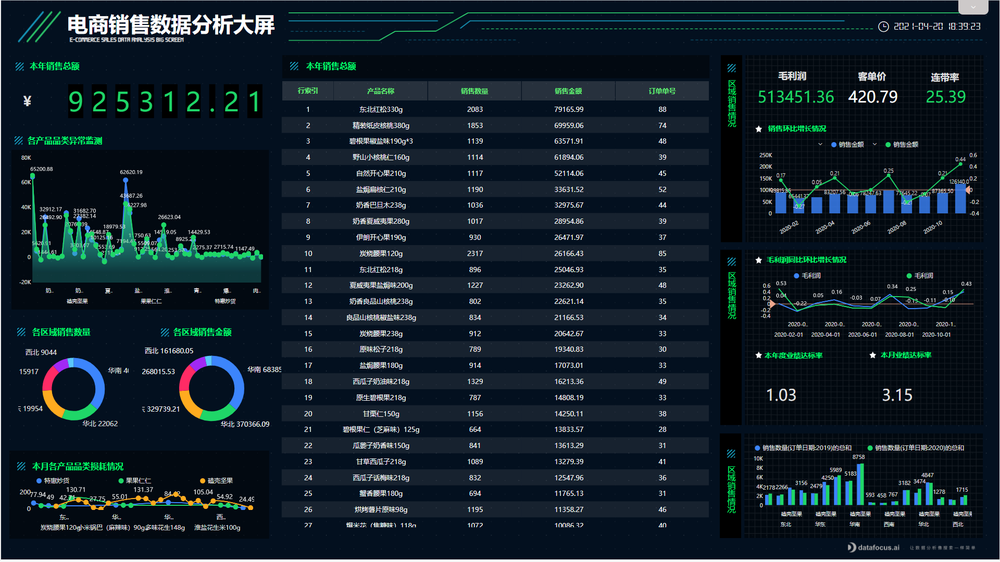
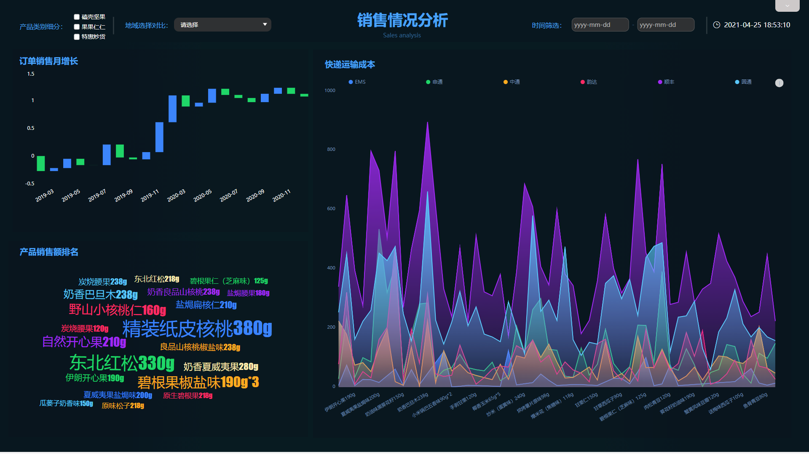

对于互联网产品，为了找出用户流失的卡点，以协助研发人员进行有针对性的修改，从而优化产品、提升用户体验，往往需要进行用户流失原因分析。

今天，我们借助DataFocus来了解在游戏产品封测期的“用户流失原因分析”。

> # 1.流失用户的卡点

以游戏行业为例，用户流失的卡点可以从用户流失的等级，流失前的主线任务、所在地图、参与的活动和副本入手。

> # 2.数据详情

数据的来源主要是游戏中用户的行为日志，因此需要对用户行为日志进行数据埋点。

这里，我们预设封测时间为8天，取玩家最后一次下线当天的最后一个游戏行为进行分析。

流失用户为4天流失用户，即封测前4天登录，而在后4天未登录的用户。同时剔除角色等级为1的和登录天数为1的用户（这些用户中泛用户居多，其游戏行为不能反映用户情况）

> ## 3.数据分析

将数据导入DataFocus系统后，即可在搜索模块进行搜索分析。

> ## 3.1 流失用户等级分布

我们首先看下流失用户的等级分布，分析用户流失的主要等级。即搜索 “角色等级”和“流失人数”数据。

如图，柱状图设置标签后，明显看到流失人数最大的角色等级是29级，且30、31、34、26、25等级的流失人数较高。

> ## 3.2 流失用户下线前的最后行为

1. 我们先从整体上了解下用户流失之前是在做什么，即最后一个游戏行为。

如图，从地图、任务、活动、副本等行为类型的维度，分析流失用户最后一次行为的人数占比情况，了解各行为类型的流失用户比例。

从图中可以看出，用户流失比例，在做任务行为之后最高。

那么，这些用户在完成这些行为后到退出游戏，总共停留了多长时间呢？

1. 我们可以基于四种行为类型和时长，汇总流失用户在完成最后一个行为到退出游戏，各行为类型花费的平均时长和比例。从整体上了解这个过程中总共花了多长时间。（制图方式同上）
2. 再基于“活动类型”、“时长”和“用户等级”数据，进一步分析各等级的用户从最后一个行为到退出游戏所花费的平均时长以及人数。

图中，28级用户进入地图活动到退出游戏的时长最高为69分钟；35级用户在做活动到退出游戏的时长最高，为38分钟。

再根据基础数据，即可了解到这些用户主要是在参加哪个具体活动中停留时间较长，并分析造成这个结果的可能性原因。

> ## 3.3 具体行为分析

接下来，我们从这四个类别，分别对流失用户下线前最后一个游戏行为进行详细分析。

以“地图”类别为例：

用关键词获取活动为“地图”的数据，分析人数和各项游戏中的时长。

从图中可以发现，扬州地图流失的人数最多，达总流失人数的42.04%。用户在游戏“境界府邸”所待平均时间较长。

那么这些用户主要集中在哪些等级呢？

我们可以针对 扬州地图 进一步分析各等级流失人数。

给图形设置标签后，可以明显看到22、30、31、32等级用户流失量较大。

除此之外，我们可以获取地图中更详细的各元素数据 ，了解扬州地图中的哪一块区域用户流失比例最大。

对用户流失原因分析，主要先从整体上了解流失用户最后一个行为，再定位到具体活动以及从最后一个行为到离开游戏的时长，查找出用户流失点，并分析用户流失原因，来为研发人员的优化提供参考依据。

多种有趣的数据分析，等待你在DataFocus中实现哦！
