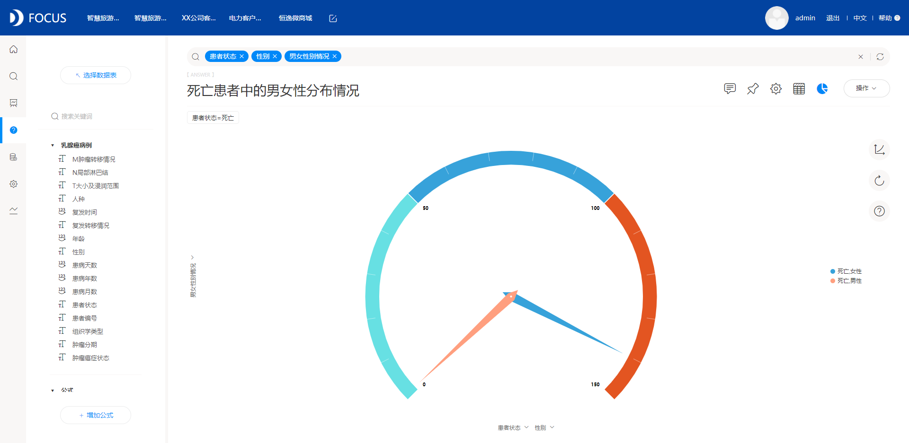
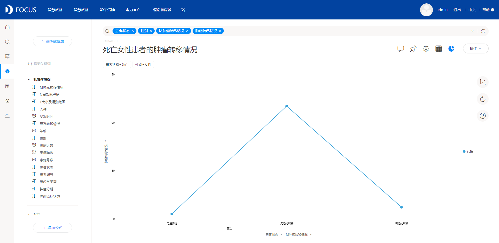

产品的设计和优化基于数据，数据是反映产品效果的一句。因此在设计产品、迭代功能钱，最后提前规划好本次产品项目的数据统计分析体系，随之在上线后不断观察数据变化，从而指导产品的进一步优化。

产品经理需要有使用数据说话的能力，只需4个步骤产品经理就能快速而清晰搭建起合适的数据衡量体系。

1.明确分析目标

1）业务区分，确定相关指标

不同行业的关键指标是不同的，比如电商行业，看中的是产生购买行为的用户数、购买金额、购买频率、客单价等；社交类产品，看中的是用户活跃市场、社区活跃度等。

2）场景区分，确定相关需求

是功能优化迭代验证效果？是差异化竞争的对比分析？是基于用户场景的拉新、留存、促活？还是流失场景的挽留？

一个优秀的数据衡量体系，不仅要能看到产品效果，还能用于产品路径的流程剖析，发现问题，找到原因，解决问题。因此Excel已经不能满足这个需求了，需要用到类似DataFocus的BI系统。

1. 细化衡量指标
2. 分析某个产品功能的转化率

一般转化率可以分为注册转化率、入口转化率等。要将这些转化路径进行细分，比如购买转化率：搜索产品——查看商品详情——点击购买——支付成功。

    3.用户相关分析

用户画像绘制：产品对用户做触达的时候，总会选择潜在目标用户，以提高转化率等各项指标。通过调整潜在目标用户的画像进行用户包提取触达，比较多个投放渠道之间的数据差异，从而达到验证的目的。

用户活跃度：活跃度指标可分为用户访问频次、购买频次等，主要是看用户在产品上的留存和活跃程度。比如活动上线后，产品用户使用为数不多的几次后即流失，即可明确下一阶段工作重点是提升用户的留存率。

用户会员体系：会员体系需要拟合升降级曲线，升级太快降级太慢，可能导致用户粘性降低。升降级速度，体现的是该产品的健康程度。

3、和竞品数据或历史数据作对比

一款产品上线效果，产品经理要看到其中的利弊，并且找到合适的参照物来对比效果，一般选择竞品数据或者历史数据和产品数据做对比，才可以做出评价和结论。

4、确定获取数据渠道

以上三步，基本以确立数据衡量体系，接下来便是产品的数据获取来源确定。一般有用户属性、用户行为数据、营销数据、反馈调查问卷和第三方数据源引入这5大渠道。

按照数据体系搭建的四步法则，在产品上线前后提前做好产品的数据衡量体系，对产品效果进行验证，从而进行功能优化。
