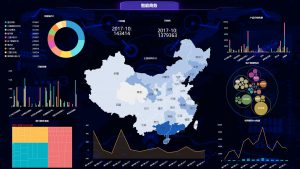

以前我们讲过大数据分析中采集（买菜）和数据清洗（洗菜）的过程。今天我们来阐述一下数据的建模和深度加工。

数据建模相当于把数据这道“菜”给配好。我们需要让数据发挥什么价值，达成什么目的，就要怎么去“配”数据，以一定的模型或算法让它发挥作用，就像配菜一样，不同的菜如何搭配才能成为一道美食，用什么样的碟子装等等。比如我们要做土豆炖牛腩，就需要把土豆洗干净，牛腩切好后翻炒、冰水过一遍、晾干，再配齐葱姜甚至辣酱，事先准备好一切，备料备好，就能够很好的提升炒菜的效率。尤其是对正规餐厅来说，备料是非常必要的，不像自己在家只买一塑料袋食材只烧几个菜，餐厅需要将大量的食材提前分类、处理并放到恰当的位置，如若不然，厨师每一道菜都需要从寻找食材并备料开始，那此店不是VIP一对一做菜的类型，便是不出一天要倒闭的类型。所以配菜（数据建模）对于大数据分析来说不可或缺，根据专业引用资料，数据建模就是建立数据存放模型，把各个数据源过来的各种数据根据一定的业务规则或者应用需求对数据重新进行规划、设计和整理。在大数据分析中，数据建模非常非常非常重要。菜品少则几种多则几十几百种，而数据，不同数据源、不同类型、不同维度、不同关联之排列组合起来，可以亿万计。比如三大运营商，内部和业务、流程、管理相关的IT系统至少一百个，这也就是一百多餐厅。可以想象一下，要经营这样100个餐厅的完全不同种类的菜品以及更多种类的原材料，还要准确无误的处理好每一个原材料并让它发挥营养价值，如果用人工，困难之至。正因如此，我们不仅有各类工具，也有各类理论和方法去支撑建模。理论方面有比较流行的几种类型：1、维度建模。类似于按既定的“菜谱”进行建模，比如数据按佛跳墙的菜谱放一起或是按叉烧肉的菜谱放一起。2、范式建模。相当于吃烤肉的时候商家上菜，基本上都是每个菜品单独一盘，比如一盘五花肉、一盘鸡翅、一盘馒头等等，将数据按类型摆放。而各大数据分析厂商经过不断的实践和研究，为一些行业量身定制了标准的数据模型，根据每个行业的业务特点比如说新零售、制造业、政府的业务模式就有很大差异，数据类型也不同，那么不同行业就像不同的餐厅，西餐厅、大排档、日料馆，都有其独特的配菜过程。

数据加工相当于开始烹饪。数据建模需要天马行空但切实可行的想象力，而数据加工就是纯技术活了，需要强大的技术能力和执行力。各位数据加工的大神，不但要把菜炒熟变的“能吃”，更要运用不同的烹饪方法和配料来让菜变的“好吃”。更重要的是，餐厅很重要的一点就是，你必须响应食客的多样化菜品需求。数据加工，权威引用就是是个将各种数据进行计算、汇总、准备的流程，是为最后的数据应用和数据消费者服务的。客户都是爸爸，尤其是ToB的业务，爸爸们的要求不是你能预测的，会常常发生变化。这就催生了各类不想因为需求变化而不断做项目，而想要用产品来适应需求的企业，并开发出各种敏捷应对的方法，比如搜索式分析。不仅如此，不仅要“好吃”，更要“好看”。这就是为什么目前各大大数据分析厂商都很注重可视化。毕竟使用的人不一定是专业的“厨师”，更可能是普通食客甚至大老板。比如《红楼梦》中，贾府每天都要上几十种品类的菜，这菜好吃是其次的，第一要好看，并且上菜要快。所以厨师们经常需要事先把菜加工成各种样式（饼图、仪表、柱图）等，然后锅碗灶台还得保证性能跟上。再加上贾府的一些突发状况，如宝玉突然想吃蟹而原来菜品是没有的，那么厨师需要及时应对，而传统的数据分析方式显然是不满足的，需要及时修改模型，重新开发，工程来不及。所以DataFocus搜索式分析或自助式分析便非常流行。而随着数学理论和技术发展，相信数据挖掘和机器学习的技术会更加成熟。

