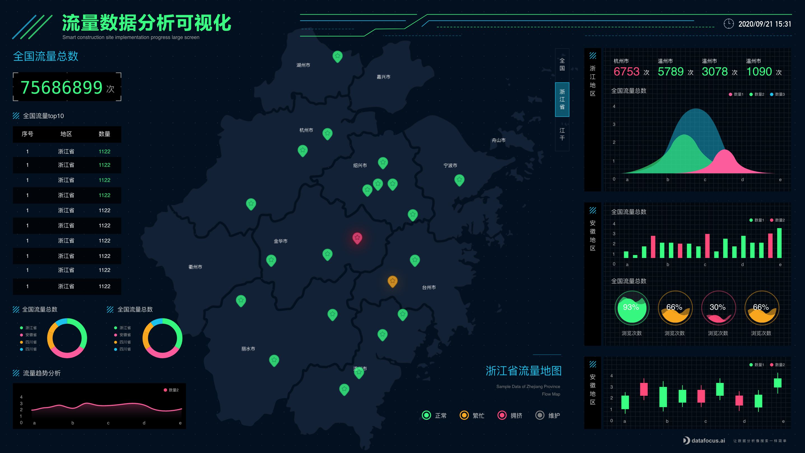
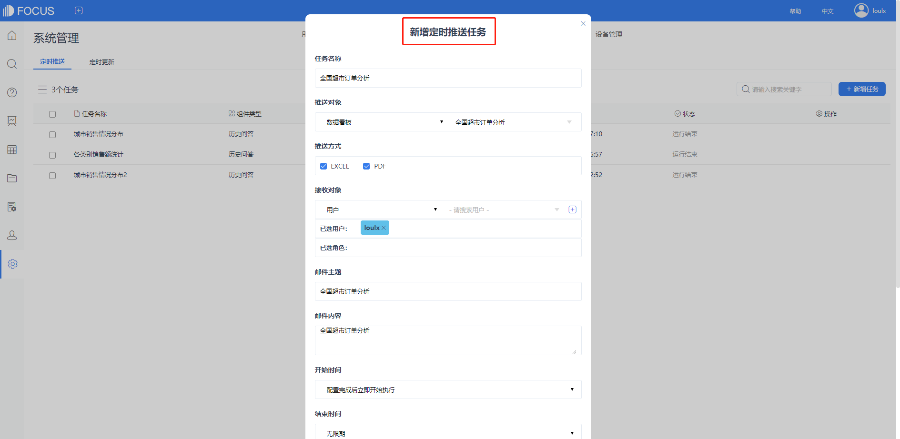

不如从11月24日，一年一度的《财富》世界500强峰会在北京举办。在这特殊的一年里，各行业专家深入探讨了世界500强企业和企业家在特殊时期应对变化的智慧以及创新。今天，小编突然感兴趣，不如让我们一起深入分析一下财富世界500强企业排行榜，挖掘一下各国横向对比和产业对比指标，分析下各国产业发展真正的含金量，以及各国产业竞争力的优劣势吧。

**以下分析全部使用DataFocus数据分析工具完成。**

首先来看各国500强企业数量占比。2020年的世界500强企业数量，中国历史性首次超过了美国，中国（含香港和台湾地区）为133家，而美国为121家。而全球总共只有32个国家和地区有世界500强企业，可见全球大部分国家，是几乎没有什么机会参与全球竞争或者出现在经济新闻头条的。

 

 

 

接下来，我们再看营业收入。2020年世界500强企业的总营业收入达到33.294万亿美元，创下历史新高。进入排行榜的门槛（最低营收收入）也从248亿美元提高到254亿美元。

 

 

再来看各国的营业收入分布情况。美国排名第一，为9.8063万亿美元，占全球总和的29.45%，中国第二为8.7351万亿美元，占全球总和的26.24%，日本第三为3.1241万亿美元，占全球总和的9.38%，接下来是德国，法国，英国，荷兰，瑞士，韩国，加拿大。**可以看出，中国500强企业尽管数量排在第一，但是营收收入总和距离美国还差了近1.1万亿美元，我们还需要更大更强。**

 

 

好了，我们进入更有价值的比较维度，也就是企业利润比较阶段。下图展示了各国500强企业的利润之和与排名占比，美国企业的超强盈利能力开始展现出来了。

 

2020年全球500强企业的利润之和为20613.17亿美元，美国的总和高达8447.71亿美元，占比高达41%。中国500强企业利润总和为4634.80亿美元，占全球的22.48%，稳居全球第二位，世界第三的日本为883.54亿美元，仅占全球的4.29%。值得一提的是沙特阿拉伯以882.11亿美元排在了第四，足以可见沙特阿美石油公司的盈利能力。

接下来就是各国500强企业的利润率对比了，利润率直接体现了产业竞争优势，看下图发现，**利润率排在前面的基本都是资源型国家**，沙特阿拉拍以26.75%的利润率排名第一。沙特之后第2-8位依次是比利时、俄罗斯、马来西亚、爱尔兰、澳大利亚、巴西、加拿大。

 

虽然中国和美国的利润率都没有进入前8名，但两国的利润率才是真正有技术含量的较量，让我们继续往下看。

我国入选的133家企业里面，我们把利润率超过5%的企业选出来，共34家。

 

为什么把利润率设置为5%，因为入选的500家企业，只有210家利润率超过了5%。入选的32个经济体里面，只有13个经济体的入选企业平均利润率超过了5%。所以5%已经是不错的数字了。

**从下图看，我国500强企业利润率排前12位有9家来自金融业（银行和保险）**，排名第一的台积公司为台湾地区的制造型企业，只有阿里和腾讯两家是互联网公司。大陆企业中阿里利润率29.3%，工商银行利润率25.5%，腾讯利润率24.7%。**注意，其实友邦保险是美资，只不过是总部在香港，所以算成了中国企业。**

 

看制造业的话，珠海格力利润率最高，达到12.32%，然后是美的集团，利润率为8.67%，再下来是华为，华为利润率为7.29%。 值得一提的是，利润率超过了5%的中国500强大陆企业中，总共只有7家制造型企业，除了前面提到的利润率最好的格力，美的和华为，接下来是航天科技7.26%，中国电子科技5.29%，安徽海螺集团5.23%，中国航天科工5.21%。

这7家500强中国制造业企业中，格力，美的，海螺水泥3家是在传统产业，而华为，中国电子科技，航天科工，航天科技4家则是在高科技行业。我们如果看每年985高校毕业生就业报告，有没有发现这4家高科技企业是985理工高校毕业生的热门去处？你看数据分析就是这么有趣，很多事情就能这样联系起来了，例如下图是北航2019届毕业生的就业去向单位，这4家公司都排在前七位。

接下来我们看下美国入选企业里面，利润率超过了5%的企业。一起来震撼一把，看看美帝国主义最赚钱的公司有哪些，美国竟然有75家企业利润率超过了5%。更重要的是，利润率的前16名，并没有能源矿产类公司，有5家金融类公司，7家ICT（包括软硬件）公司，包括微软、英特尔、甲骨文、Facebook、思科、苹果、Alphabet 、5家制造业公司，分别是辉瑞制药、菲利普-莫里斯、可口可乐、艾伯维制药、默沙东。**可以看出，ICT产业（包括软硬件和服务企业）是美国产业的头号支柱。**

再看制造业，美国有22家制造业公司利润率超过了5%，如果把ICT门类里面的思科，苹果，英特尔，惠普，戴尔也算上的话，那就是27家利润率超过5%了。这27家制造业企业行业分布非常广泛：**ICT制造业**有5家、**医疗器械和制药业**有7家、**军工航空航天**类企业有5家、**日用消费品**2家、**食品饮料**3家、其他5家。

 

**非常明显，ICT制造业是美国制造业绝对的核心产业，利润排名前两位的苹果和英特尔都是ICT制造业，其次是医疗器械和制药业。**

中国入选制造业公司来自ICT制造业的利润总额也是最高的，三家公司（华为，小米，联想）达到111.9亿美元，占比为22.62%。另外中国汽车制造业的利润排第二位，6家汽车公司（上汽，一汽，东风，吉利，北汽，广汽）利润总额104.3亿美元，占比为21.08%。排第3位的行业是军工航空航天类，7家公司（航天科技，航天科工，中国电科，兵器工业，兵器装备，中航工业，中国电子）利润总额93.2亿美元，占比18.84%。

美国500强制造的利润主要来自8个行业：ICT制造+医疗器械制药+日用消费品+食品饮料+军工航空航天+机械（工程机械和农用机械）+汽车+烟草。

中国500强制造的利润主要来自5大产业：ICT制造+汽车+军工航空航天+日用消费品（家电）+钢铁和金属加工。

非常明显的是，在以上五个领域，中国公司在其中4个都有种子选手：ICT制造的华为、军工航空航天的航天科技，航天科工，中航工业；汽车的吉利，上汽，蔚来，比亚迪，长城；机械领域的三一重工，中联重科，国机集团。

**唯独在医疗器械和制药业领域，还缺乏重量级选手，迈瑞医疗，联影，恒瑞医药等体量都还太小，离世界500强还有很长的距离。也就是说，在最重要的两个领域，ICT制造业领域美国疯狂打压华为，而在医疗器械和制药业，我们需要更加努力。**

怎么样，通过DataFocus制作的这份2020年世界500强企业实力对比，你对中美优势是不是有了新的了解。

另外，相信细心的朋友已经发现，**在DataFocus中制作图表时，小编是直接在搜索框中输入关键词实现的**，比如想要了解中国利润率超5%的企业，直接输入利润率大于0.05、国家=“中国”、企业名称就可以实现了，几秒钟就能出图，非常方便。

不如你也来试着做一下吧，相信你会有不一样的发现。
