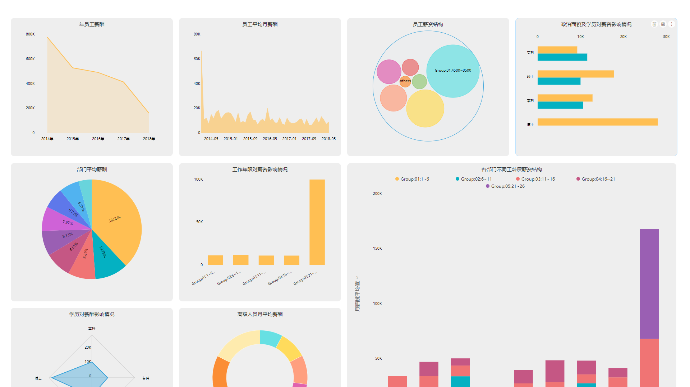

记得我曾经看过一个电影，是讲述两个人的网球对决，其中一个人是数学计算天才，一个人是这个比赛项目的高手。数学天才仔细研究了高手的所有过往的比赛，发现了他的比赛规律，并将其运用在这场比赛中，对高手的网球动作进行了预测，并以此进行回击，试图击败对手。虽然数学天才最后还是输掉了比赛，但在比赛开始前期，他对高手的预测准确度非常高。

这个事件告诉我们人类的行为是有规律可循的。“无尺度网络模型”的作者艾伯特-拉斯洛·巴拉巴西曾经说过——人类93%的行为是可以预测的。那么数据作为记录人类活动的一种重要依据，必然有着众多的规律等待人们的挖掘和发现。

现在最常接触到数据分析的一般都是零售行业、制造行业这一系列的企业，他们有自己的销售体系、业务逻辑，希望通过数据分析加强对业务的掌控，及时发现数据存在的问题，制定合理的政策解决问题。这就是所谓商业智能，也就是例如DataFocus、Tableau一系列的可视化工具可以大展手脚的地方。

但在利用商业智能软件时，数据分析必须注重以企业的业务为核心。因为在数据分析的过程中，不能离开业务实际，进行空空泛泛的描述。有了数据必须和业务结合才有效果。首先必须对企业所处的行业有所了解，结合整个企业产业链的结构，根据业务当前的需要，指定发展计划，从而归类出需要整理的数据。最后一步详细的列出数据核心指标（KPI），并且对几个核心指标进行更细致的拆解，找出那些对指标影响幅度较大的影响因子。

加下来的工作就可以才交给DataFocus、Tableau这些商业智能可视化工具进行了，无需编写复杂的代码，就能得出可视化大屏，进行数据呈现。

