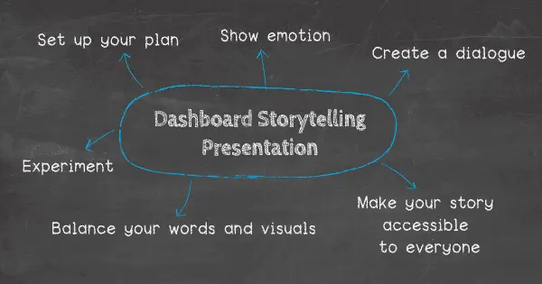
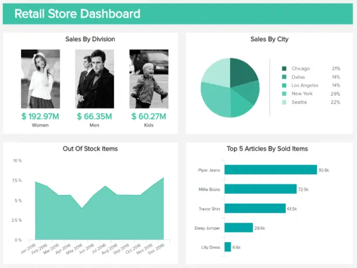

柏拉图打趣说：“讲故事的人统治着社会。这句话在今天和古希腊一样正确，在现代可能更是如此。

在当代商业世界中，古老的讲故事艺术远未被遗忘：企业依靠引人注目的数据可视化来传达信息、推动参与和说服受众，而不是在参议院发表演讲。

通过将讲故事的艺术与[仪表板软件](https://www.datafocus.ai/infos/best-dashboard-software-features)的技术功能相结合，可以开发强大、有意义、数据支持的演示文稿，不仅能感动人们，还能激励他们采取行动或做出明智的、[数据驱动的决策](https://www.datafocus.ai/infos/data-driven-decision-making-in-businesses)，这将使您的业务受益。

从任何人的记忆中，叙事就帮助我们理解了我们周围有时复杂的世界。人们没有单独列出事实、数字和统计数据，而是使用扣人心弦、富有想象力的时间线，赋予原始数据真实的背景和解释。反过来，这抓住了听众，让他们沉浸在叙事中，从而提供了一个平台，可以准确地吸收他们脑海中的一系列事件，就像它们展开的方式一样。

在这里，我们将深入探讨数据驱动的[实时仪表板](https://www.datafocus.ai/infos/live-dashboards)讲故事，通过 KPI 和数据讲故事演示的动态来研究讲故事，同时提供真实世界的故事讲述演示示例。

首先，我们将深入研究数据叙事的力量以及讲故事仪表板的一般动态，以及您可以如何处理数据来向受众提供精彩的故事。此外，我们将提供仪表板叙事提示和技巧，帮助您使数据驱动的叙事构建工作尽可能有效，从而将您的业务推向令人兴奋的新维度。但是，让我们从一个简单的定义开始。

“你永远不会扼杀讲故事，因为它是建立在人类计划中。我们一起来。

## 什么是仪表板叙事？

仪表板叙事是以有效的可视化方式呈现数据的过程，该可视化以单个屏幕上的交互式仪表板的形式实时描述关键绩效指标、业务战略和流程的整个叙述。讲故事确实是一种强大的力量，在信息时代，可以利用触手可及的大量见解，以比您想象的更强大的方式传达您的信息。因此，请继续关注我们现在将解释的重要提示和技巧，以便只需单击几下即可成功创建自己的故事。

## 4技巧开始讲仪表板故事

大数据管理着大新闻。

有远见的商业人士转向[在线数据分析](https://www.datafocus.ai/infos/data-analysis-tools)和数据可视化，以在一些精心设计的图表中显示大量内容。但是，如果这些浓缩的商业见解没有以有效和有益的方式用语言传达，它们可能会保持隐藏。没有语言，商业人士往往无法将他们的信息传达给他们的受众，因此无法产生任何真正的影响。

营销人员、销售人员和企业家是当今的故事讲述者——他们对自己的数据故事负全部责任。担任这些角色的人通常是他们的数据与他们希望鼓励采取所需行动的决策者论坛之间的桥梁。

在业务环境中使用数据进行有效的仪表板叙事必须专注于为受众定制时间线，并选择一种正确的[数据可视化类型](https://www.datafocus.ai/infos/how-to-choose-the-right-data-visualization-types/)来补充甚至增强叙事。

为了演示这一概念，让我们看一些实用技巧，了解如何准备最佳故事来伴随数据。

### 1\. 从数据可视化开始

这听起来可能重复，但是当涉及到仪表板演示或仪表板讲故事演示时，它将构成您成功的基础：您必须仔细选择可视化。

不同的视图回答不同的问题，因此在选择如何可视化故事时要小心。为了帮助您完成此计划，您将需要一个强大的[数据可视化工具](https://www.datafocus.ai/infos/data-visualization-tools)。仪表板叙事中的这些直观辅助工具现在无处不在，并提供多种选项供您选择，包括折线图、条形图、地图、散点图、蜘蛛网等等。此类交互式工具被正确地认为是比PowerPoint演示文稿或无穷无尽的Excel文件更全面的选择。

这些工具有助于探索数据和可视化数据，使您能够以有说服力的方式传达关键见解，从而获得受众的支持。

但为了获得最佳效果，我们仍然需要的不仅仅是计算机算法——在这里，我们需要一个人以一种使其有意义和有价值的方式呈现数据。而且，这个人不需要是一个普通的主持人或老师般的人物。根据斯坦福大学进行的研究，有两种类型的讲故事：作者和读者驱动的故事讲述。

作者驱动的叙述是静态和权威的，因为它向读者或听众指示分析过程。这就像分析报纸上印刷的图表一样。另一方面，读者驱动的叙事允许观众自己构建分析。在这里，受众可以选择他们认为有意义的数据可视化，并通过向下钻取到更多详细信息或从他们希望可视化的各种[KPI 示例](https://www.datafocus.ai/infos/kpi-examples-and-templates-)中进行选择来自行与他们交互。因此，他们可以寻求对他们至关重要的见解，并独立地从数据中理解。

### 2\. 把你的观众放在第一位

仪表板演示文稿的故事讲述应始终从陈述您的目的开始。您的数据故事的主要收获是什么？很明显，你的目的是激励观众采取某种行动。

与其考虑您的业务目标，不如尝试设想听众正在寻找什么。您的每个受众成员（无论是潜在客户、未来的业务合作伙伴还是利益相关者）都来收听您的数据故事演示，为自己获得利润。为了更好地满足受众的期望并获得他们的信任（和金钱），请将他们的目标放在首位，让他们决定您故事的情节。

不用说，在仪表板演示之前，请尝试尽可能多地了解听众。设身处地为他们着想：他们是谁？他们每天做什么？他们的需求是什么？他们能从您的数据中为自己获取什么价值？

您越了解您的受众，他们就越信任您并遵循您的想法。

### 3\. 不要用空话来填充你的数据故事

使用数据讲故事，而不是单独呈现数据可视化，会带来最佳结果。也就是说，你的故事有一些敌人，使它变得比启发更复杂，并将你的努力变成浪费时间。

这些错误中的第一个是各种[技术流行语](https://www.datafocus.ai/infos/technology-buzzwords/)，它们没有任何定义的含义。这些话不会在听众的脑海中创造一个清晰的画面，作为讲故事的辅助工具毫无用处。此外，为了不充分告知您的听众，流行语是您懒惰思维的标志，也是您没有任何独特或有意义的话要说的预兆。尝试通过使用更精确和描述性的叙述来真实传达您的目的，从而为您的故事增添清晰度。

另一个陷阱是使用你的行业术语听起来更专业。这里的问题是，它可能不是听众所在行业的行话——因此，他们可能无法理解你的叙述。此外，一些行话短语根据其使用的上下文具有不同的含义——它们在商业领域意味着一件事，在日常生活中意味着另一件事。它们会降低清晰度，并且还可以传达与您打算在数据故事中传达的内容相反的含义。

不要让你的故事太长，专注于解释数据的含义，而不是你语言的华丽和轶事的幽默。避免过度使用流行语或行业术语，并尝试找出听众希望从您向他们展示的数据中获得哪些见解。

### 4\. 利用讲故事的力量

在我们继续数据驱动的故事讲述之旅之前，我们想通过分享这些必须知道的见解，进一步说明为您的受众、员工或合作伙伴提供鼓舞人心的叙述的无与伦比的力量：

- 最近的研究表明，当今80%的消费者希望品牌讲述有关其业务或产品的故事。
- 普通人每天处理100，500个数字单词。通过获取您的数据并将其转换为重点突出、价值驱动的叙述，您的信息更有可能与受众产生共鸣并产生您想要的结果。
- 人类通过视觉吸收信息的速度比单独的线性文本内容快60 倍。通过利用数据可视化的力量来形成叙述，您可能会从内部或外部演示中获得指数级的成功。

## 如何呈现仪表板 - 完美仪表板讲故事演示的 6 个技巧

现在我们已经介绍了数据驱动的讲故事要点，是时候更深入地研究可以通过讲故事仪表板演示文稿产生最大影响的方法了。

[业务仪表板](https://www.datafocus.ai/infos/dashboard-examples-and-templates-)现在是商业智能领域可视化的驱动力。与其前辈不同，最先进的[仪表板构建器](https://www.datafocus.ai/infos/dashboard-builder)使演示者能够使用实时数据吸引观众，并提供一种更动态的数据呈现方法，与 Powerpoint 等僵化的线性性质相比。

借助[数据仪表板](https://www.datafocus.ai/infos/data-dashboards-definition-examples-templates)提供的额外创意自由，讲故事的艺术正在董事会中重新出现。现在的问题是：什么是出色的仪表板？

事不宜迟，以下是有关如何将您的演示文稿转换为故事并通过仪表板讲故事统治您自己的公司的六大技巧。

### 1\. 设置您的计划

从如何演示仪表板的第一点开始：概述您的演示文稿。像所有好故事一样，情节应该清晰，问题应该呈现，并预示结果。在探索数据以获得见解时，您必须问自己正确的数据分析问题，但在向特定受众展示此类数据时，您还需要问自己正确的[问题](https://www.datafocus.ai/infos/data-analysis-questions/)。他们需要了解或想要查看哪些信息？确保在演示时有一个简洁的故事板，以便在展示数据时可以带观众一起去。尝试以目标为导向，以获得最佳仪表板结果，但不要将自己纠缠在不可更改的僵化格式中。

### 2.不要害怕表现出一些情绪

领先的设计顾问Stephen Few在他的博客上解释说，“当我们严格地呼吁人们的情绪，帮助他们亲自接触信息并关心它，并且以一种吸引他们理性考虑信息的方式这样做，而不仅仅是感觉，我们创造了一条通往更光明，更理智的未来的道路”。情绪在一个人的心理中停留的时间比事实和图表要长得多。即使是最具分析能力的思想家，如果你能编织人类生活和情感的元素，也更有可能记住你的演讲。如何用情感呈现仪表板？通过添加一些轶事，每个人都可以与之相关的个人生活经历，或文化上共享的时刻和笑话。

但是，不要仅仅依靠情绪来表达你的观点。你的结论和想法需要有数据、科学和事实的支持——否则，尤其是在商业中，你可能不会被认真对待。你也会错过一个帮助人们学会利用理性做出更好决策的机会，只会利用人类中“进化较少”的部分。相反，在情感上吸引你的听众，让你的观点回家。

### 3\. 让您所在行业以外的人了解您的故事

结合复杂的行话、数百万个数据点、高级数学概念，制作一个人们可以理解的故事并不是一件容易的事。选择简单和清晰的可视化来提高受众参与度。

您的整个听众都应该能够理解您开车回家的要点。DoSomething.org 数据产品与分析总监杰夫·布拉特（Jeff Bladt）提供了一个关于通过数据访问的开创性案例研究。在评论他如何从 3.5 亿个数据点到组织变革时，他分享道：“通过直观地呈现数据，全体员工能够快速掌握并为对话做出贡献。每个人都能够看到参与度高和低的区域。这导致了一个很大的洞察力：分析团队之外的某个人注意到，德克萨斯州边境城镇的成员比西北沿海城市的成员更投入。

让您的演示文稿可供外行人访问，为您的发现提供了更多充分利用的机会。

### 4\. 创建交互式对话

没有人喜欢被告知该怎么做。与其向听众说教，不如通过[交互式仪表板功能](https://www.datafocus.ai/infos/interactive-dashboard-features/)让他们成为演示文稿的一部分。通过使用实时数据、在观众面前操纵数据点以及在演示过程中鼓励提问，您将确保您的观众在您授权他们自己探索数据时更加参与。同时，您还将提供更深层次的背景。当您拥有广泛的目标受众时，交互性在仪表板中特别有趣：它可以轻松地吸引新人，同时让“专家”更深入地挖掘数据以获取更多见解。

### 5\. 实验

不要害怕尝试使用数据讲故事的不同方法。创建一个仪表板讲故事计划，允许您进行实验、测试不同的选项，并了解什么将在听众中建立参与度，并确保使用 KPI 强化数据故事讲述。当您尝试通过让他们入睡或查看他们的电子邮件来失败时，您只会从中学习并获得有关如何使用数据技术改进仪表板和讲故事的信息，一个又一个演示文稿。

### 6\. 明智地平衡你的文字和视觉效果

最后但并非最不重要的是一个提示，它包含了上述所有建议，但也提供了一种从头到尾保持一致、可访问和有影响力的方法：明智地平衡你的文字和视觉效果。

我们在这里的意思是，在数据驱动的故事讲述中，如果你想抓住你的观众并将你的信息带回家，一致性是关键。我们的眼睛和大脑专注于突出的东西。最好的数据故事讲述者利用这一原则，通过构建图表和图形，其中包含可以毫不费力地理解的单一信息，在视觉和文字上突出显示他们希望受众最记住的信息字符串。

考虑到这一点，您应该从头到尾保持语言清晰、简洁和简单，使用最好的可视化来增强故事的每个部分，真正强调您希望观众带走的任何图形、图表或句子。

[仪表板设计](https://www.datafocus.ai/infos/great-dashboard-design-examples-for-inspiration/)的每个元素都是必不可少的，但通过强调真正重要的领域，您将使您的叙述更加令人难忘，让自己有最好的机会享受您应得的结果。

## 最佳仪表板讲故事示例

既然我们已经探索了改进以数据为中心的讲故事并充分利用演示文稿的方法，那么是时候提供一些鼓舞人心的故事讲述演示示例了。让我们从与零售业相关的讲故事仪表板开始。

### 1\. 带有 KPI 的零售商商店仪表板

零售业是一个有趣的行业，因为随着在线零售的出现，它尤其受到干扰。收集数据分析对于该行业非常重要，因为它具有数据驱动的性质，可以从分析中获得出色的优势。因此，使用 KPI 讲述数据故事是传达趋势、发现和结果的一种特别有效的方法。

 我们讲故事的第一个演示示例提供了与客户行为相关的信息，并帮助识别收集的数据中的模式。此处跟踪的特定[零售 KPI](https://www.datafocus.ai/infos/kpi-examples-and-templates-retail)侧重于销售额：按部门、按项目、按城市和缺货项目。它让我们了解客户购买习惯的当前趋势，并允许我们根据城市或性别/年龄对这些数据进行细分，以加强分析。我们还可以预测任何缺货以避免亏损，并随着时间的推移可视化缺货趋势，以发现供应链中的任何问题。

[零售仪表板](https://www.datafocus.ai/infos/dashboard-examples-and-templates-retail)中提供的这个最出色的数据故事讲述示例将帮助您讲述更深入、更复杂的故事，这要归功于您的营销活动。这些分析使我们能够调整每个渠道的这些活动：通过按部门细分销售量，我们可以看到女性是第一收入点。每个城市，纽约加起来几乎占销售额的30%。所有这些信息对于保留客户都很重要，因为保留我们已经拥有的客户比获取新客户的成本更低。

### 2\. 带有 KPI 的医院管理仪表板

我们的第二个数据故事讲述示例讲述了一家繁忙的工作医院的故事。这听起来可能比实际有点花哨，但它至关重要 - 当涉及到公共医疗保健时更是如此，这是一个对数据收集和分析非常陌生的行业，在很多方面都可以从中赢得很多好处。

 对于医院来说，集中式仪表板是设施日常管理的重要盟友。我们在这里拥有的那个为我们提供了一个复杂机构的大局，跟踪几个[医疗保健 KPI](https://www.datafocus.ai/infos/kpi-examples-and-templates-healthcare)。

从总入院人数到治疗的患者总数、急诊室的平均等待时间或按部门细分，此[医疗保健仪表板](https://www.datafocus.ai/infos/dashboard-examples-and-templates-healthcare)所讲述的故事至关重要。该设施的最高管理层具有整体视野，可以更轻松有效地运行运营，如果他们看到异常数字，可以尝试实施各种措施。例如，某个部门的平均等待时间远高于其他部门，可以揭示该部门可能面临的一些问题：缺乏人员培训、缺乏设备、单位人手不足等。

所有这些都对于患者的满意度以及每天处理生死的医院工作人员的安全和健康至关重要。

### 3\. 包含 KPI 的人力资源 （HR） 招聘仪表板

我们的第三个数据故事讲述示例与人力资源有关。这个特殊的讲故事仪表板侧重于任何现代人力资源部门最重要的职责之一——招聘新人才。

 在当今世界，数字原住民希望与一家不仅分享他们的信仰和价值观，而且提供学习、进步和成长机会的公司合作。如果您想提高内部敬业度并减少员工流动率，为您的组织找到合适的人选至关重要。

与此讲故事仪表板相关的[人力资源 KPI](https://www.datafocus.ai/infos/kpi-examples-and-templates-human-resources)（人力资源关键绩效指标）旨在增强招聘过程的各个方面，有助于降低经济效益并显着提高招聘质量。

在这里，使用 KPI 讲故事的艺术变得容易。如您所见，此人力资源[仪表板提供了人力资源](https://www.datafocus.ai/infos/dashboard-examples-and-templates-human-resources)招聘重要方面的清晰快照，包括每次招聘的成本、招聘转化率或成功率，以及从最初联系到正式报价的填补空缺的时间。

通过这个最直观的数据故事讲述示例，可以轻松构建与您的受众产生共鸣的有价值的叙述，因此，可以以促进真正变革和业务增长的方式分享您的招聘见解。

## 立即开始您的仪表板故事讲述！

“我告诉你一个秘密。老故事讲述者永远不会死。他们消失在自己的故事中。

使用仪表板的主要优势之一是它们对数据可视化所做的改进。不要让此功能浪费在您自己的演示文稿中。强调使视觉效果清晰且吸引人，以充分利用仪表板工作。

有了丰富的直观呈现数据的方法，请确保选择最适合使用数据讲故事的方法。有关更多提示，您可以查看如何创建人们喜欢阅读[的数据报告](https://www.datafocus.ai/infos/data-report-examples/)，还可以找到有关如何轻松[创建仪表板](https://www.datafocus.ai/infos/how-to-make-a-dashboard-with-ease/)的灵感。

通过在其中编织有趣且互动的情节线，将您的演示文稿从静态、毫无生气的工作产品转变为引人入胜的故事。

立即开始 DataFocus 的[14 天免费试用](https://www.datafocus.ai/console/)！
