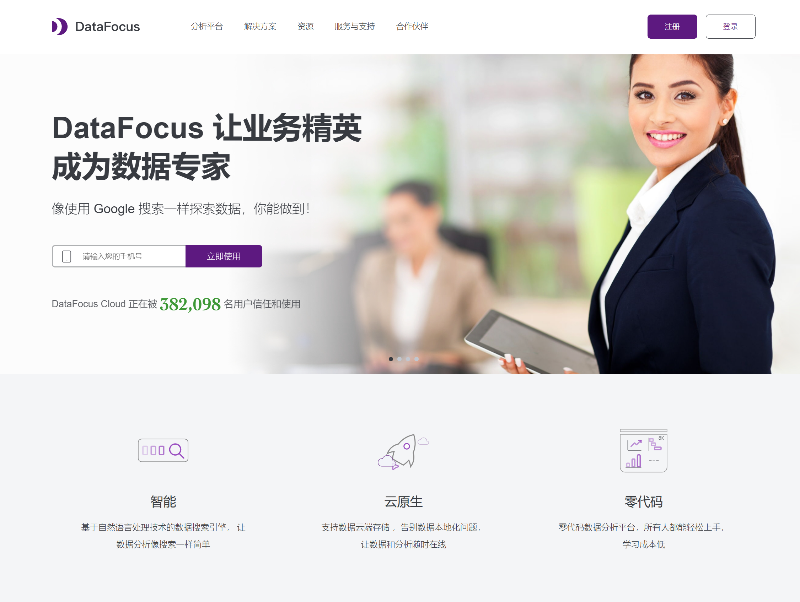

概述： 传统BI是一种基于结构化数据的商业智能解决方案，主要数据源来自于组织内部的数据仓库或数据集。而搜索式BI则是一种更加强调数据挖掘和分析的解决方案，它不仅涉及结构化数据，还包括非结构化数据。本文将从数据来源、数据处理方式、数据结构、报表展示方式、用户门槛、分析深度、精确度、实时性、应用范围和市场需求等方面对比传统BI和搜索式BI。

数据来源： 传统BI主要数据源来自组织内部的数据仓库或数据集，这些数据经过清洗和整合后，再进行分析和汇报。而搜索式BI则是从企业各种数据源整合数据，包括结构化和非结构化数据，例如社交媒体数据、在线调查数据等。因此，搜索式BI的数据来源更加广泛，可以获得更全面的信息。

数据处理方式： 传统BI的数据处理方式是先收集数据，然后清洗、整理、分析和汇报数据。而搜索式BI则是先处理数据，再进行分析、挖掘和可视化展示。因此，搜索式BI更注重数据准备和处理，以便更好地发现数据中的价值。

数据结构： 传统BI通常处理结构化数据，例如数字、文本等，这些数据可以被很好地组织和管理。而搜索式BI包括结构化和非结构化数据，例如图像、视频、音频等，这些数据需要更加复杂的处理和分析方法。

报表展示方式： 传统BI主要通过预定义的图表和指标展示数据，这些图表和指标是由开发人员在BI工具中定义的。而搜索式BI也可以通过预定义的图表和指标展示数据，但它的主要优势在于不依赖于固定报表，而是通过互动式界面连接数据库并快速查询以获取所需信息。

用户门槛： 传统BI需要专门的培训才能使用，需要了解数据库和BI工具。而搜索式BI则无需专门的培训，几乎任何人都会使用搜索引擎。这使得搜索式BI能够更加广泛地应用于企业内部。

分析深度： 传统BI可以提供一系列标准报告以了解各种指标，但搜索式BI可以自由设置查询条件和标准以识别潜在趋势并发现新的信息。因此，搜索式BI可以更深入地分析数据，发现更多的信息。

精确度： 传统BI的结果相对精确、固定，而搜索式BI的结果可参考性强，更加贴合实际业务场景。搜索式BI可以通过不断调整查询条件和标准来改进分析结果。

实时性： 传统BI常规报告需要时间才能生成，无法立即获取实时数据，而搜索式BI可以迅速获取任何时间段的数据并生成实时报表视图。因此，搜索式BI对于业务决策更加有利。

应用范围： 传统BI主要面向企业内部管理层以制定战略计划和决策，而搜索式BI则更注重市场动态信息，适合企业开拓前沿市场和开展市场活动。

传统BI与搜索式BI: 优缺点比较： 传统BI受大型企业和政府机构青睐，而搜索式BI受中小企业及自由职业者欢迎。随着企业对数据分析需求的不断增加，搜索式BI的市场需求也在不断增加。

综上所述，传统BI和搜索式BI各有优缺点，应根据具体需求进行选择。但随着数据分析和挖掘技术的不断发展，搜索式BI的应用将会越来越广泛。
