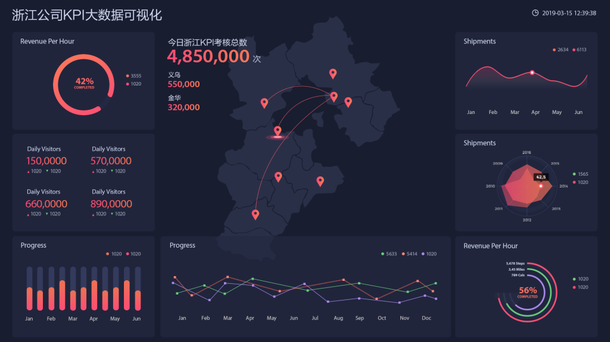

大屏显示系统的目的是什么呢？传统的工程中，无论是安防还是指挥调度中心，“大屏就是一个窗口”，观看者可以从这个窗口“拿到数据”，这些数据可能是视频、抓拍图像、也可能是传感器提供的一组数字。在传统的datafocus可视化大屏上面，其特点是什么呢？

传统型大屏企业的任务，是让这些数据能够清晰、流畅的显示在大屏幕上，并能快速切换不同组数据的显示或者不同的显示布局组合。而至于这些数据从何而来、到何处去、不同数据之间有什么关系、每个数据或者数据集合有什么意义、看到这些数据后用户会做哪些处理，这些问题则和大屏企业没有关系。

“传统大屏是平面的，也是冷血的”——这种拟物和拟人的评价，最能表征传统大屏工程行业的“价值结构”。这种价值架构的核心是“中性的硬件工程”。但是，这种产业形态已经不再适应客户的需求。

一个简单的问题是：那么多数据和素材的意义在哪里呢？答案是提供用户决策——而不是“看着好玩”。而用户的决策过程，必须依赖于数据的“前世今生”的复杂关系。即如果将大屏显示这个核心硬件，放在一个“事务性”决策流程中，去实现真实的应用价值，那么大屏企业就要将产业触角伸到数据集的深处，伸到数据之间的复杂关系之中。而基于数据间真实价值关系，提供决策级别的综合信息智能呈现方案的过程，即是“可视化”。

从数据自身的显示，到探索数据集的内在价值和固有关系，这种转变将使得大屏企业从“整合并提供显示方案”，变成“整合并提供数据关系再现方案”。

这种行业职责的变化差异主要表现在两个方面：第一，大屏企业告别简单硬件，迎来“软”时代；第二，大屏企业告别简单“专业技术”领域，进入“专业技术与客户业务融合”时代。通过上述内容的介绍，现在，大家知道传统的datafocus可视化大屏的特点是什么了吗？

