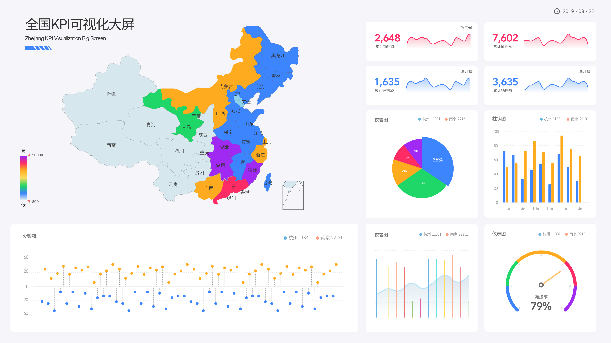

现如今，在市场大环境下消费群体普遍趋向年轻化及差异化。在90后消费群体愈发具备购买力的同时，其消费思维也与其从小到大接受的文化熏陶形成强关联纽带，二次元文化（简称ACGN）便是其一，并且蕴含着越来越大的市场蓝海。丰富的小众周边变现、IP应用变现、情怀营销变现等模式也层出不穷。

二次元人群的数据近段时间来一直是很多TO C企业分析的重点，甚至因为其多变的特性有很多决策者购买了如DataFocus、Power BI等自用BI工具进行实时数据分析。我们以前介绍过他们的人群画像，对于企业来说，需要更加深度的数据挖掘，从表征看现状，从而更好地为企业决策进行服务。本篇将为大家介绍二次元受众的数据特征。

大家应该还记得每年的淘宝造物节。造物节并不是一个卖货的“跳蚤市场”，而是一个注重体验本身的大型线下PARTY。很多所谓“神店”的装修或展示风格，也都趋近于二次元，背后的原因就是参与造物节的受众大多都是富有情怀或是由猎奇心理的二次元群体。我们也和九口山、歪瓜出品等神店进行过交流，结合一些报告，归纳出二次元的阶梯化群体特征。

对于个体，二次元的空间存在于精神领域，是目标受众摆脱日常琐碎，向往并沉浸的虚拟器官；对于群体，他们有着拥有自己独立语言体系和沟通影响偏好的交流空间；对于城市，如果希望能够借助爱好者的经济动力，则必须为此创造一个特有的商业人文空间。

因为从“数据源”角度来说，这些数据的发源地从核心创意+世界观开始，发酵出具有形象张力的故事，并进行展开，这才有了最后的IP应用和周边产品，所呈现出的交易数据和其他数据能够被企业进行分析，以制定精准的营销和吸粉策略。
