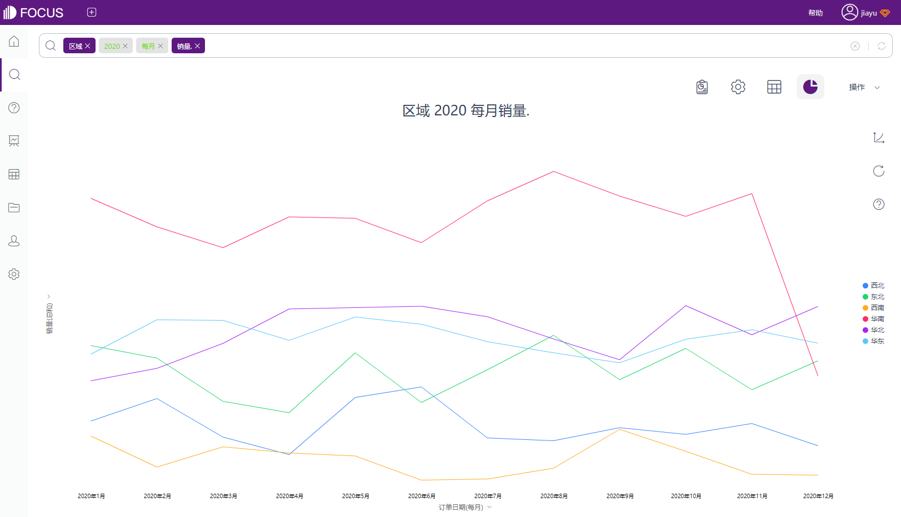
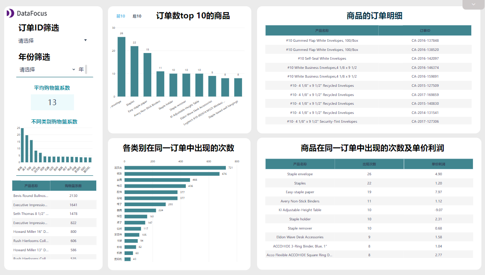

你的数据出现过“异常”的峰值么？当数据出现峰值时，你是如何解决的呢？

之前提到，当数据出现异常时，我们的首要任务是对问题进行分类，以确保能快速响应最重要的问题。对于需要我们关注的问题，我们可以对比一下过去的数据，以确定该“异常情况”是否正常或季节性趋势。

那么，除此之外，我们还可以如何确定数据是否真的“异常”，并进行解决呢？

## 1、**数据是否存在质量问题**

你的峰值可能是由数据质量问题引起的，而不是现实世界的变化。

当收集或记录数据的方式存在问题，或者由于非真实输入时，就会出现数据质量问题。常见问题包括：

- § 工具中断
- § 内部测试
- § 损坏的代码（例如事件跟踪）
- § 更改你的平台
- § 机器人
- § 垃圾邮件（例如垃圾邮件注册）
- § 导致事件触发/不触发的错误
- § 人为错误/未完成手动步骤
- § SQL 作业未运行

一旦你排除了一些导致数据质量问题的更常见原因，你就应该着眼于验证峰值。

### **使用数辅助据来验证峰值**

如果你的 KPI 确实飙升，那么导致该峰值的原因可能会影响其他相关指标。

例如，我们的页面浏览量真的增加了，但两个密切相关的指标（会话和唯一页面浏览量）没有增加。只有一个指标出现峰值，这表明存在数据质量问题。

同样，你可以使用不同的工具来跟踪相同的指标。不同工具报告的数据之间的差异是数据质量问题的信号。

例如，如果你的分析工具没有记录到支付页面的网站流量，但你的支付工具记录了持续的新支付，那么你的数据质量可能存在问题。但是，如果这两个工具都记录到了下降，那么更有可能是在用户旅程中发生了一些事情导致。

## **2、分割数据，进行细分**

分割数据是检验现有观点和推动新观点的一种好方法。

例如，我们看到12月的销量大幅下降。

如果我们假设，这是由我们运营所在国家/地区的国定假日造成的，那么你可以根据国家/地区对数据进行细分，从而很容易地检验这一观点。如果这是真的，你会看到这个国家/地区的销量下降，而其他是正常的。

如果你没有任何可行的看法，那么按不同变量进行分割可以提供线索。例如，按采集源对数据进行细分。

当然，这本身并不能解释导致问题的根本原因，但它确实给了我们下一步调查的方向。你可以重复这个分割过程，以深入了解导致峰值的具体原因。

## **3、有什么改变么？**

另一种方法是提出一个非常简单的问题，即有什么变化吗？

### **我们改变了什么吗？**

从内部开始，检查是否有新的更新、新功能、工作领域。并密切关注事件的日期和顺序。如果事件的顺序不匹配，可以排除工作上的原因。这种方式还能够揭示巧合，当两件不寻常但看似无关的事情同时发生时。

保持完全开放的心态很重要。出现峰值的原因可能是完全不相关的事情导致的意外结果。通常，这是因为某处发生了变化。

### **外面的世界有什么变化吗？**

当然，你不能调查所有事情，但一定要从有嫌疑的地方开始。如果你的峰值与网络流量有关，请检查网站是否更新了他们的算法。如果你的峰值与 IT 系统故障有关，请检查其他用户是否发生了同样的事情。

## **4、让他人参与**

可以询问一下其他人，他们自己的数据有没有出现峰值？有谁知道是什么原因导致的么？

你的团队是解决数据问题的最佳资源之一。他们可以贡献宝贵的知识和观点！

## **5、持续监控**

尽管可能令人沮丧，但你应该接受并非总能找到数据峰值的真正起因，至少不是马上可以找到。

而这种数据“异常”情况可能会再次发生。

如果它再次发生，那么你就有了一个再次发生的问题，这对你和你的企业来说意义重大。

此外，如果它再次发生，你将有两倍的数据点需要调查和比较。

所以，我们最好继续进行监控。因为你知道的越多，最终发现问题起因的可能性就越大。你可以在DataFocus中创建实时 KPI 仪表板，来跟踪重要的指标，设置阈值预警以及时获得提醒。

 
