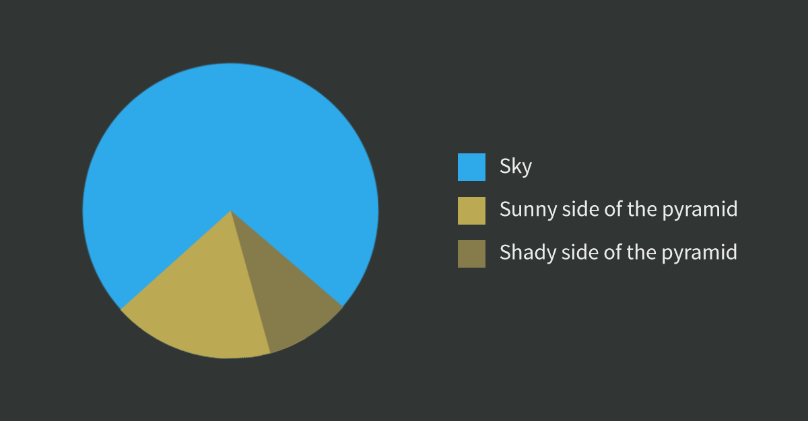

[数据可视化工具](https://www.datafocus.ai/infos/data-visualization-tools)使企业有机会使用各种具有视觉吸引力的图形来展示数据，而不是传统的数字行。最先进的业务仪表板在图形和图表上提供了许多可视化数据表示选项，但饼图仍然是这些工具中最常见的一种，但也是最臭名昭著的。对于饼图是否是一种显示数据的可靠方式，数据分析师之间的讨论永无休止。尽管它很容易创建和理解，但它受限于其简单性和仅显示数量之间基本关系的能力。

数据科学家通常不赞成使用饼图，但必须诚实地承认，对于数据可视化学科的重要性而言，饼图的发现不亚于众所周知的车轮发明。William Playfair 被认为是第一张饼图的幕后策划者。1801 年，他成为第一个在其名为《统计简略》的出版物中使用它的科学家。在这项研究中，他使用不同的图表来展示欧洲国家的地理区域、人口和收入。饼图并不是我们发现的唯一一个归功于Playfair的图形，另一个是条形图。此外，他是第一个使用折线图作为显示随时间变化的定量值的手段的人。与他之前的任何人相比，Playfair更依赖于定量数据的图形表示，因为他相信“在涉及比例和大小时，吸引眼球是传达独特想法的最佳和最容易的方法”，正如Stephan Few 的文章中引用的那样。

## 饼图的类型

在统计学的领域里没有什么是容易的，所以即使是饼图也构成了一个可以分为几种类型的图形类别。

**3D 饼图**

这是一个传统的饼图，通过添加第三个维度进行了倾斜和视觉升级。这种类型的图表通常用于美学原因，并且使数据解释更加困难。三维添加的透视图只会进一步扭曲饼图切片之间的比例。

**环状饼图**

如果在圆圈中间添加一个空白中心，饼图的类型会变得更加像甜甜圈。这个额外的空间允许关于数据的额外信息。

**分解饼图**

这是一张图表，其中一个或多个扇区与饼图的其余部分分开。这种效果非常适合添加对单个数据集的强调或以更清晰的方式显示图表的较小部分。

**极区图**

极区图类似于通常的饼图，不同之处在于扇区的角度相等，并且每个扇区从圆心延伸的距离不同。极区图用于绘制循环现象。例如，要显示每个月的数据——饼图将被分成 12 段，每段有 30 度角，只有每个切片的大小才能显示数据。这种类型的饼图通常不太受欢迎，因为它允许进行多重比较。

**玫瑰图**

与极区图类似的，还有玫瑰图，或者是南丁格尔玫瑰图。因其形似玫瑰而得名，以动径和动径角表示制图对象按方位、时间或多项指标的统计数据,有很好的直观效果。

**多级饼图**

多级饼图也称为旭日图，用于可视化分层数据，由分成多个切片的同心圆描绘。同样，这种并置允许轻松比较并显示层次关系。

## 针对饼图的指控

上面的饼图类型表明，它们能够显示的不仅仅是几个切片。那么根据数据科学家的说法，饼图最常见的缺点是什么？

首先，如果饼图被划分为过多的数据块，它的有效性就会大大降低。您可能能够读取最多包含 10 个分段的饼图，但如果切片数超过此值，阅读就会很痛苦。当显示的数量接近于10并且饼图的大小相似时，情况会变得更加复杂——在这种情况下，饼图变得毫无用处了。此外，在这里添加数据标签也无济于事，因为空间非常有限，并且可视化可能会变得过于拥挤且难以阅读。

另一个缺点是饼图只显示一个数据集，要比较多个数据集，您需要一系列饼图，这会使这种数据可视化过于耗时。在一个圆圈中比较数据切片会给读者带来问题，这是因为人们通常在估计维度方面存在问题。例如，它们可能会被颜色或切片的位置所误导，当切片不相邻且移位时，较亮的切片看起来更大且相同的大小不那么明显。这构成了威胁，因为我们不希望我们的读者得出不准确的结论，并根据视觉影响而不是数据分析做出决定。

此外，如果饼图的切片过多，很容易误导观众或犯一些[常见的数据可视化错误](https://www.datafocus.ai/infos/common-data-visualization-mistakes)。

## 但是饼图并不像我们画的那么黑

是的，这种名字甜美的图表类型也有一些优势。饼图的主要优势在于，没有更好的数据可视化类型来显示部分与整体的关系。孩子们学习分数并不是没有道理的，他们通过观察以各种方式切片的馅饼，并解码每个切片的比例（四分之一、一半、四分之三等）。条形图在其设计中没有这种明显的目的。

饼图非常容易理解，几乎是直观的。即使对于不知情的观众来说，它也可以成为一种有效的交流工具。读者或观众一目了然地看到数据比较，从而能够立即做出数据驱动的决策。这种类型的数据可视化图表不需要读者自己检查或测量基础数字，因为如果数据比例相差足够大，图表的阅读是相当明显的。另一方面，饼图的天然竞争者并没有提供可用于并列的整体表示，从而使部分-整体估计更加困难。分割的饼图确实提供了一个明显的整体图形表示。出于这个原因，许多仪器都有圆形表盘（速度计、时钟、温度计等）。此外，它们占用的空间更少，所需信息一目了然。

这就是饼图的优势。对于未来，也许让我们同意数据科学家对饼图的看法是正确的，并[选择更好的数据可视化类型](https://www.datafocus.ai/infos/how-to-choose-the-right-data-visualization-types)。
