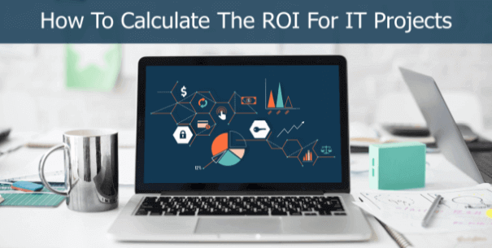
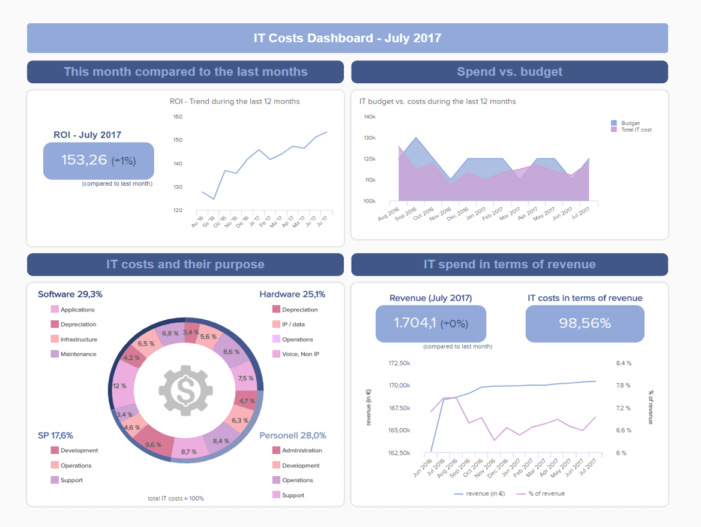

在任何项目启动之前，都会对项目的许多方面进行分析和评估：目的、时间表、任务、所需的资源，当然还有所需的预算。为了获得预算批准，经理们需要让财务部门相信他们的投资不会白费：他们实现了 IT ROI 计算——衡量项目投资回报的指标。

在今天的现实中，对于大多数公司来说，投资都朝着技术和 IT 项目的方向发展。这就是为什么通过 ROI 计算来了解技术投资的价值是至关重要的。在本文中，我们将了解什么是投资回报率、如何计算 IT 项目的 ROI、您应该警惕的常见错误以及如何有效地进行沟通。

## 什么是 IT 投资回报率

严格来说，投资回报率是一项投资的净利润与实现它的成本之间的比率。它通常以百分比表示，以表示与成本相比获得了多少利润。

这也是一种效率指标，它告诉投资者他们投资的每一元的使用效率。它是对业绩的衡量。正如Investopedia 解释的那样，投资回报率取决于您认为什么是有益的回报：跟踪营销活动的投资回报率与跟踪新制造资产的投资回报率不同。

IT 项目通常是有风险的，因为它们经常无法实现最初的业务目标。一旦支付了与维护、运营、升级、迁移等相关的所有成本，留给创新的就很少了。这就是为什么拥有高质量的项目管理更加重要的原因——这也是为什么经理们应该更加关注他们的 IT 投资回报率的原因。

## 为什么需要衡量 IT 投资回报率

您首先需要用投资回报率，来了解在这个新项目或技术上是否值得投入时间和金钱；然后仔细检查投资是否值得，是否符合你的预期。通过查看过去的投资选择并进行 ROI 分析，您可以评估这些决策，并在未来做出更好的成本预测。

您想知道您是否将资源浪费在对您没有太大帮助的技术上：例如，有人花在对自动电子邮件软件故障排除上的时间，是实际制作要发送的内容的时间的三倍。在这种情况下，技术消耗员工的时间和金钱，却没有给予足够的回报。

计算 IT 项目的投资回报率也将帮助您维护分配的预算，并可能扩展预算：通过向您的经理展示您知道自己在做什么、在哪里花费以及花费多少，您展示了您对您的部门有充分的了解，并证明其必要性。对于高级管理人员来说，这是一种很好的销售技巧，可以用来展示你对整体使命的贡献。通过在投资选项之间进行项目间比较，它还有助于确定投资优先级。最后，它还加强了项目主管对项目成功或失败的责任。

您还应该记住，特别是对于 IT 项目，用数字来表示收益可能非常困难，但回报仍然显著的，尽管是非财务形式：竞争优势、客户满意度的提高、内外沟通的改善，产品差异化，客户服务和支持的改善等。一个典型的例子是商业智能项目：商业智能的影响通常很难量化，因为它的回报是广泛而长期的。但是，有一些方法可以计算[商业智能的 ROI](https://www.datafocus.ai/infos/business-intelligence-roi)。

## 如何计算 IT 项目的投资回报率

IT ROI 在建立业务案例以证明技术计划的合理性方面提供了巨大的优势。但是，如果您不首先了解如何计算投资回报率，就无法真正评估任何投资的盈利能力。让我们来看看这样做的方法。

在任何事情之前，你应该问自己几个问题：

- 我可以衡量预期的利润/节省吗？
- 这样的利润可以实现吗？
- 这个 IT 项目实施的好处是否会在多个业务领域中体现出来？

最后一点，确保不要将收益计算两次，这会夸大投资回报率并扭曲结果。

因此，要计算 IT 投资回报，您首先需要确定成本和收益以及您期望的它们是多少；评估它们发生的可能性，并确定您可以在不损失资金的情况下偏离预期成本和收益多少。

**第 1 步 - 费用**

在这个阶段，您应该概述与实施新技术（比如软件）相关的所有成本。从许可到实施、每年的支持和内部经常性运营成本：所有这些类别都有具体的费用项目（软件安装、员工培训、接口适配等）需要详细估算。

**第 2 步 - 好处**

IT 投资将产生的收益或利润更难评估。我们希望这些好处是有形的和货币形式，但是，如前所述，它们很可能是非金融的。在这种情况下应该做的是对将受到投资积极（或不）影响的每个功能以及如何受到影响的进行概述。不过，总的来说，实施新技术/软件的好处在于改进流程和手动任务的自动化。

**第 3 步 - 比较**

IT ROI 计算的最后一步是将成本与收益（或节省）进行比较，以确定 ROI 的现金流。希望这将为您计划的 IT 投资带来良好的回报。为了获得更好的评估，您可以评估所有最佳和最坏情况。您将增强对投资风险的认识。

## 远离的常见错误

对于任何其他项目，经理们在试图计算 IT 项目的投资回报率时很容易陷入陷阱。其中一个经常出现的问题是高估了预期的收益——换句话说，这是_不_提高投资回报率的最佳方式。相反，有时企业会低估初始成本，从而导致计算不准确。

正如乔奈特在哈佛商业评论中解释的那样，计算投资回报率的另一个常见错误是将初始投资与回报进行比较。初始投资总是以现金形式进行，而回报则以利润或收入来衡量。正如我们上面计算的最后一步所指出的，正确的方法是使用现金流。

谈到时间，管理者会忘记他们的时间和员工的时间的价值。当项目超过最后期限时，由于没有分配足够的资源，它会花费更多的钱。然而，在这一点上，你应该仔细考虑所有的风险，以及什么更重要：截止日期/时间，还是资金/资源。因为实施更多资源以按时或在截止日期之前完成项目很可能会超出预算，而不是超过截止日期。

因为投入更多的资源来按时或在到期日之前完成项目很可能会超出预算，更何况远超最后期限。

## 有效地沟通您的 IT 投资回报率计算

为了充分利用您的 IT 投资回报率估计，并让您的高层管理人员或投资者相信您拥有以真实数据为后盾的正确计算，并有效地传达所有信息，[IT 分析](https://www.datafocus.ai/infos/business-intelligence-it)软件是您可以使用的最佳工具。事实上，从长远来看，它不仅可以帮助您监控您的项目，还可以让您创建专业的[IT 仪表板](https://www.datafocus.ai/infos/dashboard-examples-and-templates-it)，一次显示您的所有信息，这是忙碌的高管迫切需要的高效概览。

通过预测收益或简单地以以前的项目为例，您可以帮助房间里的每个人了解所有风险并可视化复杂的计算。他们拥有一切可以做出更好的数据驱动决策的能力。以下是 IT 成本仪表板的示例，着重于超过一年的成本管理，并显示该时间段内 IT 投资回报率的演变。

了解如何计算项目的投资回报率是第一步，否则您无法清楚地了解项目的目标和收益，因此您的预算也无法获得批准。评估 IT 投资回报率将帮助您从财务角度更好地销售和管理您的项目。

项目经理应充分了解 ROI 计算背后的所有要素，以便准确了解所需的手段和资源，以及企业将从中获得的所有收益。

知道如何向高层管理人员和投资者展示它是您不应该失败的关键行动 - 使用专业的 IT 仪表板将极大地帮助您传达您的见解并为财务评估提供坚实的背景。[要从数据可视化软件](https://www.datafocus.ai/infos/data-visualization-software)所能带来的一切好处中受益，请尝试我们的 30 天[免费试用](https://www.datafocus.ai/console)。
