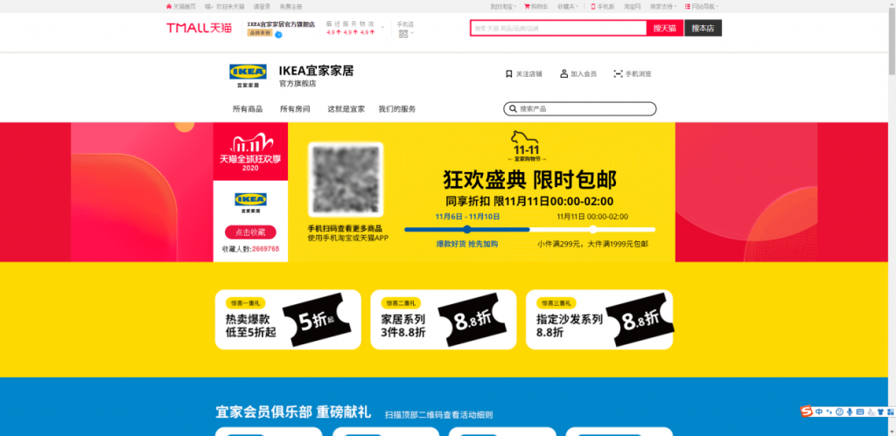

前面几篇文章的内容主要介绍了电商运营的历史、数据分析师的职责、电商运营的基础理论、渠道运营节奏等等来奠定读者们对电商运营的基础。从这一章节开始，我们正式将数据指标投入实际业务场景，不仅可以加深对各项基础指标的理解，还可以帮助探究业务的本质真相。

作为一名优秀的数据分析师，必须具备从繁复的数据指标中挑选出关键指标并加以利用的能力。这篇文章的主要目的就是帮助大家了解，与运营紧密相关的七个业务部门所形成的业务运用逻辑中存在哪些关键指标。

## 业务运营逻辑

一般的电商企业在电商运营的过程中，会涉及至少七大部门的业务关联，可以通过运营业务将这七大部门串联出一条完整的业务逻辑线。这七大部门分别是运营、商品、市场推广、视觉编辑、客服、仓储、财务管理，以最近上线的“双十一”活动为例，简单介绍一下这条业务逻辑线。

首先，运营团队会比对平台提供的流量资源和平台活动，制定此次的销售目标以及促销方案，假设在此次双十一运营活动中，本品牌制定的业绩目标是500万；接下来，运营团队会依据这500万的销售目标，对商品部门提出本次所需的商品资源，对市场推广部门提出资源和流量推广需求；

商品和市场推广的负责人据此接招，根据运营部门的要求，提供商品库存情况，制定可行的流量支持方案，最终与运营团队协商达成一致；

然后，视觉编辑们大展身手，设计出各色五花八门的店铺活动页面，匹配此次的促销方案、活动主题、主推商品等等。店铺活动页面、详情页的设计会对此次双十一活动的促销效果产生直接影响；

图1-1 双十一天猫店铺页面设计

当以上步骤完成后，代表此次双十一活动的运营计划已经初步拟定了。下面就需要进入更细致的运营筹备阶段，为到来的双十一活动做好充分的准备；

等活动开启后，进入后续的客服接待、订单处理以及仓库的物流发货等环节；

最后，等活动结束后，财务部门对这一销售阶段的销售业绩进行汇总统计，通过BI工具DataFocus核算财务指标，对此次活动的销售目标达成情况做一个数据上的结论。

图1-2 双十一业务达标率

## 二、各项重要数据分析指标

在上述介绍过的业务运营逻辑中，我们可以看到以运营为首的七大业务部门，每个部门都有其独特的数据指标，但再聪明的数据分析师也不能记住所有指标，因此，我们必须挑选七大部门中各自的重点指标，借此诊断品牌的业务运营状态。

因为业务框架是以运营为导向，我们就先来解读运营部门的重要职能和数据指标：

1. 运营部门

【重要职能】

运营部门有两个最主要的职能，第一，是制定并达成品牌的销售目标；第二，在打成销售目标的同时，需要注意控制运营成本。销售中的运营成本一般包括销售折损、销售退货、平台扣点、物流、推广费用等。

【数据指标】

评估运营能力需要避免使用单一指标，一般会使用业绩达标率、业绩增长率、销售利润额三个指标来进行综合评估。

图2-1 图源：DataFocus每季度销售利润额

本篇文章主要讲解了业务运营的一个基础框架，并借助DataFocus例举了运营部门的重要职能和重要的数据指标，下一篇我们将继续完成剩余六大部门的指标介绍~~
