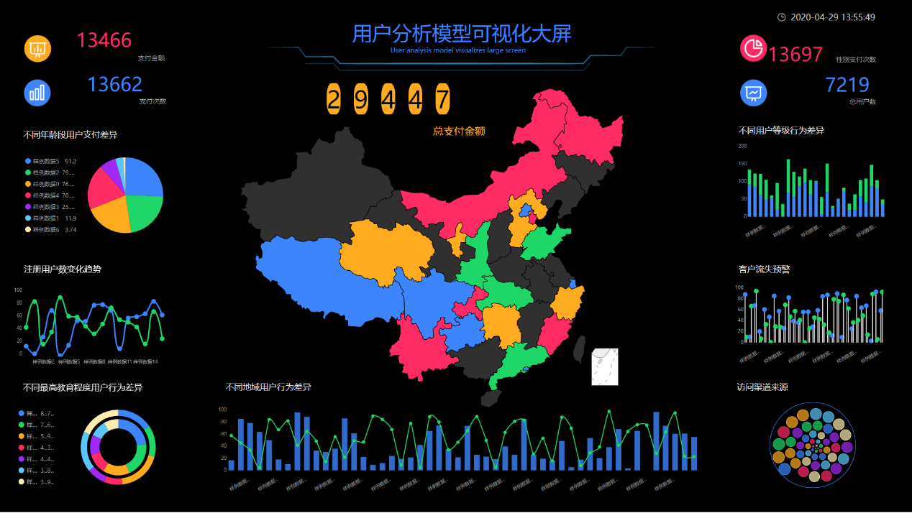

最近公司新添加了一款“利器”——DataFocus，我们部门主要负责数据分析工作，因此对这款产品了解较多，几乎每个功能都有所涉猎，这里不得不介绍一个功能，就是在可视化看板中添加自定义组件。自定义组件功能的出现，使得原本只能放置历史问答的数据看板，增加更多类型的数据表达形式。

说了自定义组件的这么多优点，接下来就要实际上手，利用DataFocus系统演示添加自定义组件的步骤，以及如何配置自定义组件的内容等。

1、浮动文字

不管是网格布局还是自由布局下，添加浮动文字类型的自定义组件，会在页面左侧添加一块面积较小的空白矩形方块，覆盖在answer上。点击空白处，添加任意文字，例如添加这个看板的标题。添加完毕后，可以对组件文字进行设置，包括加粗、斜体、是否居中、是否隐藏背景、修改颜色、修改字号。

点击组件右侧的配置，在弹出的组件样式中，还可以对组件背景进行设置，背景设置可供选择的类型有颜色和图片。

2、浮动图片

在网格布局或自由布局下，添加浮动图片类型的自定义组件，和浮动文字类似的，出现一块面积较大的空白方块，同样覆盖在answer上。

点击空白处，在弹出的自定义组件配置对话框中，可以选择需要上传的图片，最多可以上传7张图片，若上传的图片为多张，则会在看板中自动切换。若要删除某张图片，点击组件右上角的配置按钮，同样可以弹出如下图的对话框。

3、标题文字

标题文字组件只能在网格布局的情况下添加，和浮动文字类似的，点击空白处即可添加文字，然后对文字进行配置，编辑组件背景。但不同的是，标题组件不会覆盖answer，且组件的大小不能自由调节，有固定的四种大小样式。

4、标题图片

同样，标题图片也只能在网格布局下添加，添加组件的矩形大小和标题文字一致，内容则和浮动图片一致，也是最多可上传7张图片，若上传的图片为多张，则会在看板中自动切换。

添加自定义组件是不是很简单且实用，赶紧也免费申请试用DataFocus，尝试着做一下吧~~~
