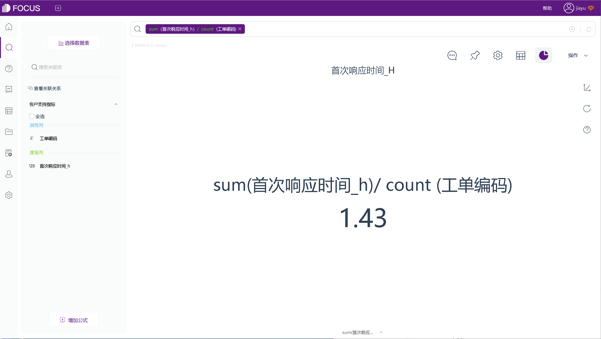
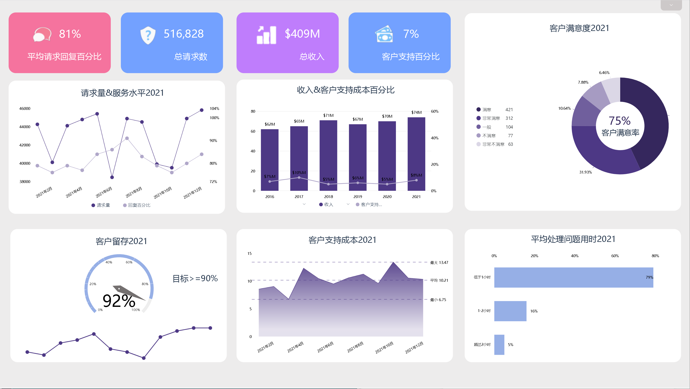

客户支持在任何行业中都很重要，它是解决客户问题和疑虑的一种方式，以使客户能继续使用你的产品。然而，**许多客户不喜欢联系产品支持团队**。

Statista 的一项调查发现，**60%** 的受访者**担心等待时间过长**，**59%** 的人**担心**他们会被调到其它的部门，并不得不**多次重复他们的问题**。

通过**提高支持团队的效率**，可以减少团队与客户之间的摩擦，让客户在支持互动中感到积极和满意。提高效率的**第一步是跟踪客户支持指标**，以清楚地了解团队绩效和客户体验。

**客户支持指标有数十种，优先考虑哪些指标呢?**

以下五个指标较利于你监控团队的效率、随时掌握支持工单并密切关注客户满意度。

### **1、客户满意度（CSAT）**

客户满意度（CSAT）是衡量客户满意度的指标。它基于客户与支持团队互动后填写的调查。虽然调查的确切问题可能有所不同，但它要求客户对他们的体验进行评分，使你可以量化客户满意度的通常定性指标。

CSAT是一项重要的客户支持指标。客户支持团队的最终目标是帮助客户并确保他们满意。CSAT可以衡量这些工作的成功与否，并提供来自客户的直接见解。

**CSAT（%）=（积极回应的数量/总响应数）X 100%**

“积极回应”的定义将取决于你的问题和规模。如果客户可以在1到5分的范围内做出回应，5分是最好的体验，那么你可能会认为4分或5分是积极的回应，3是中等的，2或1是负的。

按支持渠道细分CSAT，可以查看客户在通过电话联系你的团队时是否比通过聊天、电子邮件或其他渠道更满意。如果你的CSAT较低，查看各个来源会让你了解到，你的改进工作应该集中在哪里。

### **2、首次响应时间**

首次响应时间，也称为首次回复时间，是客户提交支持通知单与客户支持代表提供初始响应之间的时间。首次响应时间是衡量支持团队效率的指标，因为它表明客户需要等待多长时间才能得到帮助。

**没有人愿意等待很长时间才能获得问题的回复，因此缩短响应时间可以提高客户满意度。**

你可以跟踪每个客户支持代表的首次响应时间，以及整个团队的平均时间。如果平均值太高，那么跟踪每个代表的时间，可以帮助你了解谁可能需要额外的帮助或培训。根据 Zendesk的说法，12 小时是电子邮件的最佳第一响应时间，社交媒体为 2 小时或更少，实时聊天为1 小时或更少。

**平均首次响应时间=首次响应时间的总和 / 工单数的总和**

单张工单的首次响应时间，是客户的初始支持请求与支持代表的第一次联系之间的小时数或天数。公司通常以工作日来衡量这个时间，因此周末和下班时间不会缩短你的平均响应时间。

### **3.平均解决时间**

平均解决时间(ART) 是你的团队处理工单所需的平均时间，从工单首次打开到解决和关闭。较长的解决时间意味着客户的等待时间较长，这会影响满意度，并最终影响客户保留率。

尽管解决时间因公司而异，但你可以使用行业基准来查看你的平均解决时间与同行业的其它公司相比如何。如果你的 ART 每周都很高，这可能表明你当前的支持流程效率低下或你团队成员的工作量太高。与你的支持团队交谈，了解他们在哪里遇到问题，以及你可以采取哪些措施来加快解决过程。

还要查看整个团队每个人的平均解决时间。这将帮助你了解是否有成员在“苦苦挣扎”。

**平均解决时间= 所有已解决工单的总解决时间 / 已解决的工单数量**

定期检查平均解决时间以观察变化。若它随着时间的推移而稳步增长，则可能表明你的支持团队需要更多的帮助或培训来处理客户提出的新的、更复杂的问题。

### **4\. 工单积压**

工单积压是在给定时间段结束时，队列中未解决的工单数量。例如，如果你的支持团队在周一至周五工作，你可能会在周五 临近下班时查看积压的工单，以了解有多少客户必须等到周一才能解决他们的问题。

**总工单积压=未结工单总和**

将工单积压量与工单总量进行比较，以查看在本周末仍未解决的工单的百分比。如果该比率每周都很高，你可能需要扩大你的支持团队。

### **5\. 工单量**

工单量是你的团队在设定的时间范围内收到的工单的总数。

跟踪工单数量随时间的变化，以确定你的团队收到最多支持请求的时间，是在一天中的哪个时间段和一周中的哪几天。有了这些信息，你可以更有效地计划班次和分配工作量。这不仅有助于确保你的支持代表不会不堪重负，而且还可以提高你团队的响应效率，从而减少客户等待的时间并更快地解决他们的问题。

**总工单量=所有工单的总和**

查找工单量，只需将相关时间范围内提交的所有工单相加即可，可能是一天、一周或一个月。

### **最后，使用强大的仪表板实时显示客户支持指标**

借助**实时客户支持仪表板**，你的团队可以实时看到客户支持指标（例如积压的工单和工单数量）的变化。BI工具DataFocus可以整合来自多个支持渠道的数据，并定期更新仪表板中数据，使你的团队可以即时看到问题并随时掌握收到的工单。

