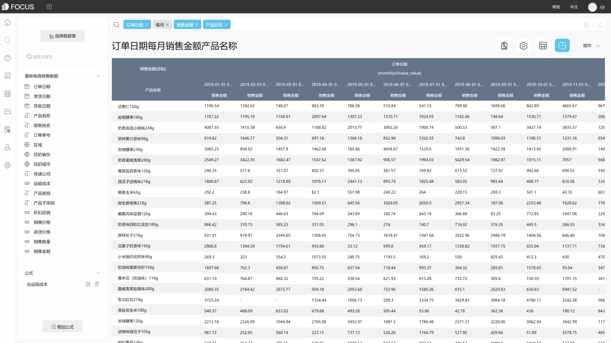

　　说起大数据，相信大家都不陌生，那么本文就来讲一讲新兴的商业智能软件DataFocus以及老牌商业智能软件Tableau，这两个软件都是在可视化大屏上来呈现的，两者又有哪些区别呢？跟着小编一起来看看吧。

　　从功能来进行对两款软件的对比：

　　1数据连接

　　DataFocus能够支持外部数据源上传以及抽取数据库到系统这两种数据连接的方式，而且支持整体或是单表的数据更新，支持定时更新。

　　Tableau也能够支持数据源连接以及抽取数据到系统这两种数据连接的方式，但是在数据更新的方面，仅仅支持当前所分析数据的增量更新，不能精确到某张表且不支持定时更新。

　　2数据源支持

　　DataFocus和Tableau都支持主流数据库以及文本数据集等。但是Tableau支持的数据源比较多，例如云数据库、更多格式的文本数据集等。

　　3数据处理

　　DataFocus采用的是中间表和关联表的模式，能够有效的支持简单的数据ETL操作，如数据整合、过滤清洗、新增公共列、分组统计、使用部分字段等功能，并且不需要进行复杂且学习成本较高的SQL操作。

　　Tableau也能够支持一些简单的ETL操作，但是主体上还是需要SQL处理。

　　总结

        这两款产品可以说是各自都有优缺点，单从功能的丰富程度上来看，显然是Tableau更胜一筹，但是DataFocus在使用的便捷性上来看确实是要比Tableau便捷很多。从可视化大屏产品的发展趋势来看，DataFocus可以说是下一代商业智能的代表性产品。如果企业想要降低成本来构建自己的数据分析体系，选择DataFocus就会节省极大的资源投入，并且也能满足企业的绝大部分需求。
