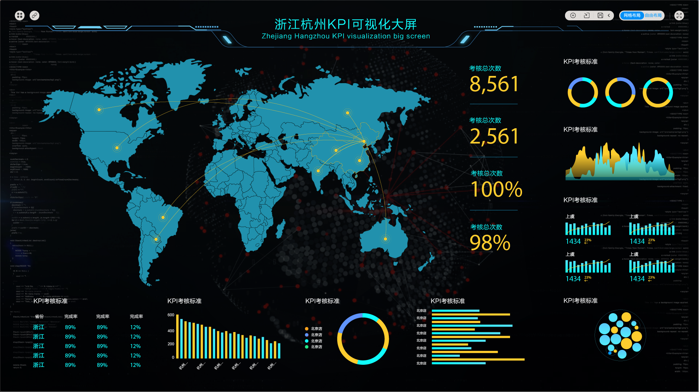

        随着信息化建设的飞速发展，可视化大屏需求爷越来越高，硬件技术也越来越成熟，可视化大屏开始慢慢普及，而且在大数据时代来临之后，可视化大屏也不再单单作为显示工具，将图像、数据信号通过datafocus传输到大屏幕上显示给用户看，而是需要对大量的数据信息进行分析，实现了硬件搭载软件的完美结合，能够帮助管理者发现数据的关系和规律，为决策提供数据依据。

　　**方法一**：用报表的 DashBaord 功能做

　　适用于在一个屏幕之内进行展示，能够很好的自适应屏幕，可以支持表格，文本，统计图等。

　　优势：能够灵活的调整布局还可联动。

　　不足：不能够支持复杂的组件，比如单个组件内的 tab 切换

　　**方法二**：自定义页面的制作

　　比较适用于超宽超高的大屏，它的组件功能比较复杂，页面布局要求也比较精细。

　　优势：基本上所有的功能以及需求都能得到满足，视频，联动，背景色，tab 切换等。

　　不足：需要大量的页面和美工开发人员来一起做。

　　**解决方案**

　　**步骤 1**：制定大屏的内容及显示方案

　　工作内容：首先要根据业务场景抽取出关键指标，然后定义和分析指标的维度，最后定义指标的统计图类型以及页面的划分。

　　**步骤 2**：美工设计整体的布局

　　工作内容：要根据业务专家所划分的页面来进行指标布局，还有根据用户的要求的色系来进行样图设计, 并且根据用户最终定稿的样图来进行切图。

从上面的可视化大屏制作过程可以看出，一个大屏要做的炫，更多的是需要美工和页面的活，项目组有美工和页面人员配合就可以搞定，如果大屏要算的快，就是个技术活了，如果美工和页面人员数量不够的话那么就可以用datafocus来解决了，datafocus基本上可以解决企业数据分析的大部分问题。
