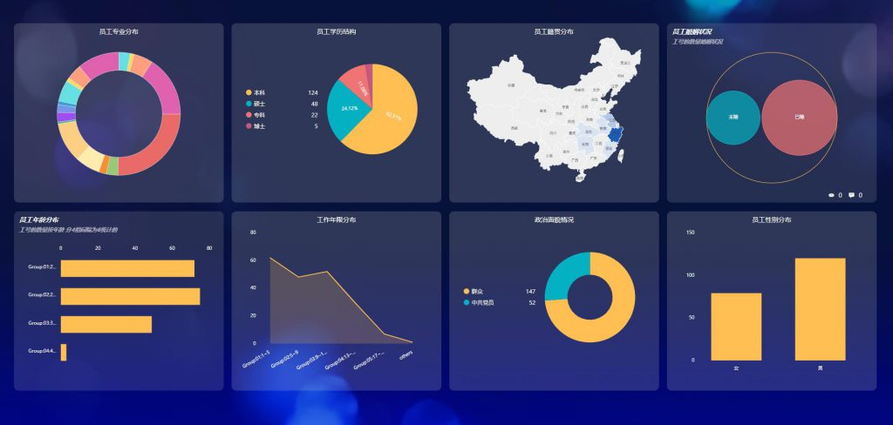

大数据时代，可视化数据分析可以把纷繁复杂的大数据集还有晦涩难懂的数据报告变得轻松易读、易于理解。当然datafocus可视化数据分析并不是简单的把数字用图表表示出来，而是帮我们发现数据后的规律。

未来，就是数据的世界，一切皆数据。

我们可以将将中国可视化数据分析发展可以划分为以下四个阶段：先计算机时代、计算机读表时代、计算机读图时代和大数据时代。

我们目前正处在大数据时代，可视化大数据分析在现实生活中的主要应用有哪些呢？

1、宏观态势可视化：宏观态势可视化数据分析是指在特定环境当中对随着时间推移而不断变化的目标的实体进行觉察，能够灵活、直观、逼真地展示宏观态势，能够很快掌握某一领域的整体态势和特征。

2、设备仿真运行可视化。就是通过图像、三维动画还有计算机程控技术与实体模型相融合，实现对设备的可视化表达，使管理者对其所管理的设备有形象具体的概念，对设备所处的位置、外形及所有参数一目了然，会大大减少管理者的劳动强度，提高管理效率和管理水平，是“工业4.0”涉及的“智能生产”的具体应用之一。

3、数据统计分析可视化，是目前提及最多的应用，普遍应用于商业智能、政府决策、公众服务、市场营销等等领域。借助于可视化的数据图表，可以很清晰有效的传达与沟通信息。

以上就是可视化数据分析在现实生活中的主要应用，相信通过阅读本文大家一定对datafocus有了一定的了解，同时也希望大家多关注这方面的内容。
