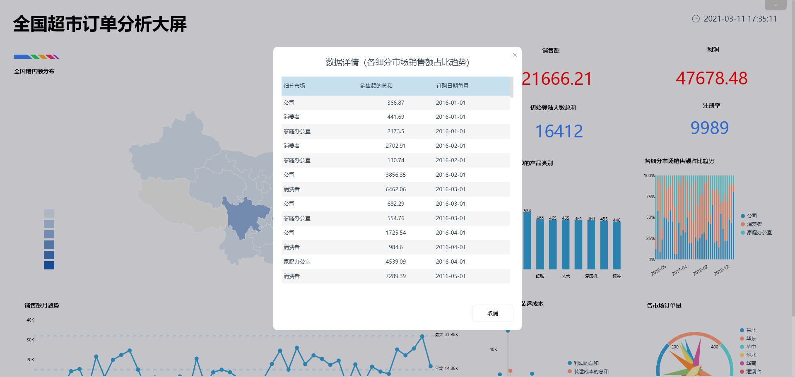

介绍了这么多天的可视化，我一直说到利用DataFocus做可视化有非常丰富的数据表达形式，包括图形、表格、文字、图片、KPI等等等。今天就详细来和大家讲解一下我在为公司制作可视化大屏时经常会用到的一些数据表达形式。

**1、图形**

这里的图形指的就是各种不同的图表类型，在DataFocus系统中主要划分为基础图形和高级图形图形的种类非常的全面，基本能满足日常的数据可视化需求，其中比较具有代表性的有柱状图、折线图、饼图、环图、散点图、条形图、堆积条形图、面积图、组合图、树形图、词云图、打包图……

而且图形数量还在持续不断的改进中，相信未来会有更多丰富的图形供大家使用。

**2、表格**

这里的表格包括图表类型中的数据透视表和纯粹的数值表。很多习惯使用数字记录数据的老业务员们或者是对数据十分敏感的业务员，也可以满足他们的需求，将表格和图形一样放置在数据看板上。

**3、仪表盘**

仪表盘可以用于多个数据之间的对比，将数值在同一仪表盘上进行展示，可以鲜明数据之间的对比，用于比较计划于实际完成情况之间的差异。

**4、数字文本形式**

这里的数字文本是指将最后结果直接用数据展示出来，简单明了，在DataFocus系统主要可以利用KPI指标或者添加一个自定义组件，自行将想要的文字打字上去。尤其适合核心指标的展示，比如去年的总利润和总体销售额等。

**5、地图**

这里将地图特意拎出来，是因为地图、经纬图、热力图这些图形所需要的数据有特殊的要求。例如要制作一张地图，就必须拥有一列省份的数据；经纬图就必须拥有经度纬度列数据。

**6、动态图形**

动态图形是最近新增的一类图形，包括时序柱状图、时序条形图、时序散点图、时序气泡图等，这是一种可以根据你数据中的月份自行变动的图表类型，放置在可视化看板上，效果相当不错。

**7、图片**

这里指的图片就是自定义组件所添加的图片。图片若有多张，则会在看板上自动切换。

本文介绍了7中常见的在DataFocus系统的可视化大屏上比较常见的数据表达形式，是不是觉得相当丰富，快去试试吧，做一个看板，让领导眼前一亮吧！
