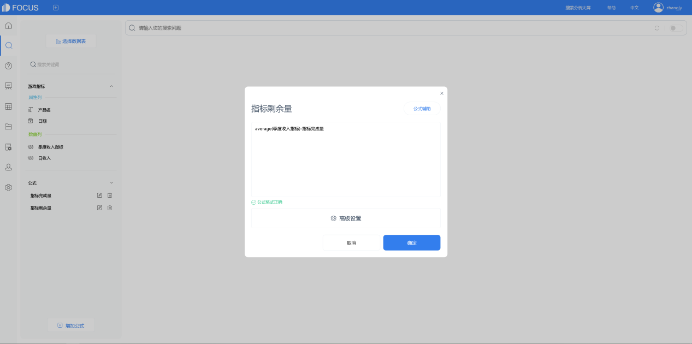
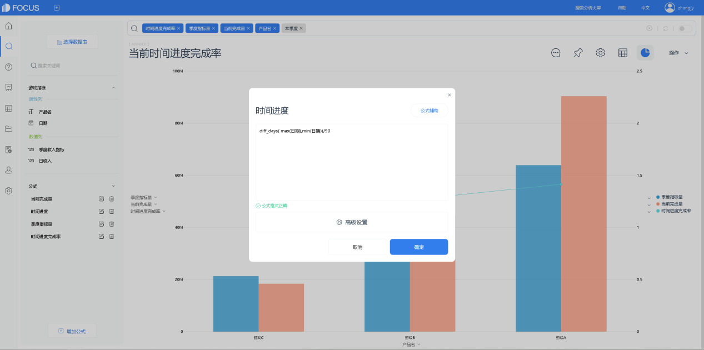
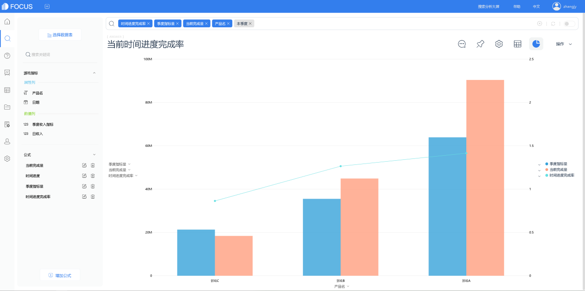

公司一般会制定收入指标，监控收入完成情况的同时，及时了解运营情况，为运营方案的制定提供数据支持。

今天，我们以游戏产品为例，借助DataFocus了解对收入指标完成情况的4个方面分析。

# 数据来源

对于游戏产品，数据主要来自游戏收入数据，即流水。端游流水指消耗金额，手游流水指充值金额。

# 分析详情

对于游戏产品的收入指标情况分析，可以从指标完成情况、当前时间进度完成率、本季度和上季度对比、本周收入和上周对比四个方面进行分析。

## 2.1 指标完成情况

我们先来查看本季度的指标完成情况。在DataFocus搜索模块，使用公式计算“指标完成量”以及“指标剩余量”，指标剩余量=指标-指标完成量。

图 1指标完成量

图 2指标剩余量

搜索分析指标情况时，双击或搜索框中输入列名，并使用关键词“本季度”进行数据的筛选。

切换到堆积柱状图后，可以通过标签设置，直接查看指标完成率。

图 3 设置标签

除了在数值表中查看各项值，也可以通过设置标签或直接鼠标滑动到图柱上，进行值的查看。

## 2.2 当前时间进度完成率

通过分析指标完成情况，我们了解到各产品的季内指标完成率。因为指标是以季度为周期，当前没有完成季指标的产品，可能已达到日均收入指标，因此，我们需要结合时间维度进一步分析。

使用公式计算当前完成量、时间进度、当前应达到季指标以及时间进度完成率。

图 4 当前完成量

时间进度=季度已过天数/季度总天数

图 5 时间进度

当前应达到季度指标量=季度总指标\*时间进度

图 6 当前应达到的季指标量

时间进度完成率=完成量/(日均收入指标×已完成天数)=完成量/（季总指标\*时间进度）=完成量/当前需达到的季度指标

图 7 时间进度完成率

最后，双击或搜索框中输入所需的公式列名，并使用关键词“本季度”进行信息筛选。

设置组合图，并将完成率配置到右轴，即了解到各产品时间进度完成率。

图 8 当前时间进度完成情况

## 2.3 “季度同期对比”与“周对比”

对于收入指标分析，还需进行“本季度和上季度同期对比”以及“本周收入和上周对比”。

在DataFocus中进行常规的环比同比的计算，可以直接使用“增长关键词”来实现。

但对季度数据的对比，当前需要的是本季截至目前与上季同期对比，因而需要先对季数据进行筛选，再开始增长率或增长量的计算。

这一部分，可以参考DataFocus官网上的学习交流社区里，对于“对比本年截止到今天的销售额和去年截止到去年今天的销售额”问题的回复。有多种实现方法哦~

还没有试用DataFocus的朋友， 可以到官网试用最新的DataFocus “商业分析师版”，功能更多，“云端上的数据分析”，使用更方便哦~
