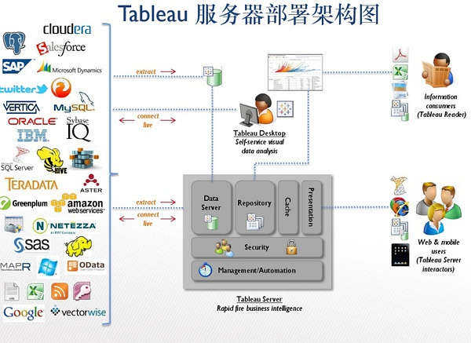

DataFocus是最近新兴的自助式商业智能软件，Tableau是功能强大的老牌商业智能软件，两款产品都致力于开发让每个人都能使用的分析工具并有所突破，但实际操作起来两者的目标方向还是有非常大的区别的，例如Tableau的功能全面而且可操作深入，更适合专业的数据分析人员依靠自身强大的业务理解来进行个性化的数据展示，而DataFocus则是面向普通的业务人员，数据分析过程采用了中文自然语言分析和一键自动分析数据，更简单易用，并为企业提供了全面的数据管理和组织管理策略。下面对这两款商业智能软件做个简单的对比评测。

DataFocus是杭州汇数智通科技有限公司研发的首个中文自然语言数据分析系统，自动建模，采用简单的搜索式的交互，系统便可以自动以数据或图表给予回答，支持进行数据筛选、钻取、数据联动等操作，自由、多角度地分析数据。让不具备代码能力、不熟悉数据结构的业务人员也能迅速上手制作出美观深入的数据图形。

**DataFocus系统构架：**

Tableau是连续六年在Gather BI与数据分析魔力象限报告中占据领导者地位的体量巨大的老牌产品。Tableau功能强大，注重细节，倾向于较专业的数据分析师，只要数据预先处理好，就可以制作很多绚丽多彩的信息图。覆盖数据源范围广，拖拽式操作只需把相应的数据拖到对应位置即可将数据信息映射为图形信息。在熟悉软件后，通过用户对组件的操作可以深入分析数据图表，生成美观清晰的数据报告。

从功能来对来对两款软件进行对比：

**1、数据连接**

DataFocus支持数据源连接和抽取数据至系统两种数据连接的方式，且支持整体或单表的数据全量或增量的更新，支持定时更新。

Tableau也支持数据源连接和抽取数据至系统两种数据连接的方式，但在数据新方面，支持增量更新且增量更新只支持对当前分析的所有数据的增量更新，不能精确到某张表，不支持定时更新。

**2、数据源支持**

DataFocus和Tableau均支持主流数据库、文本数据集等。但Tableau支持的数据源较多，如云数据库、更多格式的文本数据集等。

**3、数据处理**

DataFocus采用中间表和关联表的模式，有效的支持了数据的ETL操作，如新增公共列、数据整合、过滤清洗、分组统计、使用部分字段等功能，且不需要进行复杂学习成本较高的SQL操作。

Tableau支持一些简单的ETL操作，但主体还是需要SQL处理。

**4、数据可视化与分析**

DataFocus支持中文自然语言分析，用户可以通过跟AI人机对话的方式探索数据，系统可以理解人类关于数据的问题，以丰富的图表和数据回答相关问题，无需像拖拽操作一般要用户预先在构建好数据图形的数据结构，真正实现帮助业务人员去探索数据问题所在的目的。支持数据的钻取、过滤、联动等操作，多角度、各个维度的自由分析数据。同时还拥有丰富、美观的图表类型，根据数据问题智能选择合适的图表类型。

Table支持维度和度量的自由分析，用户通过自由拖拽操作生成图表。Tableau采用组件中的筛选器、标记、行列坐标的三级结构将数据信息转化为图形信息，自动生成相应的图表，以控制标记展示特性的方式去区别数据突出特点。支持数据的上钻、下钻、联动等OLAP操作。有丰富的图表类型和个性化的视觉效果。

**5、用户及数据权限管理**

DataFocus支持对接三方数据库内的组织人员信息和系统自建梁红方式添加用户。通过企业的行政组织构架来对用户进行管理。在数据权限管理方面，精确到表行列的细粒度访问控制，使不同权限用户根据企业需要只能看到表中与权限相符的数据，安全便捷。

Tableau支持直接添加、导入服务器中用两种添加用户的方式，用户管理是将添加进的用户按不同的分组进行分组。一个用户可以分属多个组。然后权限则依据所分的组进行设置，灵活有余，简捷不足。

**6、移动端**

DataFocus移动端无须二次开发，企业微信同步更新PC端分析报告，使用户可以随时随地得对自己的数据了如指掌。

Tableau Mobile仅支持独立的APP（Tableau，只有IOS），只允许一个服务器连接，支持联动、钻取、筛选等操作，但和PC端相比，没有编辑功能，支持邮件分享，但不支持微信、QQ分享。
