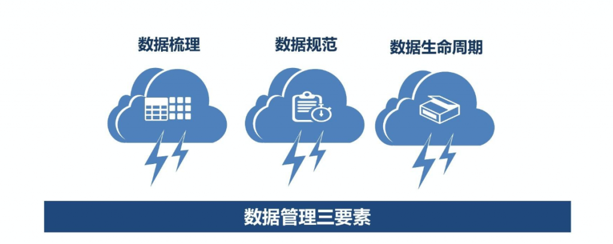
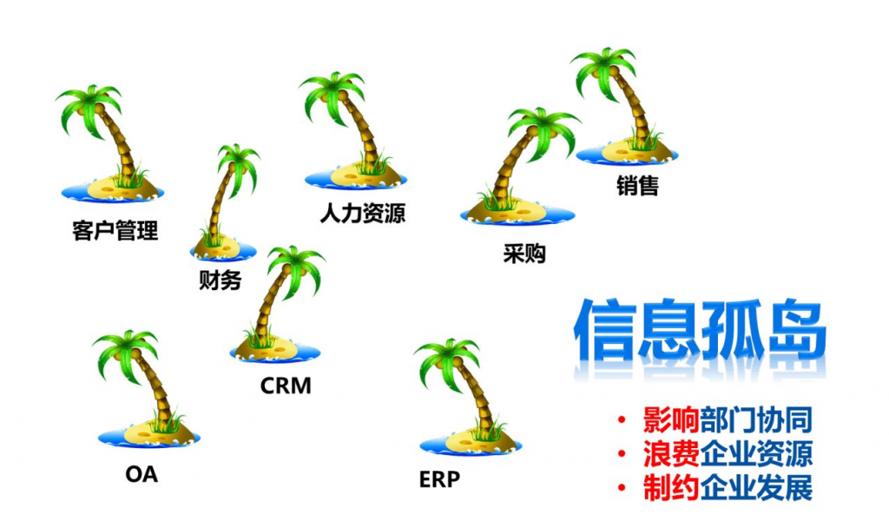

国家不断提倡加快实施和发展大数据，社会各界也不断提出“大数据分析”概念，但是数据分析的核心是通过DataFocus该如何实现“大数据分析”的价值？下面跟着小编一起来看看吧。

大数据分析，指的是无法在一定时间范围内用常规软件工具进行管理和处理的数据集合，是需要新处理模式才能具有洞察发现力和流程优化能力的高增长率和多样化的信息资产。从定义中可以看出大数据存在三个特点：种类繁多、数据量大、更新速度快。

因此，为了迎合企业的需求，商务智能系统陆续诞生，成为大数据分析的首要工具。商业智能BI在大数据处理方面主要包含三个方面：

1、建立数据仓库，进行数据清洗

根据分析最终结果的不同，所需的数据内容也存在差异。以DataFocus为例，DataFocus能够连接企业的数据库，然后从中筛选出需要的表格、字段，将其进行存储到系统当中，并可以进行定时更新，方便得出企业数据的可视化看板。

2、数据处理

这是商业智能最主要的功能，通过数据分析和数据挖掘，发挥大数据的价值，将数据转化为可见的信息，从而帮助管理者做出科学的判断。

3、数据展示

工具通过可视化大屏进行数据展示，其中还内设有一级看板以及二级看板，可以将多张看板的数据从属关系分清楚。可视化效果也是非常炫酷的。

通过以上3点，小编相信通过DataFocus已经能够将大数据分析的价值基本呈现出来了，也希望大家能够持续关注这方面的内容。
