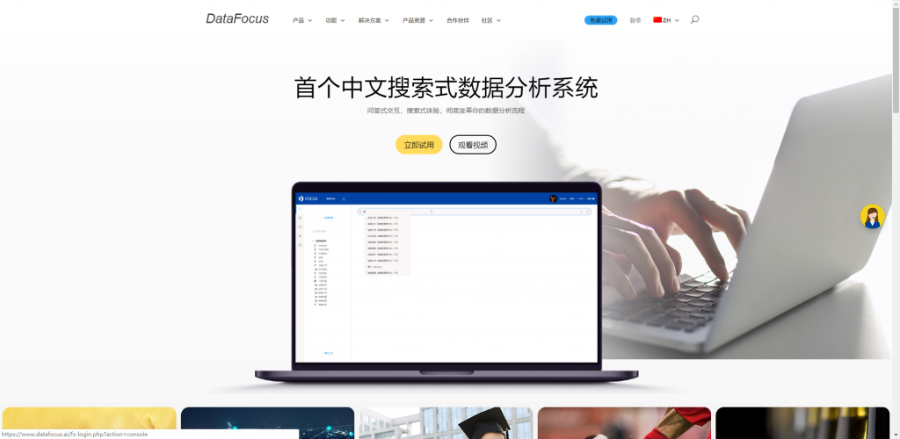

大数据可视化在数据信息企业规模、数据预处理、图表刻画效率高、图表具体表现能力、系统可扩展性、快速构建能力、数据信息数据分析和传输数据等规模化数据信息方面遭受新的研究课题。

<figure>

<figcaption>

数据分析

</figcaption>

</figure>

## 数据信息经营规模

大中小型数据信息企业规模大，实用价值密度低，页面室内空间设计较为比较有限，可以显示的数据量较为比较有限。因而以便合理显示信息使用者所关心的数据信息和特点，必须选用合理的数据编码方式。现阶段现有的方式对于数据信息自身开展取样或汇聚，未考虑到数据可视化的显示信息特点。最近一些专家学者明确提出了对于特殊可视化情景的数据编码方式。可是现阶段仍然缺乏通用性的朝向可视化的数据编码方式，也缺乏具体运用的商品。

## 数据预处理

  
大数据的另一个主要表现是基本数据类型多种多样，经常遍布于不一样的数据库查询。怎样结合不一样来源于、不一样种类的数据信息，为使用者出示统一的可视化角度，适用可视化的关系探寻与关联发掘，是一个关键的难题。在其中涉及到数据信息关系的全自动发觉、多种类数据可视化、语义网搭建等好几个技术性难题。

## 图表绘图高效率

伴随着数据信息经营规模的提升，图表可视化的高效率难题愈来愈突显。现阶段，一些可视化商品刚开始选用WebGL依靠GPU完成平行面绘图。愈来愈多的数据可视化商品选用B/S构架，其特性一定水平上优先选择于电脑浏览器；此外，因为跨终端设备要求愈来愈广泛，也对图表绘图明确提出了大量挑戰。

## 图表表述能力

伴随着造成数据信息的来源于提升，基本数据类型持续提升，数据信息使用者针对数据信息的互动要求愈来愈多，现有的数据可视化商品彻底不能满足使用者的可视化要求，常常出現必须的可视化方式商品不兼容或适用不足等难题。这就针对系统软件的图表表述能力明确提出了更高的标准，另外针对系统软件适用使用者的个性定制明确提出了新的标准。

## 系统软件扩展性

大数据针对数据可视化系统软件的拓展能力明确提出了新的挑戰，系统软件的扩展性将变成考量一个大数据可视化系统软件的关键指标值。

## 迅速搭建能力

大数据随着着迅速转变与提升的数据信息，怎样协助客户立即了解数据信息，发现问题，不可或缺数据可视化的迅速搭建能力，即依据使用者数据驱动的图表迅速订制能力。数据信息在s级乃至ms级升级的状况下，有木有将会完成图表的秒级升级与迅速订制。此外，图表订制后的迅速共享资源与回应作用也将成为必要的系统功能。

## 数据统计分析

传统式的BI专用工具关键集中化在数据筛选、汇聚及可视化作用，早已不可以考虑大数据剖析的要求，Gartner明确提出了“提高剖析”，数据可视化仅有融合丰富多彩的大数据统计分析方法，将数据信息的探寻式剖析产生一个闭环控制，才可以完成详细的大数据可视化商品，合理协助使用者了解数据信息。预测性剖析是大数据的发展趋势，数据可视化合理融合预测分析方式，将有利于使用者的管理决策。

## 数据信息互动

大数据可视化使用者必须根据可视化与图表身后的数据信息和解决逻辑性开展互动，从而反映使用者的人性化要求，协助客户用一种互动迭代更新的方法了解数据信息。在传统式的互动方式基本上，更为当然的交互技术，将有利于使用者与数据信息更强的互动，也有利于扩展大数据可视化商品的应用范畴与应用领域。
